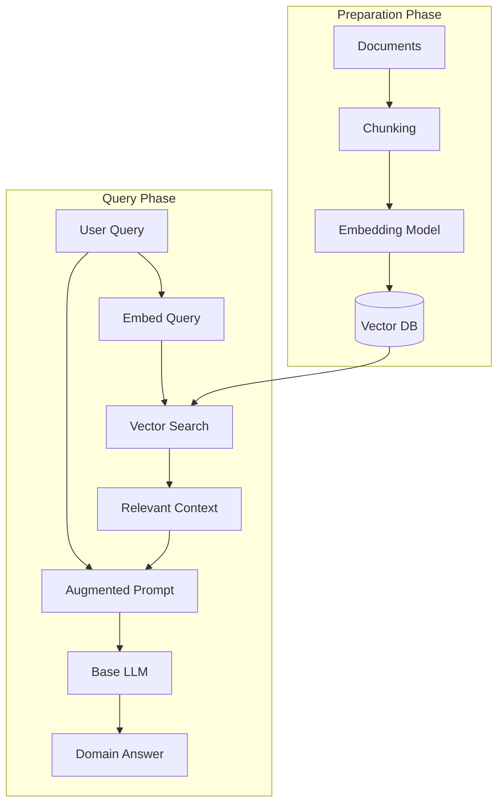
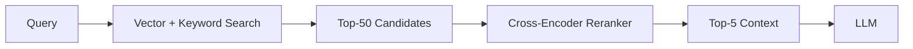
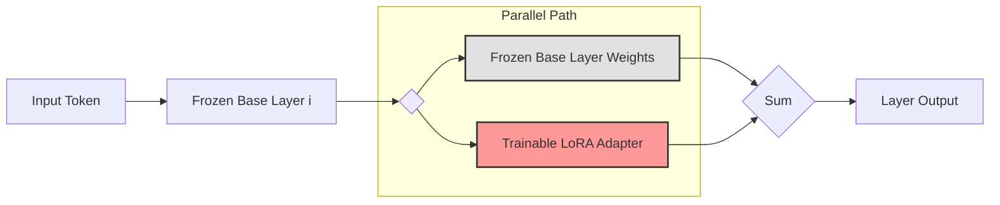
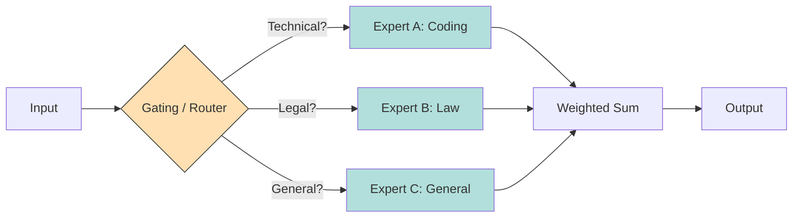
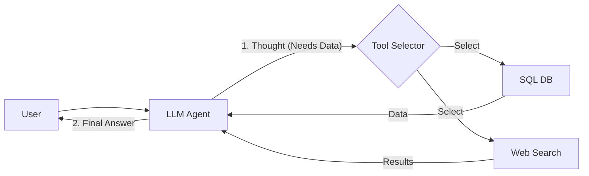
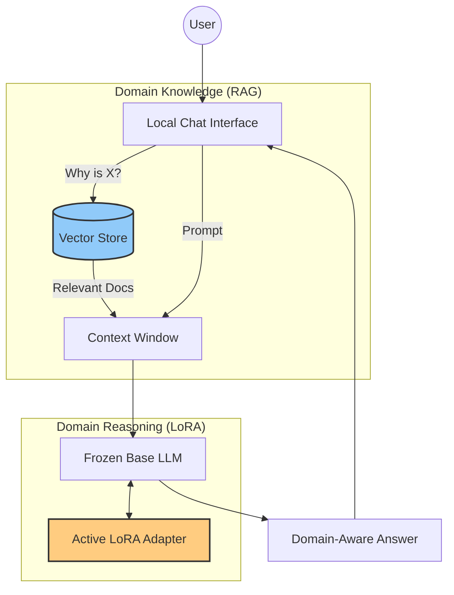

# Domain Specialization for a Local LLM

### Overview

This document explains **how a general-purpose local LLM can gain domain knowledge** and **how domain expertise can be added as a pluggable layer**.&#x20;

The focus is on approaches that work well on a **laptop or personal device**.

***

### 1. Problem Statement

Assume you have:

* A local LLM[^1] running on your laptop
* Trained only on general knowledge (roughly high‑school / early undergraduate level)

Goal:

> Enable the model to gain **deep knowledge and reasoning ability in a specific domain** (e.g. finance, distributed systems, law, medicine, internal company systems).

***

### 2. How an LLM Gains Domain Knowledge

#### 2.1 Retrieval‑Augmented Generation (RAG) — Most Practical

**Idea**: Keep the model frozen. Inject domain knowledge at inference time.

**Pipeline**:

1. Collect domain documents (PDFs, wikis, tickets, manuals, code)
2. Chunk documents (500–1,000 tokens)
3. Create embeddings for each chunk
4. Store embeddings in a vector database (FAISS, Chroma, Milvus)
5. At query time:
   * Embed the user query
   * Retrieve top‑k relevant chunks
   * Insert them into the prompt as context



**Strengths**:

* No retraining
* Cheap and fast
* Easy to update knowledge
* Ideal for personal devices

**Limitations**:

* Knowledge is not internalized
* Limited by context window

**Best for**: factual, procedural, and frequently changing knowledge

**Advanced RAG Architecture**

Basic RAG can suffer from poor retrieval. Production systems use:

1. **Hybrid Search**: Combine vector search (semantic) with keyword search (BM25) to catch exact terminology.
2. **Reranking**: Retrieve a large candidate set (e.g., 50 chunks), then use a high-precision Cross-Encoder model to re-score and sort them.
3. **Query Transformation**: Rewrite user queries (e.g., "features" -> "what are the features of system X") for better matching.



**Sample Setup (Python Stack)**

* **Orchestration**: `LangChain` or `LlamaIndex`
* **Vector DB**: `ChromaDB` (local file-based)
* **Embeddings**: `sentence-transformers`

```python
# Conceptual Setup
from langchain.vectorstores import Chroma
from langchain.embeddings import HuggingFaceEmbeddings

# 1. Load Embedding Model
embed_model = HuggingFaceEmbeddings(model_name="BAAI/bge-m3")

# 2. Initialize Vector DB
db = Chroma(persist_directory="./chroma_db", embedding_function=embed_model)

# 3. Retrieve & Rerank (Conceptual)
retriever = db.as_retriever(search_kwargs={"k": 50})
# ... logical step to pass results to a Cross-Encoder ...
```

**Recommended Models**

* **Embeddings**: `BAAI/bge-m3` (multilingual, strong), `nomic-embed-text-v1.5` (long context).
* **Rerankers**: `BAAI/bge-reranker-v2-m3`.

***

#### 2.2 Prompt Engineering and Tools

**Idea**: Guide the model using structured instructions and examples.

Techniques:

* System prompts with domain rules
* Few‑shot examples
* Reasoning templates
* External tools (search, DB queries, calculators)

**Pros**:

* Zero infrastructure

**Cons**:

* Shallow domain depth
* Does not scale well

**Best for**: constrained or procedural domains

***

#### 2.3 Fine‑Tuning — Internalized Knowledge

**Idea**: Train the model further so domain knowledge lives in the weights.

**Training data**:

* Domain textbooks
* Internal documentation
* Q\&A datasets
* Codebases

**Approaches**:

* Full fine‑tuning (rarely feasible locally)
* **LoRA / QLoRA** (recommended)

**Pros**:

* Domain concepts internalized
* No retrieval latency

**Cons**:

* Higher compute cost
* Hard to update
* Risk of hallucination

**Best for**: stable domains and reasoning patterns

***

#### 2.4 Continual / Online Learning

**Idea**: The model updates itself over time as it sees new data.

**Reality**:

* Hard to control
* Catastrophic forgetting
* Mostly research‑only

Not recommended for personal setups.

***

#### 2.5 Hybrid Approach (RAG + Fine‑Tuning)

**Common production setup**:

* Fine‑tune for domain reasoning style
* Use RAG for facts and fast‑changing information

***

### 3. Pluggable or Modular Domain Expertise

Yes — this concept exists and is widely used.

The main mechanisms are **adapter layers** and **expert modules**.

***

### 4. Adapter Layers — True Pluggable Expertise

#### 4.1 What Adapter Layers Are

Adapter layers are **small trainable modules** inserted between frozen base‑model layers.

```

[Base LLM Layer] → Adapter (domain) [Base LLM Layer]

```

Only the adapters are trained; the base model remains unchanged.



***

#### 4.2 Why Adapters Matter

* Domain knowledge is isolated
* Multiple domains can coexist
* Adapters can be enabled or disabled
* Very low compute requirements

This directly matches the idea of a _plug‑in domain expertise layer_.

***

#### 4.3 Common Adapter Techniques

* LoRA / QLoRA (most common)
* Houlsby adapters
* Compacter

Supported by Hugging Face Transformers and PEFT.

***

#### 4.4 How Adapters Affect Reasoning

* Base LLM provides general reasoning
* Adapter injects domain bias and intuition
* Output becomes domain‑aware

Adapters encode **how to think** in a domain rather than storing large fact databases.

**Architecture: Low-Rank Decomposition**

Fine-tuning a massive matrix $W$ is expensive. LoRA decomposes the update $\Delta W$ into two small matrices $A$ and $B$ where $\Delta W = B \times A$.

* $W\_{new} = W\_{frozen} + B \times A$
* Process: Only $A$ and $B$ are trained.
* Memory: Reduces trainable parameters by \~99%.

**Sample Setup (PEFT)**

* **Library**: Hugging Face `peft`, `bitsandbytes` (for 4-bit loading).

```python
from peft import LoraConfig, get_peft_model

# Target specific modules in the transformer (e.g., attention projections)
config = LoraConfig(
    r=16,           # Rank (size of A and B)
    lora_alpha=32,  # Scaling factor
    target_modules=["q_proj", "v_proj"], 
    lora_dropout=0.05
)

# Wrap base model
model = get_peft_model(base_model, config)
model.print_trainable_parameters() 
# Output: "trainable params: 0.05% of all params"
```

**Existing Models & Ecosystem**

* **Hugging Face LoRA Hub**: Thousands of community adapters (e.g., "SQL coder", "Mental Health").
* **Specialized Models**: `OpenBioLLM` (Llama-3 fine-tune), `Hermes` (Command/Reasoning fine-tune).

***

### 5. Mixture of Experts (MoE)

#### 5.1 Concept

Multiple expert modules exist inside the model. A router activates the most relevant experts per input.

```

Input → Router → Expert A (finance) → Expert B (legal)
```



***

#### 5.2 Trade‑offs

**Pros**:

* Dynamic specialization
* Efficient parameter usage

**Cons**:

* Hard to train locally
* Less user‑controllable

Mostly used in large‑scale research and enterprise models.

**Architecture: Sparse Mixture of Experts**

A standard LLM activates 100% of parameters for every token. An MoE model might have 8 "expert" networks but only use 2 per token.

* **Gating Network**: A small classifier deciding which experts to use.
* **Efficiency**: Inference is fast (active params are low) but VRAM usage is high (must load all experts).

**Sample Setup (Local)**

Running MoE models locally is now standard with `llama.cpp` or `Ollama`.

* **Requirement**: High RAM/VRAM. Mixtral 8x7B (quantized to 4-bit) needs \~24GB+ RAM.
* **Command**: `ollama run mixtral`

**Existing MoE Models**

1. **Mixtral 8x7B**: The gold standard open MoE. 8 experts, uses 2 per token.
2. **DeepSeekMoE**: Uses finer-grained experts (e.g., 64 small experts) for specialized coding/math tasks.
3. **Grok-1**: A massive 314B parameter MoE (too large for typical laptops).

***

### 6. External Tool and Plugin Layers

Instead of modifying neural weights, the LLM calls external systems:

* Search engines
* Databases
* Rule engines
* Ontologies

This is not a neural layer, but functionally similar to pluggable expertise.



***

### 7. Comparison Matrix

| Approach       | Modular  | Training Cost | Update Ease | Laptop Friendly |
| -------------- | -------- | ------------- | ----------- | --------------- |
| Prompting      | Yes      | None          | Easy        | Yes             |
| RAG            | Partial  | None          | Very Easy   | Yes             |
| Adapter Layers | Yes      | Low           | Medium      | Yes             |
| Full Fine‑Tune | No       | High          | Hard        | No              |
| MoE            | Internal | Very High     | Hard        | No              |

***

### 8. Recommended Local Stack

#### Real-World Sample Stack (The "Local Pro" Setup)

Constructing a domain-specialized laptop assistant:

| Component              | Choice                            | Reason                                                   |
| ---------------------- | --------------------------------- | -------------------------------------------------------- |
| **Inference Engine**   | **Ollama** or **vLLM**            | Easy API, optimized for Apple Silicon / NVIDIA.          |
| **Base Model**         | **Llama 3 8B** (Quantized)        | Best general capabilities at small size.                 |
| **Domain Logic**       | **Custom LoRA**                   | Fine-tuned on industry terms/styles. Loaded into Ollama. |
| **Knowledge Base**     | **ChromaDB** + **BGE-M3**         | Stores thousands of PDFs/Wikis.                          |
| **UI / Orchestration** | **Open WebUI** or **AnythingLLM** | Connects RAG + Models without writing code.              |

**Recommended Strategy**:

1. **Day 1**: Use **Open WebUI** -> Point it to your folders (RAG).
2. **Day 7**: Identify reasoning gaps -> Fine-tune a LoRA (using `Unsloth` for speed) -> Load adapter into Ollama.
3. **Result**: A pluggable expert that knows your docs (RAG) and speaks your language (LoRA).



***

### 9. Mental Model

* **RAG = memory**
* **Adapters = habits / intuition**
* **Prompting = instructions**

Together, they form a modular expert system.

***

### 10. Final Summary

A general‑purpose LLM can gain domain expertise through multiple mechanisms.

For a personal device, the most effective architecture is:

> **Frozen base LLM + RAG (facts) + Adapter layers (expert reasoning)**

This provides:

* Pluggable domain expertise
* Low compute cost
* Easy updates
* Strong reasoning capability

This architecture reflects the dominant practical design used today.

[^1]: Large Language Model
