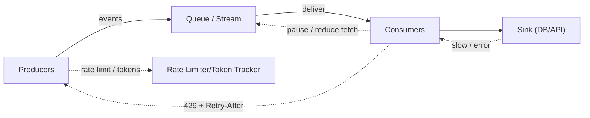
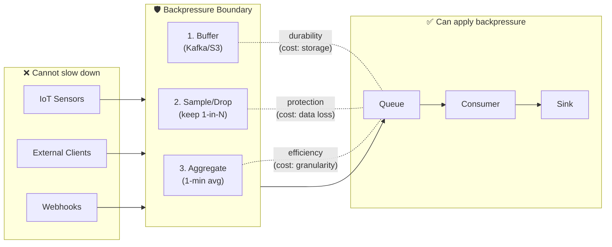
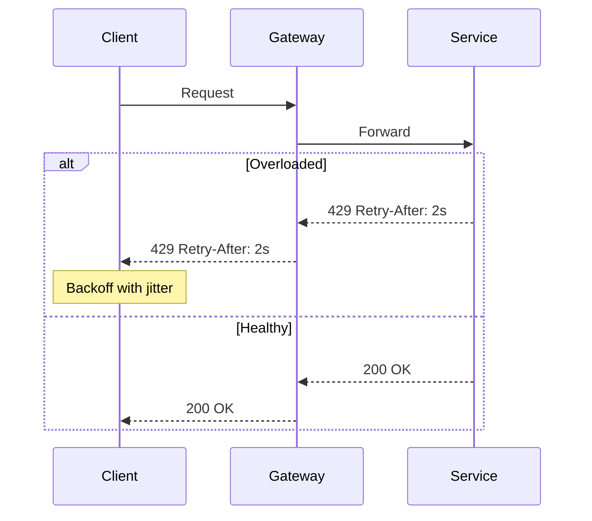
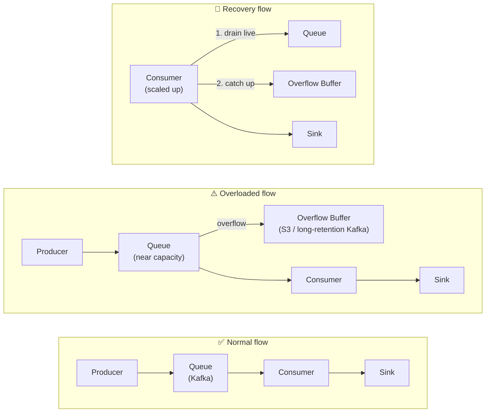
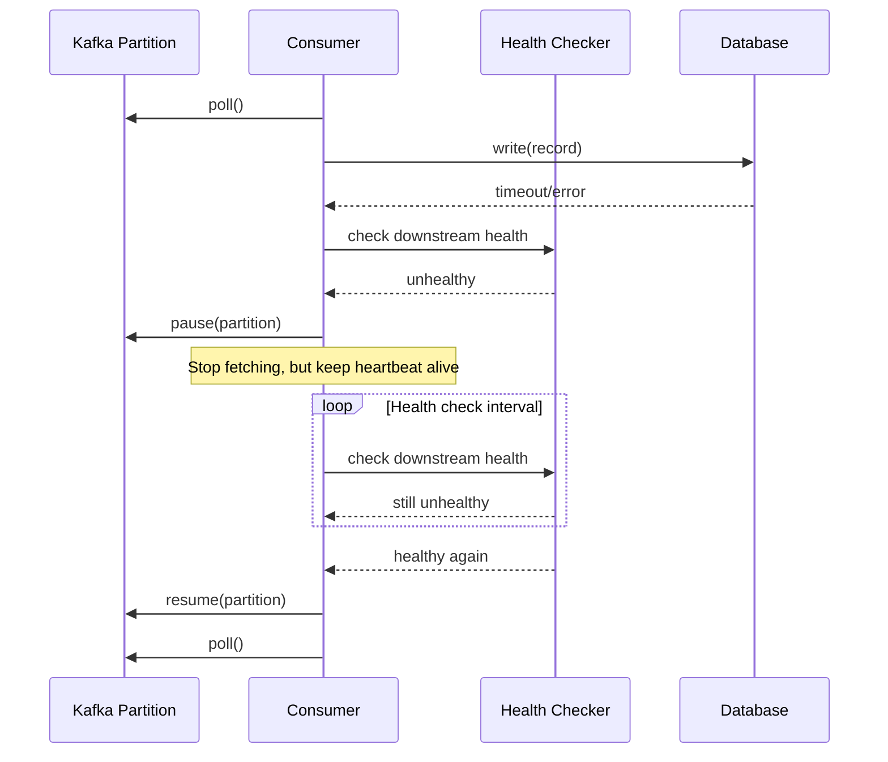
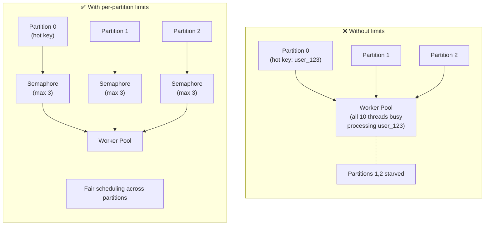
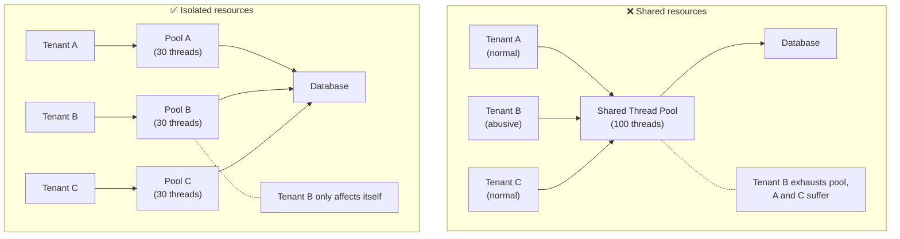
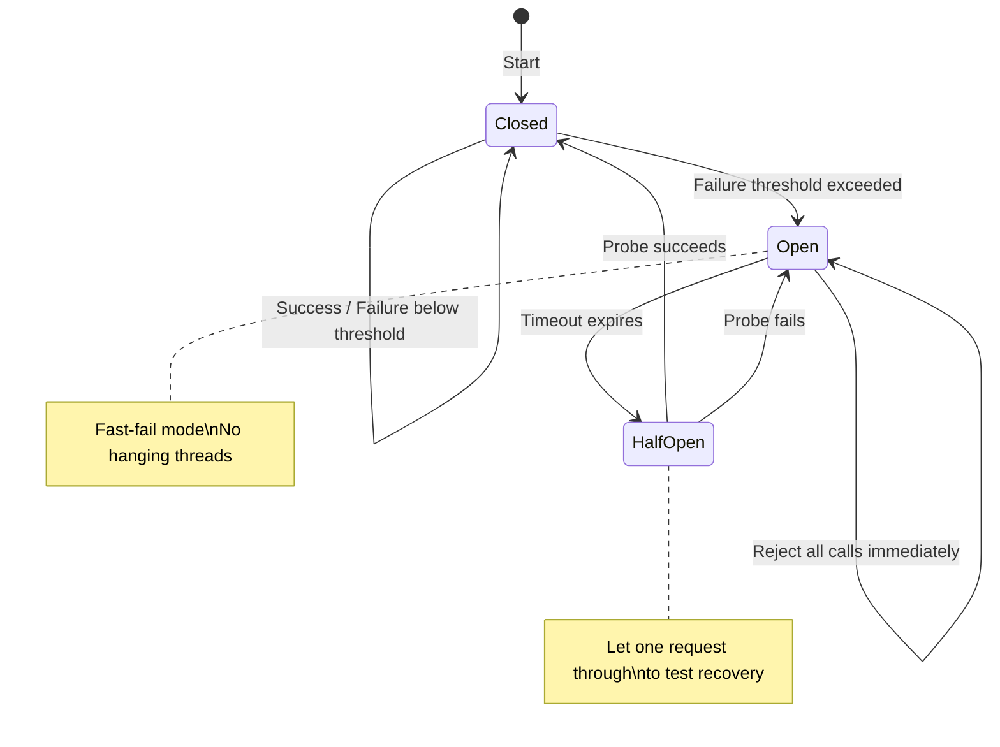
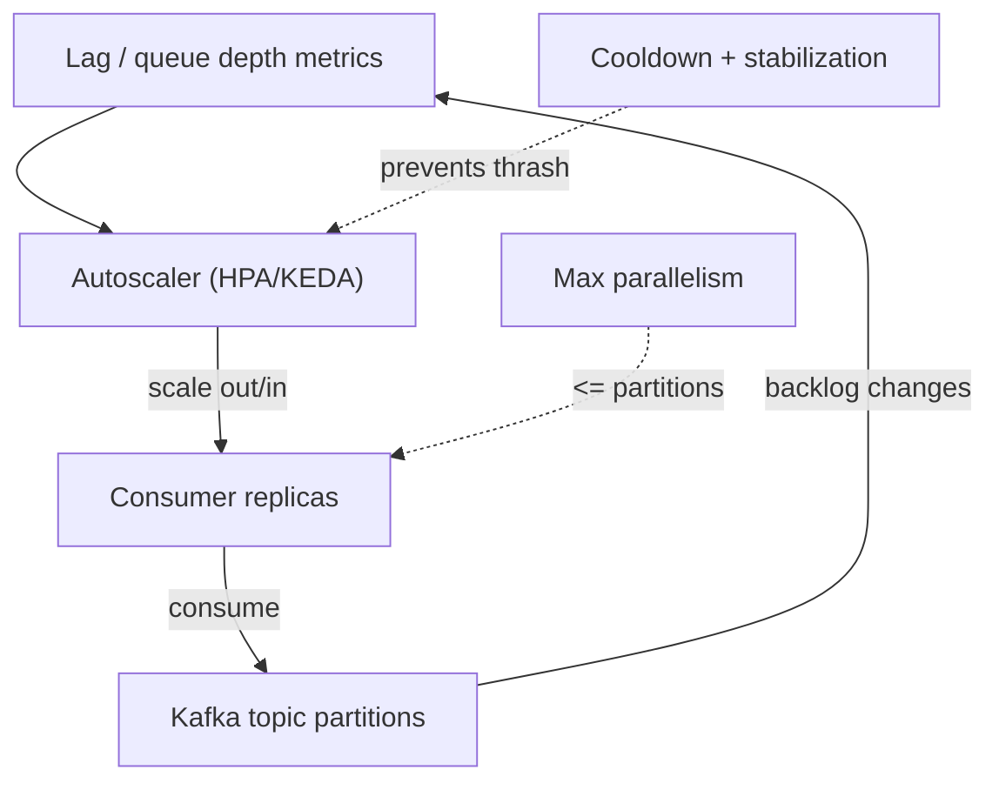

# Backpressure + consumer scaling strategies

Backpressure is the set of mechanisms that prevent a fast producer from overwhelming a slower consumer. At small scale, overload “just” causes higher latency. At large scale, overload becomes a cascading failure: retries amplify traffic, queues grow without bound, and downstream timeouts spread upstream.

The practical goal isn’t “never be overloaded.” The goal is:

* **Fail predictably under load** (bounded latency and bounded memory)
* **Protect critical dependencies** (databases, payment providers, stateful services)
* **Recover quickly after incidents** (controlled drain of backlog)
* **Preserve correctness** (avoid duplicate side effects, avoid data loss where durability is required)

Backpressure is also not a single component feature. It is an end-to-end property: if only the nearest hop throttles while upstream keeps pushing, you still melt the system—just one layer earlier.

***

### The feedback loop (what you are building)

In production, the effective design is a feedback system: downstream capacity signals propagate upstream, and upstream adapts by slowing, shedding, buffering, or rerouting.



For example in this diagram, if your DB is under stress, the signal sent back to up stream - consumers - in form of latency or error.

Now depend on how producer and consumer communicate with each other (async or sync) consumer will need to communicate the backpressure signal back to producer in different ways:

* In **async communication** (message queues, event streams), consumer can slow down fetching new messages from the queue or pause consumption entirely. This will cause messages to accumulate in the queue, signaling the producer to slow down if it monitors queue depth or lag.
* In **sync communication** (HTTP/gRPC calls), consumer can respond with explicit backpressure signals like HTTP 429 (Too Many Requests) along with `Retry-After` header.

#### Common pitfalls

The “signals” can be explicit (credits, request-n, retry-after) or implicit (queue depth, consumer lag). Either way, you’re building a control loop with a few common pitfalls:

* **Too slow to react** → backlog grows faster than you can drain it
  * If your metrics pipeline has 1-2 minute lag, and autoscaling takes another 3-5 minutes, you're 5+ minutes behind reality
  * During that window, queue depth explodes and recovery time compounds
  * Fix: use real-time signals (consumer lag, in-flight count), shorter polling intervals, and predictive scaling based on rate-of-change
* **Too aggressive** → oscillations (scale thrash, retry storms)
  * Scaling up immediately on a spike, then scaling down when lag clears, causes constant rebalances
  * Each Kafka rebalance pauses all consumers — you lose throughput and create more lag
  * Retry storms: if all clients retry at the same time after a 429, you get a synchronized spike that overwhelms the system again
  * Fix:
    * **Cooldown periods** — after scaling up/down, block further scaling actions for N minutes (e.g., 5 min) to let the system settle
    * **Stabilization windows** — only scale if the metric stays above/below threshold for a sustained period (e.g., 2-3 min), not just a momentary spike
    * **Jittered backoff** — add randomness to retry delays so clients don't all retry at the exact same moment (e.g., `delay = base * 2^attempt + random(0, base)`)
* **No end-to-end propagation** → local throttling only shifts the failure
  * If consumers slow down but producers keep publishing at full rate, you've just moved the problem to the queue
  * The queue grows, costs rise (storage, retention), and drain time increases
  * Eventually the queue hits limits (disk, retention policy) and you lose data anyway
  * Fix:
    * **Rate limit producers based on consumer lag** — expose lag metrics (e.g., Kafka consumer lag) to a control plane that dynamically adjusts producer quotas. Example: if lag > 1M messages, reduce producer rate by 50%; if lag > 5M, pause non-critical producers entirely. Can be implemented via a sidecar that checks lag before allowing publishes, or a central rate limiter that adjusts tokens based on lag.
    * **Admission control at the API boundary** — if producers are triggered by API calls (e.g., user uploads → events), reject or queue requests at the edge before they become messages. Return 429 with `Retry-After`, or use a bounded in-memory queue with overflow rejection. This stops the flood before it enters the system.

<details>

<summary><strong>Explicit backpressure signals explained</strong></summary>

| Signal      | Protocol/Context       | Who controls                       | Granularity            |
| ----------- | ---------------------- | ---------------------------------- | ---------------------- |
| Credits     | AMQP, custom protocols | Consumer grants to producer        | Per-connection/channel |
| Request-N   | Reactive Streams, gRPC | Subscriber requests from publisher | Per-stream             |
| Retry-After | HTTP                   | Server tells client                | Per-request            |

**Credits (credit-based flow control):** Consumer tells producer "I have N credits, send me at most N items." Producer blocks when credits hit 0; consumer grants more when ready.

**Request-N (Reactive Streams):** Same concept — subscriber explicitly requests N items via `request(n)`. Publisher must not push more than requested. Used in Project Reactor, RxJava, Akka Streams, gRPC.

**Retry-After (HTTP header):** Server responds with 429/503 and tells client exactly when to retry (seconds or timestamp). Client should wait that long before retrying.

</details>

#### Where it ends?

So the very natural question you may ask is: when does the backpressure stop propagating upstream? What if the very first producer in the chain/pipeline cannot slow down (like an IoT sensor)—what should we do?

**Backpressure stops where you decide to absorb or shed load.** In practice, _**there's always a boundary where upstream cannot be controlled**_—external clients, IoT devices, third-party webhooks, or physical sensors that emit data at a fixed rate regardless of downstream health. At this boundary, you have three options:



1. **Buffer with bounded storage** — accept all incoming data into a durable buffer (e.g., Kafka with long retention, S3, or a time-series DB) that can absorb hours or days of backlog. You're trading cost (storage) for durability. The system processes at its own pace and eventually catches up.
2. **Sample or drop** — if the data is high-volume and best-effort (telemetry, metrics, logs), drop or sample at the edge. Keep 1-in-N samples, or drop the oldest when the buffer fills. You lose some data, but you protect the system. This is often the right choice for observability data.
3. **Aggregate at the edge** — instead of forwarding every event, aggregate at the source. IoT gateways can compute 1-minute averages instead of sending per-second readings. This reduces volume by orders of magnitude while preserving signal.

The key insight: **you cannot infinitely propagate backpressure**. At some point, you must either store, drop, or transform the data. The architecture decision is _where_ that boundary lives and _which strategy_ you apply there.

### The core techniques (what actually works)

In large systems you typically combine multiple layers of protection.

#### 1) Admission control (protect the system boundary)

The **system boundary** is where traffic enters from sources you don't control. This isn't limited to public internet traffic—it's any point where "their world" meets "your world." For example, if Team A owns a service that receives requests from Team B's service, Team A's ingress is a system boundary even though both teams are internal. The key question is: _can you tell the upstream to slow down?_ If not, that's your boundary.

Normally your boundary be one of the following: API gateway, edge service or message producer.

At your ingress (API gateway, edge service, message producer), enforce limits:

* Per-tenant/per-user rate limits
* Concurrency limits (in-flight requests)
* Budget-based controls (e.g., per-customer QPS caps during incidents)

This is where HTTP **429 with `Retry-After`** is valuable: it tells clients exactly how to behave.



**Production lessons**:

* 429 only helps if clients honor it. For internal callers, bake retry discipline into shared client libraries.
* Always add **jitter** to backoff. Without jitter, retries synchronize and become a periodic load spike.
* Cap retries and set a deadline; otherwise, you turn overload into an infinite retry loop.

<details>

<summary><strong>What "cap retries and set a deadline" means</strong></summary>

**Cap retries (max retry count):** Limit how many times a client retries a failed request — typically 2-5 attempts max. Without a cap, a persistently failing request retries forever, consuming resources and amplifying load during outages.

**Set a deadline (total timeout budget):** Define a maximum wall-clock time for the entire operation, including all retries. Once the deadline passes, stop retrying immediately. Even with exponential backoff, retries can stack up. If your deadline is 30s and you've already spent 25s, there's no point starting another attempt.

**Why both matter together:**

* Retry cap alone doesn't account for slow failures (5 retries × 30s timeout = 2.5 min wasted)
* Deadline alone doesn't prevent rapid-fire retries if failures are fast
* Both together: bounded total time AND bounded attempts

</details>

#### 2) Bounded queues (control memory, preserve throughput)

Queues absorb bursts, but queues also **hide problems**. If you let them grow without bounds, you “stabilize” the system by moving the failure to memory/disk.

Choose your stance explicitly:

**Lossless (durability required):**

When data loss is unacceptable (billing events, orders, audit logs), backpressure upstream is mandatory. But queues have limits—memory for in-memory queues, disk space for persistent queues like Kafka/Pulsar. If upstream producers can't slow down (IoT devices, external webhooks), you need a relief valve before the queue overflows.

**Strategy: Tiered buffering with overflow to durable storage**

1. **Primary queue** (Kafka/Pulsar) handles normal load with bounded retention
2. **Overflow buffer** (S3, longer-retention Kafka topic, time-series DB) absorbs excess when primary queue approaches capacity
3. **Controlled drain** after scaling: consumers first empty the live queue, then catch up by processing the overflow buffer

Your system design should allow to switch between consuming from overload buffer and primary queue.



This trades **latency for durability**—data is delayed but never lost. In any case, this is only a temporarily relief, you still need to scale your system properly if the volume is organically high.

**Lossy (best-effort):**

If certain level of data lost is acceptable, you can drop or sample at the edges to protect core dependencies. Acceptable for telemetry, metrics, and logs where some data loss is tolerable.

For event streams (Kafka/Pulsar), “bounded” typically means:

* bounded consumer memory and processing queues
* bounded retries / DLQ for poison pills
* bounded time-in-queue to meet SLOs

#### 3) Consumer-side controls (don’t let the consumer self-DDoS)

Consumers should be able to slow down without crashing:

* **Pause/resume** consumption when downstream is unhealthy
* Use **concurrency limits** per partition (or per key) to prevent hot-key overload
* Apply **bulkheads**: isolate work by tenant, by dependency, or by priority
* Use **timeouts** and **circuit breakers** to avoid “hanging threads” that reduce capacity Let's dive deeper into each technique:

**Pause/Resume Consumption**

When your downstream dependency (database, API, cache) becomes unhealthy, continuing to consume messages at full speed makes things worse—you'll either exhaust connection pools, accumulate failed messages, or crash the consumer itself.



**Key implementation details:**

```python
class AdaptiveConsumer:
    def __init__(self, consumer, health_checker):
        self.consumer = consumer
        self.health_checker = health_checker
        self.paused_partitions = set()
    
    def consume_loop(self):
        while True:
            # Check health before polling
            if not self.health_checker.is_healthy():
                # Pause all assigned partitions
                assigned = self.consumer.assignment()
                self.consumer.pause(assigned)
                self.paused_partitions = assigned
                
                # Keep polling to maintain group membership (heartbeat)
                # but with no records returned
                self.consumer.poll(timeout_ms=1000)
                continue
            
            # Resume if we were paused
            if self.paused_partitions:
                self.consumer.resume(self.paused_partitions)
                self.paused_partitions = set()
            
            records = self.consumer.poll(timeout_ms=100)
            self.process(records)
```

**Why pause instead of just stopping poll()?** If you stop calling `poll()`, the consumer will be considered dead and trigger a rebalance. Pausing keeps the partition assignment stable while you wait for recovery.

**Concurrency Limits Per Partition / Per Key**

Without concurrency limits, a single hot key or partition can monopolize all worker threads, starving other work and creating head-of-line blocking.



**Implementation pattern:**

```python
from threading import Semaphore
from collections import defaultdict

class BoundedConcurrencyProcessor:
    def __init__(self, max_per_partition=5, max_per_key=2):
        self.partition_semaphores = defaultdict(lambda: Semaphore(max_per_partition))
        self.key_semaphores = defaultdict(lambda: Semaphore(max_per_key))
        self.executor = ThreadPoolExecutor(max_workers=50)
    
    def process_record(self, record):
        partition = record.partition
        key = record.key
        
        # Acquire both limits
        partition_sem = self.partition_semaphores[partition]
        key_sem = self.key_semaphores[key]
        
        if not partition_sem.acquire(blocking=False):
            # Partition is at capacity, pause and retry later
            return False
        
        if not key_sem.acquire(blocking=False):
            # Key is at capacity, release partition sem and retry
            partition_sem.release()
            return False
        
        try:
            self.executor.submit(self._do_work, record, partition_sem, key_sem)
            return True
        except:
            partition_sem.release()
            key_sem.release()
            raise
    
    def _do_work(self, record, partition_sem, key_sem):
        try:
            # Actual processing
            self.handle(record)
        finally:
            partition_sem.release()
            key_sem.release()
```

**When to use per-key limits:** When processing is stateful or order-dependent per key (e.g., user session updates, account balance changes). This prevents race conditions while allowing parallelism across different keys.

**Bulkheads: Isolation by Tenant, Dependency, or Priority**

The bulkhead pattern (named after ship compartments) isolates failures so one bad actor doesn't sink the entire system.



**Three dimensions of bulkheading:**

| Dimension         | Isolation Unit                              | Use Case                                      |
| ----------------- | ------------------------------------------- | --------------------------------------------- |
| **By tenant**     | Separate queues/pools per customer          | Multi-tenant SaaS, prevent noisy neighbor     |
| **By dependency** | Separate pools per downstream service       | Prevent slow DB from blocking cache calls     |
| **By priority**   | Separate lanes for critical vs. best-effort | Ensure payments process even if analytics lag |

**Priority-based bulkhead example:**

```python
class PriorityBulkhead:
    def __init__(self):
        # Critical work gets dedicated resources
        self.critical_pool = ThreadPoolExecutor(max_workers=20)
        self.critical_queue = queue.Queue(maxsize=100)
        
        # Normal work shares remaining capacity
        self.normal_pool = ThreadPoolExecutor(max_workers=30)
        self.normal_queue = queue.Queue(maxsize=500)
        
        # Best-effort work is shed first under pressure
        self.besteffort_pool = ThreadPoolExecutor(max_workers=10)
        self.besteffort_queue = queue.Queue(maxsize=1000)
    
    def submit(self, task, priority="normal"):
        if priority == "critical":
            # Never drop, block if necessary
            self.critical_queue.put(task)
            self.critical_pool.submit(self._run, self.critical_queue)
        elif priority == "normal":
            try:
                self.normal_queue.put_nowait(task)
                self.normal_pool.submit(self._run, self.normal_queue)
            except queue.Full:
                # Shed load: reject with backpressure signal
                raise BackpressureException("Normal queue full")
        else:
            try:
                self.besteffort_queue.put_nowait(task)
                self.besteffort_pool.submit(self._run, self.besteffort_queue)
            except queue.Full:
                # Silently drop best-effort work
                self.metrics.increment("besteffort_dropped")
```

**Timeouts and Circuit Breakers**

**The hanging thread problem:** Without timeouts, a single slow downstream call can block a thread indefinitely. If enough threads hang, your consumer stops making progress even though it's technically "running."



**Timeout strategy:**

```python
import time
from functools import wraps

def with_timeout(seconds):
    """Decorator that enforces a timeout on any function"""
    def decorator(func):
        @wraps(func)
        def wrapper(*args, **kwargs):
            import concurrent.futures
            with concurrent.futures.ThreadPoolExecutor(max_workers=1) as executor:
                future = executor.submit(func, *args, **kwargs)
                try:
                    return future.result(timeout=seconds)
                except concurrent.futures.TimeoutError:
                    raise TimeoutException(f"{func.__name__} exceeded {seconds}s")
        return wrapper
    return decorator

class CircuitBreaker:
    def __init__(self, failure_threshold=5, recovery_timeout=30):
        self.failure_threshold = failure_threshold
        self.recovery_timeout = recovery_timeout
        self.failure_count = 0
        self.last_failure_time = None
        self.state = "CLOSED"
    
    def call(self, func, *args, **kwargs):
        if self.state == "OPEN":
            if time.time() - self.last_failure_time > self.recovery_timeout:
                self.state = "HALF_OPEN"
            else:
                raise CircuitOpenException("Circuit is open, failing fast")
        
        try:
            result = func(*args, **kwargs)
            self._on_success()
            return result
        except Exception as e:
            self._on_failure()
            raise
    
    def _on_success(self):
        self.failure_count = 0
        self.state = "CLOSED"
    
    def _on_failure(self):
        self.failure_count += 1
        self.last_failure_time = time.time()
        if self.failure_count >= self.failure_threshold:
            self.state = "OPEN"
```

**Combining all techniques:**

```python
class ResilientConsumer:
    def __init__(self):
        self.db_circuit = CircuitBreaker(failure_threshold=5, recovery_timeout=30)
        self.api_circuit = CircuitBreaker(failure_threshold=3, recovery_timeout=60)
        self.bulkhead = PriorityBulkhead()
        self.partition_limits = defaultdict(lambda: Semaphore(10))
    
    @with_timeout(seconds=5)
    def process_record(self, record):
        partition_sem = self.partition_limits[record.partition]
        
        if not partition_sem.acquire(blocking=False):
            raise BackpressureException("Partition at capacity")
        
        try:
            priority = self.classify_priority(record)
            
            # Route through appropriate bulkhead
            self.bulkhead.submit(
                lambda: self._do_work(record),
                priority=priority
            )
        finally:
            partition_sem.release()
    
    def _do_work(self, record):
        # Database call with circuit breaker
        self.db_circuit.call(self.db.write, record)
        
        # External API call with separate circuit
        if record.needs_external_call:
            self.api_circuit.call(self.api.notify, record)
```

#### 4) Coordinated concurrency (reactive / credits)

Protocols like TCP windowing and reactive streams (request-n) formalize backpressure. The practical version in service-to-service systems is:

* downstream advertises a concurrency/throughput budget
* upstream never exceeds it

Even if you don’t use a reactive framework, you can implement the idea with:

* token buckets
* fixed-size work queues
* semaphore-based concurrency limits

***

### Kafka consumer scaling: what’s possible and what isn’t

Kafka is a common place to talk about backpressure because lag is visible and scaling is (seemingly) easy. The big constraint people forget:

* A consumer group’s max parallelism is bounded by **partition count**.

Scaling replicas above partitions doesn’t increase throughput; it just increases coordination and noise.



Practical guidance for scaling consumers:

* **Scale on lag and drain time**, not just CPU.
  * CPU can look fine while lag grows because downstream is bottlenecked.
  * A good mental model is “time to clear backlog”:
    * $\text{drain\_time} = \frac{\text{lag\}}{\text{effective\_consume\_rate\}}$
* Use **cooldowns** and **stabilization windows**.
  * Without them, you’ll scale up during a transient spike and scale down immediately after, causing frequent rebalances and throughput loss.
* Guardrails:
  * **max replicas <= partitions** (or <= partitions per topic if multiple topics)
    * Kafka assigns at most one consumer per partition within a consumer group. If you have 12 partitions and scale to 20 replicas, 8 replicas sit completely idle—wasting resources and increasing rebalance complexity.
    * For multi-topic consumers, the limit is the _minimum_ partition count across subscribed topics, or you need separate consumer groups per topic.
    * Before scaling consumers, consider whether you need to repartition the topic (requires planning—partition count increases are non-trivial in production).
  * **min replicas to survive a node failure**
    * If you run 1 replica and it dies, lag accumulates until a new pod schedules. Set `minReplicas >= 2` so at least one consumer is always processing.
    * For critical topics, consider `minReplicas = ceil(partitions / max_partitions_per_consumer)` to ensure full partition coverage even during rolling updates or node failures.
    * Factor in Kubernetes pod anti-affinity: if both replicas land on the same node, you haven't actually improved fault tolerance.
  * **cap per-pod concurrency to protect sinks**
    * Even if Kafka can feed records faster, your downstream (database, API, cache) has finite capacity. Without concurrency limits, a scaled-out consumer fleet can DDoS your own database.
    * Use semaphores or thread pool sizing: e.g., `max_concurrent_writes_per_pod = 10`. Total write pressure = `replicas × per_pod_concurrency`.
    * This cap also prevents a single consumer from monopolizing database connections during bursts, leaving headroom for other services.

Operational knobs that matter in real incidents:

* **Consumer processing time distribution (p95/p99), not just mean**
  * _Why it matters:_ Mean latency hides outliers. If your mean is 10ms but p99 is 2s, a small percentage of "slow" records can stall entire partitions and cause cascading lag.
  * _Impact:_ High p99 indicates either poison messages, hot keys, or downstream degradation. During incidents, p99 spikes often appear _before_ lag explodes—it's an early warning signal.
  * _Actionable:_ Alert on p95/p99 crossing thresholds (e.g., p99 > 500ms). Investigate the slow records—are they specific keys, tenants, or message types? Consider separate processing paths for heavy records.
* **Max in-flight per partition**
  * _Why it matters:_ Kafka consumers can fetch batches ahead of processing. If you allow too many in-flight records per partition, a slow downstream causes memory pressure and increases duplicate processing on rebalance (uncommitted records get re-delivered).
  * _Impact:_ Too high → memory bloat, longer rebalance recovery, more duplicates. Too low → underutilized throughput, artificially slow consumption even when downstream is healthy.
  * _Actionable:_ Start conservative (e.g., `max.poll.records=500`, in-flight limit = 1-2 batches). Tune based on observed memory usage and rebalance behavior. If you see OOMs or massive duplicate spikes after rebalances, reduce in-flight limits.
* **Commit strategy (at-least-once semantics require idempotency downstream)**
  * _Why it matters:_ Kafka's default is at-least-once delivery. If a consumer crashes after processing but before committing, the record will be re-delivered. Without idempotent writes downstream, you get duplicate side effects (double charges, duplicate rows, inflated metrics).
  * _Impact of different strategies:_
    * _Auto-commit (default):_ Simple but dangerous—commits happen on a timer regardless of processing success. Can lose data if processing fails after commit.
    * _Commit after processing:_ Safe for at-least-once, but requires idempotent sinks (upserts, deduplication keys, idempotency tokens).
    * _Transactional / exactly-once:_ Kafka supports EOS within Kafka (consume-transform-produce), but end-to-end exactly-once with external sinks requires distributed transactions or idempotency.
  * _Actionable:_ Default to manual commits after successful processing. Ensure downstream writes are idempotent (use unique keys, conditional writes, or dedup tables). For critical paths, add deduplication at the sink level.
* **DLQ strategy for poison messages (don't block the entire partition forever)**
  * _Why it matters:_ A single malformed or unparseable message can block an entire partition if your consumer keeps retrying and failing. Since Kafka guarantees ordering within a partition, you can't skip ahead—everything behind that message is stuck.
  * _Impact:_ Without a DLQ strategy, one bad record = unbounded lag growth on that partition = SLA breach. With aggressive retries, it also amplifies load on downstream systems.
  * _Actionable strategies:_
    * _Bounded retries + DLQ:_ After N failures (e.g., 3), send to a dead-letter topic and move on. Alert on DLQ growth.
    * _Error classification:_ Distinguish retryable errors (timeout, 503) from permanent failures (parse error, schema mismatch). Only retry transient errors.
    * _DLQ replay tooling:_ Build tooling to inspect, fix, and replay DLQ messages. A DLQ without replay capability becomes a data graveyard.
    * _Partition-level circuit breaker:_ If a partition hits too many errors, pause consumption on that partition while others continue.

***

### Backpressure must be end-to-end (or it doesn’t work)

A classic failure mode:

* Consumers slow because the database is degraded
* The queue grows, but producers keep publishing at full rate
* Lag explodes, costs rise, recovery time increases

To avoid this, propagate capacity signals upstream:

* If the consumer can’t keep up, **reduce production** (sampling, tenant throttling, delaying non-critical work).
* If production is user-driven (APIs), shed load at the boundary (429, queueing with a cap, degraded mode).

The important nuance: the “right” behavior differs by workload.

* For **critical, lossless workloads** (billing, ledger writes): accept slower processing and enforce strict backpressure.
* For **best-effort workloads** (analytics enrichment, cache warm): drop, sample, or delay to protect core systems.

***

### Retry discipline: stop turning overload into a multiplier

Retries are one of the top causes of overload amplification.

Rules that work well in practice:

* Retry only on clearly transient errors (timeouts, 429, some 5xx).
* Use exponential backoff with jitter.
* Add a request deadline and stop retrying after it.
* Separate budgets: per-request retry budget and global retry QPS budget.
* Prefer hedged requests only when you can afford duplication and have idempotency.

If you don’t control clients (public APIs), treat this as a probabilistic adversary: set tight server-side limits and keep responses deterministic.

***

### Buffer sizing: it’s not a magic number

Buffers buy you time. They also buy you recovery debt.

When choosing buffer sizes, pick a target:

* absorb a known burst window (deploy spike, cron surge)
* but keep worst-case drain time within an operationally acceptable bound

If the system can’t drain a full buffer within your incident tolerance window, the buffer is too large _or_ the steady-state capacity is too low.

***

### Observability and runbooks (what makes it operable)

Backpressure systems fail silently unless you instrument them.

Minimum metrics that help in incidents:

* Queue depth / Kafka lag per topic, partition, and tenant
* Age of oldest message (time-in-queue)
* Consumer throughput (records/sec) and processing latency (p95/p99)
* Error rates (429s, 5xx, timeouts) and retry rate
* Rebalance frequency (Kafka) and stalled partitions / hot keys

Operator questions your system should answer quickly:

* Is the bottleneck production, queueing, consumption, or the sink?
* Are we losing data or just delaying it?
* What’s the estimated drain time at current capacity?
* Which tenants/keys dominate load (hot partitions)?

***

### Design trade-offs (real-world choices)

* **Drop vs buffer**: dropping protects the system; buffering preserves durability but increases recovery time.
* **Scale out vs protect sinks**: scaling consumers without sink protection often just moves the bottleneck to the DB.
* **Fast autoscaling vs stability**: aggressive scaling can thrash clusters; use cooldowns and stabilization.
* **Local throttling vs end-to-end**: if you can’t slow producers, you haven’t really implemented backpressure.

***

### A short checklist

* Define which workloads are lossless vs best-effort.
* Enforce admission control at ingress (rate limits, concurrency caps).
* Make consumers able to pause, limit concurrency, and shed non-critical work.
* Scale consumers on lag/time-in-queue with stabilization windows.
* Cap retries; add backoff + jitter; implement retry budgets.
* Instrument lag, age, throughput, errors, and drain time.
* Write a runbook for “DB slow”, “lag spike”, and “poison message”.
