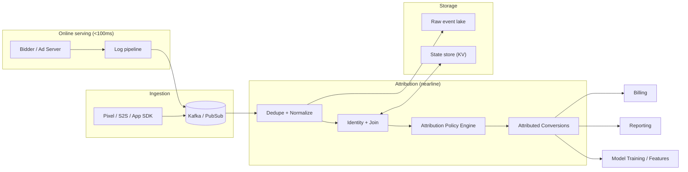
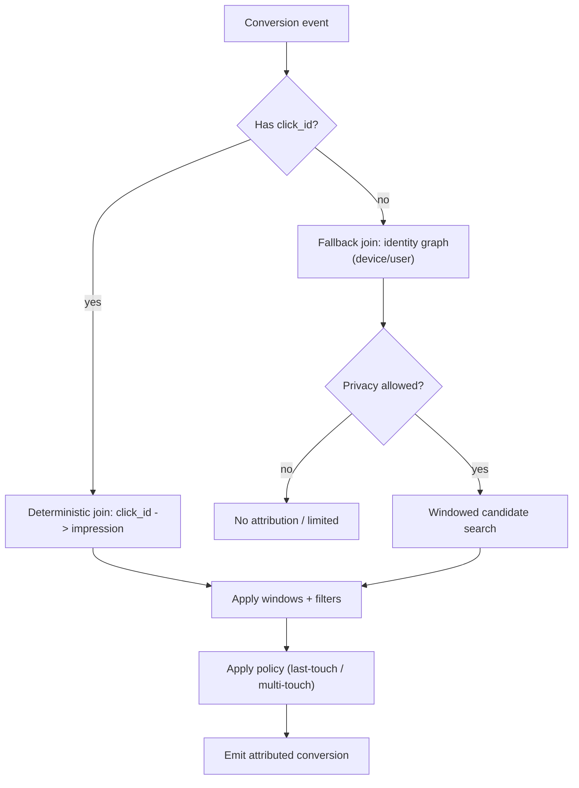
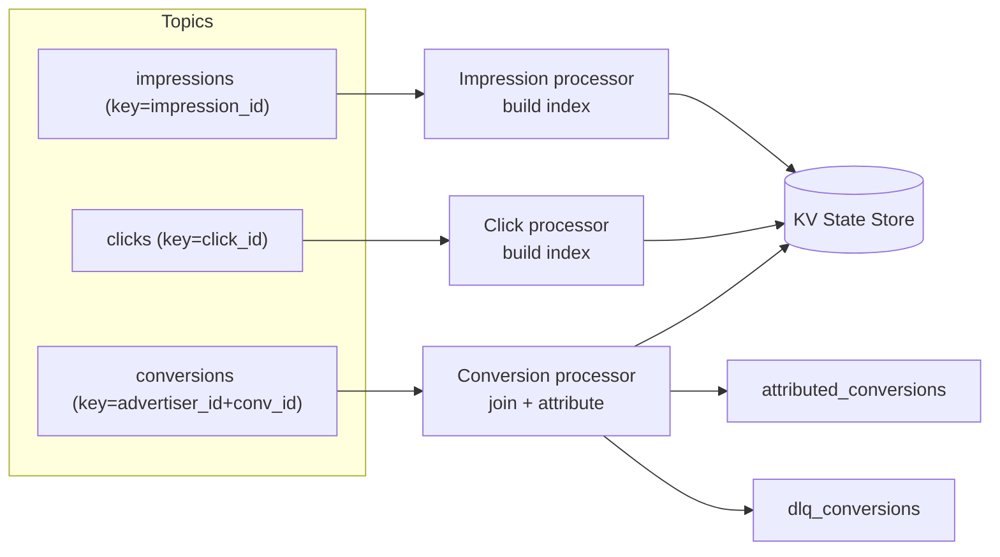
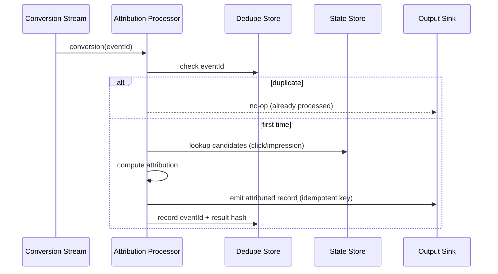
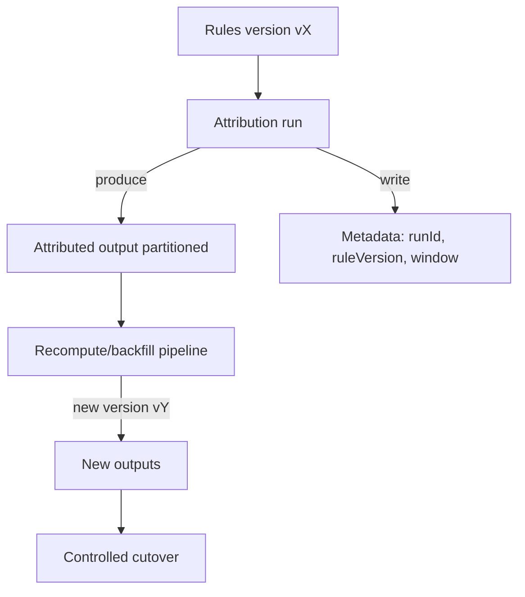
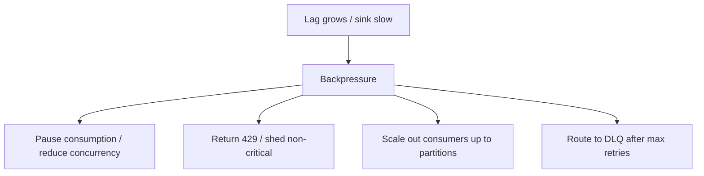

# An attribution engine in an RTB (real-time bidding) system

is the component that answers:

* “Which ad exposure(s) should get credit for this conversion?”
* “How much credit should each exposure get?”
* “What should we bill/optimize/learn from it?”
* It sits downstream of the RTB serving path (which decides and serves ads in <100ms) and turns impressions/clicks plus conversion events into attributed conversions that drive reporting, billing, and model training.

### Where it fits in RTB

Serving path (online): bid request → select ad → log impression/click → return response.

Measurement path (offline/nearline): ingest logs + conversion signals → dedupe/join → apply attribution rules → output “conversion credited to X” records.

### Inputs

* Ad events: impression logs, click logs (with identifiers like impression\_id, click\_id, request\_id, campaign/ad/creative IDs, timestamps, cost, device/user IDs).
* Conversion events: purchase/signup/etc. from advertiser (pixel/server-to-server/app SDK) with timestamp and some identifiers (often click IDs, or user/device IDs).
* Configuration: attribution window (e.g., 7-day click / 1-day view), model/rules, dedupe rules, fraud filters, privacy constraints.

### Core responsibilities

* Identity / join logic: match conversions to prior exposures using IDs (preferred: click/impression IDs) or probabilistic/device identity when allowed.
* Deduplication: handle retries, duplicates, and late events so you don’t double-count conversions.
* Attribution policy: last-touch, multi-touch, view-through vs click-through, fractional credit, etc.
* Windowing + lateness: accept late conversions within a window; keep state long enough to match.

### Outputs: attributed conversion records and rollups used for:

```
Billing (what to charge for)
```

Pacing/optimization (ROI/CPA signals) Reporting (dashboards) ML training (labels)

### Why it’s hard at scale (practical reality)

Massive volume (billions of events/day), skew (hot campaigns), and late/out-of-order conversions.

“Exactly once” is not realistic end-to-end → you need idempotency + stateful dedupe.

Privacy changes (loss of identifiers) force multiple matching modes and careful governance.

Attribution rules change over time → you need versioned logic and replay/backfill capability.

***

### Staff-level design: high-scale attribution engine

This section designs an attribution engine that is production-grade: scalable to billions of events/day, correct under retries and late arrivals, auditable for billing, and operable during incidents.

#### 1) Goals and requirements

**Functional requirements**

* Ingest impression, click, and conversion events from multiple sources (SDK, pixel, S2S).
* Deduplicate events and make processing idempotent.
* Join conversions to eligible exposures using a configurable hierarchy:
  * deterministic IDs first (click\_id / impression\_id)
  * then allowed identity-based join (device/user identity graph)
* Support attribution policies:
  * last-touch (click-first, view-through fallback)
  * multi-touch (linear / time-decay) if needed
  * configurable windows (e.g., 7d click, 1d view)
* Emit attributed conversion records and rollups for reporting/billing/ML.
* Support schema evolution and rule versioning.
* Support replay/backfill for corrected rules, late data, or audits.

**Non-functional requirements**

* Scale: multi-billion events/day; handle bursty traffic (campaign launches, pixel spikes).
* Latency: nearline attribution within a target window (e.g., p95 < 5s from conversion ingestion to attributed output).
* Correctness: no double-count billing; deterministic and reproducible attribution for audits.
* Availability: degrade gracefully under downstream outages; isolate failures.
* Cost: bounded state growth; predictable compute/disk usage.
* Privacy/compliance: minimize identifiers, enforce retention/consent, isolate advertiser data.

Key correctness stance (explicit):

* Ingestion and processing are **at-least-once**.
* The engine guarantees **exactly-once effects** for billing/reporting by using **idempotency + dedupe stores**.

***

#### 2) High-level architecture

We separate the system into:

1. **Online serving** (low-latency RTB path) that logs exposures
2. **Ingestion** (stream intake + normalization)
3. **Attribution processing** (stateful join + policy evaluation)
4. **Storage/serving** (raw event lake + state store + outputs)



Rationale / trade-offs:

* Keeping RTB serving path write-only (log) protects the <100ms latency budget.
* Stateful joining happens in nearline processors where we can manage retries, state, and backfills.
* A raw event lake enables replay and audit without depending on transient stream retention.

***

#### 3) Event model and IDs (the foundation)

You want deterministic joins whenever possible. This is the single biggest lever to reduce complexity.

Recommended identifiers:

* `impression_id`: unique per impression (generated in serving path)
* `click_id`: unique per click (generated on click redirect)
* `request_id`: RTB request correlation
* `conversion_id`: advertiser-provided id (or derived stable hash)
* `event_id`: unique ingestion id for dedupe (can equal impression\_id/click\_id/conv\_id when available)
* `occurred_at`, `received_at`: separate event time vs ingestion time

Rationale:

* A stable `event_id` enables idempotent processing across retries and replays.
* Separating event-time and ingest-time is required for correct windowing and late data handling.

***

#### 4) Joining strategy (deterministic-first)

We join conversions to exposures using a configurable hierarchy.



Rationale / trade-offs:

* Deterministic IDs (click\_id) are cheaper, more accurate, and easier to audit.
* Identity-based join is costly and politically/compliantly sensitive; gate it behind privacy policy.
* If you must use identity join, keep it as a secondary path and measure match rates.

***

#### 5) Stateful processing design

We model the system as 3 main streams:

* Impressions stream: records exposures and builds lookup indices
* Clicks stream: maps click\_id to impression\_id and adds click metadata
* Conversions stream: joins and attributes



State store contents (KV examples):

* `click_id -> {impression_id, clicked_at, campaign_id, ...}` (TTL = click window)
* `impression_id -> {shown_at, campaign_id, cost, ...}` (TTL = view window)
* `conversion_dedupe:{advertiser_id, conversion_id} -> {status, attributed_to, rule_version, ...}` (TTL = retention window)

Rationale:

* Partitioning by IDs keeps state access local and scalable.
* TTL bounds state size and prevents unbounded storage growth.

***

#### 6) Dedupe and idempotency (billing-grade correctness)

At scale you will see duplicates (retries, redelivery, replays). The safe approach:

* Maintain a **dedupe store** keyed by conversion uniqueness (`advertiser_id + conversion_id`) and/or ingestion `event_id`.
* Make output idempotent (e.g., `attribution_id = hash(rule_version, advertiser_id, conversion_id)`).



Rationale / trade-offs:

* This design avoids double-billing even under at-least-once delivery.
* Dedupe storage has cost; mitigate via TTL and by choosing the smallest safe key.
* “Exactly once” in the streaming engine is nice but not sufficient—downstream sinks (billing DB, warehouse) still need idempotent upserts.

***

#### 7) Windows, late data, and reconciliation

Conversions can arrive late; you need two related mechanisms:

* **Event-time windowing**: candidate exposures are limited by view/click windows.
* **Lateness budget**: accept and process late conversions up to a configured duration.

Operational stance:

* For reporting: late updates are acceptable (correct over time).
* For billing: choose a billing cutoff (e.g., T+N days) and treat later arrivals as adjustments/credits.

Rationale:

* Without a cutoff, you can’t close books.
* Without late handling, you undercount conversions and bias optimization.

***

#### 8) Policy engine (rules + versioning)

Policies change over time. Make rule evaluation:

* **pure/deterministic** (same inputs → same output)
* **versioned** (rule\_version attached to outputs)
* **replayable** (so you can backfill)



Rationale / trade-offs:

* Versioning enables audits and safe incremental rollout.
* Backfills are expensive; limit recompute scope by partitioning by advertiser/date and keeping good metadata.

***

#### 9) Scaling, partitioning, and hot-spot mitigation

Scaling levers:

* Partitions are the hard cap on parallelism for ordered per-key processing.
* Scale processors up to partitions.
* Use bounded per-partition concurrency to protect state stores and sinks.

Hotspots (common in ad-tech):

* a single advertiser floods conversions
* a campaign goes viral
* identity join creates skewed lookups

Mitigations:

* isolate large tenants into dedicated partitions/topics
* implement per-tenant rate limits and priority queues
* use pre-aggregation for metrics; keep attribution per conversion deterministic

***

#### 10) Backpressure and failure isolation

Backpressure is mandatory or you will self-amplify under incidents.



Practical approach:

* Separate critical and non-critical outputs (billing vs analytics).
* If analytics sink is down, keep billing path flowing (or vice versa depending on business).
* Use DLQs with runbooks for poison events and schema mismatches.

***

#### 11) Storage choices

You typically need three layers:

* **Stream retention** (Kafka/PubSub): short-to-medium retention for realtime.
* **Event lake** (object store + table format): long retention for audit/backfill.
* **State store** (KV): TTL-based indices for joins.

State store options:

* Embedded (RocksDB via Kafka Streams/Flink): best throughput, good locality, more ops around rebalances.
* Remote (Redis/Cassandra/Dynamo): simpler serving and elasticity, but can bottleneck at very high write QPS.

Trade-off rationale:

* For billions/day and heavy joins, embedded state often wins on throughput and cost.
* For simpler joins or heavy read serving, remote KV can be a better fit.

***

#### 12) Observability and operability

Minimum SLOs/metrics:

* end-to-end attribution latency (conversion received → attributed emitted)
* consumer lag and time-in-queue
* dedupe hit rate and dedupe store size/TTL efficacy
* join match rates by method (deterministic vs identity)
* DLQ volume/age and top failure reasons
* output sink error rate and idempotent upsert conflicts

Debuggability requirements:

* Every output record contains: `conversion_id`, `attribution_id`, `rule_version`, `matched_event_ids`, timestamps.
* One query path by `conversion_id` that reconstructs “why this was attributed” (critical for advertiser support and billing disputes).

***

#### 13) Security and privacy

Design choices that reduce risk:

* Prefer deterministic IDs over raw device identifiers.
* Encrypt sensitive identifiers at rest; minimize propagation of raw IDs.
* Enforce retention via TTL and lake policies.
* Make identity join explicitly policy-gated and auditable.

***

#### Summary of key decisions

* **At-least-once processing** with **idempotent outputs** for billing-grade correctness.
* **Deterministic join first** (click\_id/impression\_id), identity join only as fallback and policy-gated.
* **Stateful stream processing** with TTL-bounded KV indices.
* **Rule versioning + backfill pipeline** to handle policy changes and late data.
* **Backpressure + DLQ isolation** to stay stable during outages.
