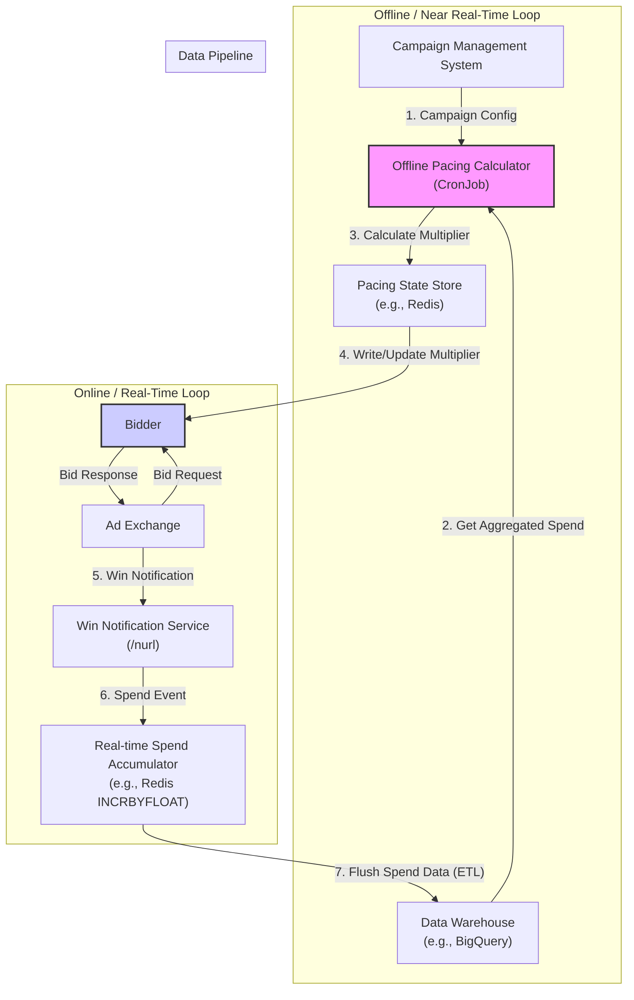

# Campaign Pacing System Design

This document outlines the design for a campaign pacing system for a Demand-Side Platform (DSP) operating in a Real-Time Bidding (RTB) environment.

### 1. Overview

#### 1.1. What is Campaign Pacing?

In digital advertising, a campaign is typically configured with a specific budget to be spent over a defined period (a "flight"). **Campaign Pacing** is the process of controlling the rate of spend to ensure the budget is distributed effectively throughout the campaign's flight.

Without a pacing system, a campaign with a desirable audience might exhaust its entire budget in the first few hours of its flight, missing out on valuable impression opportunities later on. Conversely, a campaign might fail to spend its budget, resulting in under-delivery.

The primary goal of a pacing system is to spend the budget as close to the plan as possible, avoiding both significant over-delivery and under-delivery.

#### 1.2. Why is it Important?

* **Budget Fulfillment:** Ensures the advertiser's budget is spent completely and within the specified timeframe, maximizing their reach.
* **Performance Optimization:** Smooth spending allows bidding algorithms to learn and optimize towards performance goals (like CPA or CTR) over the full duration of the campaign.
* **Opportunity Access:** Prevents budget exhaustion early in a day or flight, ensuring access to valuable inventory across all time periods.
* **Advertiser Trust:** Predictable and controlled delivery builds confidence and trust with advertisers.

### 2. Requirements

#### 2.1. Functional Requirements

* **FR1: Budget Distribution:** The system must be able to distribute a campaign's budget over its flight duration according to a specified strategy.
* **FR2: Pacing Strategies:** Must support at least two primary strategies:
  * **Even/Smooth:** Distribute the budget as evenly as possible over the flight duration.
  * **ASAP (As Soon As Possible):** Spend the budget as quickly as possible without exceeding it.
* **FR3: Real-time Updates:** Must handle mid-flight changes to a campaign's total budget, daily caps, or end dates.
* **FR4: Spend Control:** Enforce daily and/or hourly spending caps.
* **FR5: Bidder Integration:** Provide a real-time signal to the bidder to influence its decision to bid or the price of the bid.
* **FR6: Status Reporting:** Provide a near real-time view of a campaign's pacing status (e.g., on-track, ahead, behind) and current spend.

#### 2.2. Non-Functional Requirements

* **NFR1: Low Latency:** The real-time pacing decision logic must add minimal overhead to the bid processing pipeline. The p99 latency for a pacing decision should be **< 1ms**.
* **NFR2: High Availability:** The system must be highly available (99.99%). Failure of the pacing system should not cause catastrophic overspending or a complete halt in bidding. A fail-safe mechanism must be in place.
* **NFR3: High Scalability:** The system must scale to handle the full volume of bid requests processed by the DSP (potentially millions of QPS).
* **NFR4: Accuracy & Consistency:** While 100% accuracy is impossible due to the nature of RTB, the system should aim to keep final campaign delivery within a small tolerance (e.g., +/- 2%) of the target budget. Eventual consistency is acceptable for spend aggregation.
* **NFR5: Fault Tolerance:** The system must be resilient to the failure of individual components without bringing down the entire service.

### 3. High-Level Design

We will adopt a **hybrid architecture** that separates the computationally intensive planning from the low-latency, real-time decision-making. This is a common and effective pattern for high-performance RTB systems.

The system consists of two main loops:

1. **The Offline/Planning Loop (Near Real-Time):** This component runs periodically (e.g., every 1-5 minutes). It calculates an ideal spending plan and a "pacing multiplier" for each active campaign based on its progress.
2. **The Online/Execution Loop (Real-Time):** This component is integrated directly into the bidder. For every bid opportunity, it uses the pre-calculated pacing multiplier to make an instantaneous decision on whether and how to bid.



**Workflow:**

1. The **Campaign Management System** provides campaign budget, flight dates, and pacing settings.
2. The **Offline Pacing Calculator** runs every few minutes. It fetches campaign settings and aggregated spend data from the **Data Warehouse**.
3. It calculates the `ideal_spend` vs. `actual_spend` and determines a `pacing_multiplier` for each campaign.
4. This `pacing_multiplier` is written to a low-latency **Pacing State Store** (e.g., Redis).
5. The **Bidder** maintains an in-memory cache of the `pacing_multiplier` for active campaigns, updated asynchronously from the Pacing State Store.
6. On a bid request, the Bidder's **Online Pacing Gate** uses the multiplier to adjust the bid price.
7. If the Bidder wins an auction, it sends a win notification to the **Real-time Spend Accumulator**.
8. The Spend Accumulator's data is periodically flushed to the Data Warehouse, completing the loop.

### 4. Detailed Design

#### 4.1. Data Models

* **`CampaignPacingConfig`**: Stored in a primary database (e.g., Postgres, MySQL). Managed by the Campaign API.
  * `campaign_id`: string (Primary Key)
  * `total_budget`: decimal
  * `daily_budget_cap`: decimal (optional)
  * `start_date`: timestamp
  * `end_date`: timestamp
  * `pacing_type`: enum (`EVEN`, `ASAP`)
* **`PacingState`**: Stored in a low-latency Key-Value store (e.g., Redis, DynamoDB).
  * Key: `pacing:state:{campaign_id}`
  * Value (Hash):
    * `pacing_multiplier`: float
    * `last_updated`: timestamp
* **`SpendAccumulator`**: Implemented in a distributed in-memory store like Redis.
  * Key: `spend:minute:{campaign_id}:{YYYYMMDDHHMM}`
  * Value: decimal (incremented via `INCRBYFLOAT`)

#### 4.2. Offline Pacing Calculator

This is a scheduled service (e.g., a Kubernetes CronJob) that runs every N minutes.

**Logic:**

1. **Fetch Data:** Get all active campaigns and their `CampaignPacingConfig`.
2.  **Calculate Ideal Spend:** For each campaign with `pacing_type = EVEN`:

    * `total_flight_seconds` = `end_date` - `start_date`
    * `elapsed_seconds` = `now()` - `start_date`
    * `ideal_spend_to_date` = (`total_budget` / `total_flight_seconds`) \* `elapsed_seconds`

    > **Rationale:** A linear projection is a simple and robust starting point. Future iterations can use historical delivery data to create a more sophisticated projection that accounts for daily and weekly traffic fluctuations.
3. **Get Actual Spend:** Fetch the total `actual_spend_to_date` for the campaign from the Data Warehouse (which contains aggregated data from the spend accumulators).
4.  **Calculate Pacing Multiplier:** This is the core control logic. We will use a **PID Controller** for its stability and responsiveness.

    * **Error (`e`):** `ideal_spend_to_date - actual_spend_to_date`
    * **Proportional (`P`):** `Kp * e`. Reacts to the current error. A large underspend (positive error) will increase the multiplier.
    * **Integral (`I`):** `Ki * integral(e)`. Corrects for past, accumulated error. If we have been consistently underspending, this term will grow to push the multiplier up.
    * **Derivative (`D`):** `Kd * derivative(e)`. Predicts future error. If underspending is rapidly decreasing, this term will dampen the response to prevent overshooting.
    * **`pacing_multiplier` = 1.0 + P + I + D** (clamped to a reasonable range, e.g., \[0.0, 5.0])

    **Conceptual Diagram of PID Control:**

    ```
      Spend ($)
        ^
        |
        | . . . . . . . . . . . . . . . . . . . . . . . . . . . . . . Ideal Spend (Linear Target)
        | Overspend (Multiplier < 1.0)
        |                     /""""""""""\
        |                    /            \
        |                   /              \
        | . . . . . . . . ./ . . . . . . . .\ . . . . . . . . . . .
        |                 /                  \
        |                /                    \
        |               /                      \ Actual Spend (Controlled by PID)
        | Underspend   /
        | (Multiplier > 1.0)
        +-------------------------------------------------------------------> Time
    ```

    > **Rationale (PID vs. Simple Ratio):** A simpler approach like `multiplier = ideal / actual` is prone to oscillation. For example, if we are overspending (`actual > ideal`), the multiplier becomes < 1.0, causing spend to slow. We may then slow down too much, causing an underspend, which pushes the multiplier > 1.0, and so on. A PID controller is a standard industrial control mechanism designed to create smooth, stable responses and is well-suited for this problem.
5. **Update State:** Write the calculated `pacing_multiplier` to the `PacingState` store in Redis for each campaign.

#### 4.3. Online Pacing Gate (in Bidder)

This logic must be executed for every eligible bid opportunity.

**Logic:**

1. **Get Multiplier:** Retrieve the `pacing_multiplier` for the campaign from the local in-memory cache. This cache is refreshed asynchronously from the `PacingState` store. If a campaign is not in the cache (a new campaign), we can default to a multiplier of 1.0 or skip bidding until the cache is populated.
2.  **Apply Pacing:** We will use **Bid Modulation**.

    * The bidding strategy component calculates a `base_bid_price`.
    * `adjusted_bid_price` = `base_bid_price` \* `pacing_multiplier`

    > **Rationale (Bid Modulation vs. Throttling):** A simple throttling approach (`if rand() > multiplier, drop bid`) is inefficient. It discards opportunities without considering their value. Bid Modulation is more intelligent. When underspending (`multiplier > 1.0`), we bid more aggressively, increasing our win rate, especially on more competitive inventory. When overspending (`multiplier < 1.0`), we lower our bids, saving budget by winning cheaper impressions while still competing for inventory. This better aligns pacing with performance optimization goals.
3. **Fail-safe:** If the Pacing State store is unavailable and the in-memory cache is stale for more than a configured threshold (e.g., 15 minutes), the pacing gate should apply a default conservative multiplier (e.g., 0.9) or use daily caps to prevent catastrophic overspend. An alert must be fired.

#### 4.4. Real-time Spend Accumulation

* **Mechanism:** When the bidder receives a win notification (from the exchange's `/nurl` call), the win-serving component will fire an asynchronous event containing `campaign_id` and `win_price`.
* **Service:** A lightweight service consumes these events and executes an `INCRBYFLOAT` command in Redis on a key that includes the campaign ID and a time bucket (e.g., the current minute).
*   **Data Pipeline:** A separate batch or streaming job (e.g., Spark, Flink) runs periodically to read these minute-level buckets from Redis, aggregate them, and persist the results to the main Data Warehouse for use by the Offline Pacing Calculator and for long-term analytics.

    > **Rationale (Eventual Consistency):** We trade strict, real-time transactional consistency for performance and scalability. A small amount of data loss from the spend accumulator (e.g., due to a Redis node failure before data is persisted) is acceptable. The financial impact is minimal, and the Offline Calculator will self-correct in its next run based on the more accurate data from the warehouse. This avoids making the high-throughput win notification path dependent on a slow, transactional database.

### 5. Integration with RTB System

* **Campaign Management System:** The pacing system subscribes to a message queue (e.g., Kafka, SQS) for `CampaignCreated` or `CampaignUpdated` events to invalidate its configuration caches and trigger recalculations.
* **Bidder:** The integration point is the **Online Pacing Gate**. It is a mandatory step in the bidding logic waterfall, applied after campaign targeting but before the final bid price is sent to the exchange.
* **Reporting & Analytics:** The Data Warehouse is the source of truth for spend. The pacing system enriches this data with pacing-specific metrics (e.g., ideal vs. actual spend over time) for visualization in monitoring dashboards.
* **Monitoring & Alerting:**
  * Dashboards will visualize `pacing_ratio` (`actual/ideal`) per campaign.
  * Alerts will be configured for:
    * Campaigns deviating significantly from their ideal spend curve (e.g., `pacing_ratio` < 0.8 or > 1.2 for an extended period).
    * Failure of the Offline Calculator job.
    * High latency or errors from the Pacing State store.
    * Activation of the fail-safe mechanism.

### 6. Future Improvements

* **ML-based Traffic Forecasting:** Replace the linear spend projection with an ML model that predicts available impression volume based on time-of-day, day-of-week, audience segments, and other factors. This will create a more accurate `ideal_spend` curve.
* **Performance-Aware Pacing:** Evolve the system to pace towards a combination of budget delivery and a performance goal (e.g., CPA, CPC). The `pacing_multiplier` could be adjusted not just by budget deviation, but also by how far the campaign is from its performance KPI.
* **Global & Portfolio Pacing:** Introduce a level of pacing above the individual campaign to manage a single advertiser's total budget across multiple campaigns, shifting budget dynamically to the best-performing ones.
