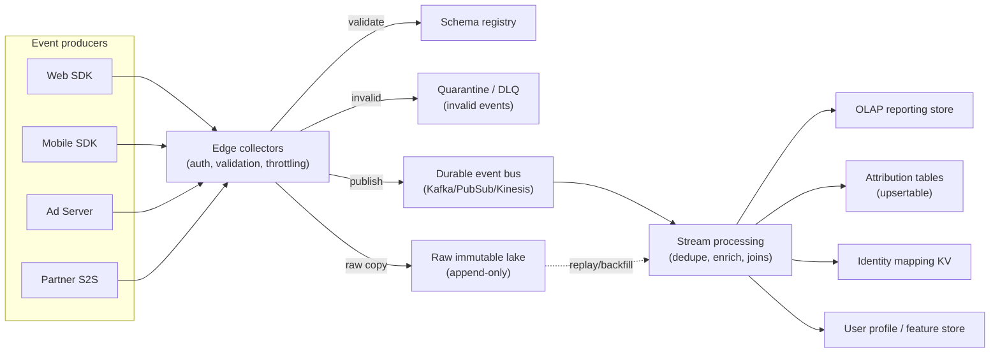
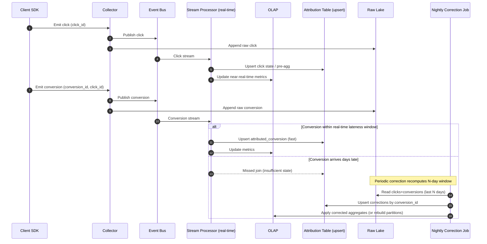
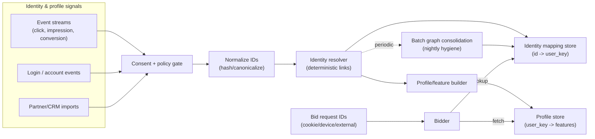

# Click-Log Stream Processing for an Ads Platform

**Audience**: engineers (backend, data, infra) unfamiliar with our ads data stack.

### 1) Problem Summary

An ads platform needs to collect high-volume user interaction events (ad request, ad served, impression, viewable, click, landing page view, product view, add-to-cart, purchase/conversion) and turn them into:

* **Near-real-time reporting** (spend, impressions, clicks, CTR, viewability, conversions)
* **Attribution and joins** across event streams (e.g., conversion ↔ click ↔ impression ↔ campaign)
* **Late event handling** (e.g., conversion days after click)
* **User identity & profile enrichment** to support a downstream identity system used for bidding

The system must be correct under duplicates, out-of-order delivery, retries, and partial data. It must also be safe: PII handling, consent, retention, deletion.

***

### 2) Goals and Non-Goals

#### Goals

1. **Durable event collection** with replay capability.
2. **Consistent event model** (schema, IDs, timestamps) to support joins.
3. **Streaming computation** for fast metrics and quick attribution.
4. **Correctness with late/out-of-order events**, with explicit latency-vs-cost trade-offs.
5. **Identity/profile pipeline** to build an identity graph and serve it to bidding.
6. **Operational clarity**: monitoring, backfills, data quality, and incident modes.

#### Non-goals

* Designing a complete ad server / auction system.
* Advanced ML feature engineering (we will define interfaces and storage, not full modeling).
* Cross-device probabilistic identity modeling details beyond basic interfaces.

***

### 3) Requirements

#### Functional

* Ingest events from web, mobile, server-to-server (S2S) partners.
* Support event types:
  * **Ad lifecycle**: `ad_request`, `ad_response`, `ad_serve`
  * **Engagement**: `impression`, `viewable_impression`, `click`
  * **Post-click**: `landing_view`, `product_view`, `add_to_cart`
  * **Conversion**: `purchase`, `signup`, `subscription`, etc.
* Support joins for:
  * campaign reporting (events ↔ ad/campaign metadata)
  * attribution (conversion ↔ click ↔ impression)
  * identity enrichment (events ↔ user keys)
* Handle late conversions up to **N days** (typically 7–30 days depending on product).
* Provide data outputs:
  * OLAP tables for reporting
  * attribution tables (incremental updates)
  * identity graph/profile store (low-latency lookup)

#### Non-functional (targets, adjust per business)

* **Scale**: millions of events/sec peak (web + app + partners).
* **Latency**:
  * near-real-time dashboards: p50 < 1–2 minutes, p99 < 5–10 minutes
  * identity profile availability: < 5–30 minutes for most signals (some S2S may be hours)
* **Correctness**:
  * dedupe via `event_id` and idempotent writes
  * event-time processing with watermarks
* **Availability**: collectors and bus must tolerate regional issues.
* **Privacy/compliance**: consent, minimization, encryption, retention, delete requests.

***

### 4) High-Level Architecture

At a high level we separate concerns into: collection → durable log → processing → storage/serving.

1. **Client SDK / Server Emitters**
2. **Edge Collectors** (HTTP ingest, validation, throttling)
3. **Durable Event Bus** (Kafka/PubSub/Kinesis)
4. **Raw Storage (Data Lake)** (immutable append; source-of-truth)
5. **Stream Processing** (Flink/Spark/Beam) for:
   * cleaning/dedup
   * sessionization
   * joins + attribution
   * enrichment
6. **Serving Stores**
   * OLAP for reporting (Druid/ClickHouse/BigQuery/Snowflake)
   * KV/feature store for identity/profile (Cassandra/Bigtable/Redis + persistence)
   * optional search/index for debugging (OpenSearch)

#### 4.1 Architecture diagram

Key principle: **The data lake is the truth.** Streaming produces fast results; batch reprocessing fixes long-tail late events and logic changes.

***

### 5) Event Model (The Contract That Makes Joins Possible)

#### 5.1 Core envelope

All events share a common envelope. This is critical: without consistent IDs and timestamps, “joins” become guesswork.

Required fields:

* `event_id` (UUID/ULID): globally unique; used for dedupe.
* `event_type`: one of the canonical types.
* `occurred_at`: event-time timestamp from the source.
* `received_at`: ingestion-time timestamp at collector.
* `source`: `web_sdk|mobile_sdk|ad_server|partner_s2s|pixel|offline_import`.
* `schema_version`: integer.

Identifiers (not all present for all sources):

* `request_id`: assigned by ad server for an ad auction/request.
* `impression_id`: assigned when an ad is rendered/served.
* `click_id`: assigned on click.
* `conversion_id`: assigned by conversion endpoint (or derived from partner reference).

User keys:

* `user_key`: our primary, stable internal key if known (post-identity resolution).
* `device_id` / `cookie_id`: platform-specific anonymous IDs.
* `external_ids`: hashed emails, partner IDs, mobile ad IDs (consent-gated).

Ad metadata keys:

* `campaign_id`, `ad_group_id`, `creative_id`, `advertiser_id`, `publisher_id`.

#### 5.2 Why we need multiple IDs

In practice, different joins prefer different keys:

* `request_id` is best for joining ad server logs to downstream render/impression.
* `impression_id` is best for viewability and for click linkage.
* `click_id` is best for deterministic conversion attribution.
* `user_key` (or fallback `cookie_id/device_id`) is a last-resort join for missing IDs.

Design decision: **we generate and propagate IDs as early as possible**, ideally at ad server time, then carry them through client events and redirects.

#### 5.3 Event-time vs ingest-time

* We compute metrics in **event-time** (what the user did when), not ingest-time.
* We still record `received_at` to debug delays and to build SLAs.

Trade-off: event-time processing is more complex (watermarks/state), but it is necessary for correctness under retries and latency.

***

### 6) Collection & Ingestion

#### 6.1 Client SDKs (web/mobile)

Responsibilities:

* Generate `event_id`.
* Attach `occurred_at` with device clock.
* Capture context: user agent, app version, page URL/referrer (sanitized), placement.
* Buffer + retry with exponential backoff.

Important constraints:

* Mobile/web devices can be offline → events can arrive hours/days late.
* Device clocks can be wrong → we must tolerate skew.

Mitigation:

* Clamp unreasonable `occurred_at` (e.g., > 24h in future) and flag.
* Always store both `occurred_at` and `received_at`.

#### 6.2 Collector service (edge ingest)

Collector responsibilities:

* Authenticate/authorize sources (API keys, mTLS for partners).
* Validate schemas (schema registry), reject/park invalid events.
* Rate-limit per customer/source to protect the pipeline.
* Enrich with ingest metadata: geo (coarse), edge POP, headers (redacted).
* Publish to the event bus.

Reliability:

* Stateless collectors behind a load balancer.
* Multi-region active-active if needed; a single logical bus topic per event type.

#### 6.3 Event bus

Use Kafka-like semantics:

* Topics per domain: `ads_request`, `ads_delivery`, `ads_engagement`, `ads_conversion`, `user_profile`.
* Partition by a stable join key:
  * Preferred: `impression_id` for engagement, `click_id` for conversion.
  * Fallback: `request_id`, else `cookie_id/device_id`.

Trade-off:

* Partitioning by join key improves local state joins.
* But hotspots can occur (e.g., huge publishers). We mitigate with:
  * composite keys (publisher\_id + impression\_id)
  * adaptive partitioning
  * dedicated topics for extreme sources

#### 6.4 Raw immutable storage (data lake)

We write all accepted events to immutable storage in near real time (hourly/daily partitions), e.g.:

* `s3://lake/events/event_type=click/date=YYYY-MM-DD/hour=HH/...`

Why:

* Replay for backfills, logic changes, audit.
* Separation of collection reliability from downstream compute.

***

### 7) Processing: Cleaning, Dedupe, Enrichment

This is the “bronze → silver → gold” concept:

* **Bronze**: raw events (as received).
* **Silver**: validated, normalized, deduped, enriched with stable keys.
* **Gold**: aggregated metrics, attribution outputs, identity outputs.

#### 7.1 Dedupe strategy

We dedupe primarily on `event_id`.

Implementation options:

1. **Streaming dedupe with TTL state** (Flink keyed state):
   * Keep a TTL cache of `event_id` for e.g. 7 days.
   * Pros: prevents duplicates propagating.
   * Cons: state size can be large at high throughput.
2. **Idempotent sink writes** (upserts by primary key):
   * Store events in tables keyed by `event_id` (or `(event_type,event_id)`).
   * Pros: simpler; state moves to storage engine.
   * Cons: higher write amplification; still need careful exactly-once.

Recommended: **combine both**

* streaming dedupe for short-window duplicates (retries)
* idempotent sinks as a safety net

#### 7.2 Enrichment

Enrichment sources:

* Campaign metadata (dimension tables)
* Publisher/app/site metadata
* Identity resolution outputs (user\_key mapping)

Enrichment must be versioned and time-aware:

* Campaign settings change; we need “as-of” logic for historical correctness.

***

### 8) Joins and Attribution

#### 8.1 What “join” means here

We need to connect events that are emitted by different systems at different times:

* Ad server: request/response/serve
* Client: impression/viewability/click
* Post-click: product view/cart/purchase

We support multiple join pathways (best-effort, deterministic-first):

1. Conversion joins to click by `click_id`.
2. Click joins to impression by `impression_id`.
3. Impression joins to ad request by `request_id`.
4. Fallback: join by user keys + time proximity window.

#### 8.2 Streaming join pattern

We implement joins in a stateful stream processor:

* Keyed by the “primary join ID” (e.g., `click_id` for conversion processing).
* Maintain state for the earlier events (click, impression) long enough to match late arrivals.

For example (conversion attribution):

* Stream A: `click` keyed by `click_id`
* Stream B: `conversion` keyed by `click_id`
* Join condition: same `click_id`
* Output: `attributed_conversion` record + metrics updates

#### 8.3 Handling late events (core requirement)

**Late event** means `occurred_at` is earlier than the current watermark.

We need a strategy that balances:

* correctness (include conversions after days)
* cost (state retention and reprocessing)
* latency (dashboards should update quickly)

We use a **two-tier approach**:

**Tier 1: Real-time attribution (fast, bounded state)**

* Watermark: e.g. 30–120 minutes depending on source.
* Allowed lateness for “real-time” updates: e.g. 24 hours.
* Maintain click/impression state for the real-time window + lateness.

Pros:

* Low latency, predictable cost.

Cons:

* Misses conversions arriving days later.

**Tier 2: Long-window corrections (batch or periodic replay)**

We correct attribution for long tails (e.g., 7–30 days) by reprocessing from the lake.

Implementation options:

1. **Nightly batch correction job** (Spark/Trino):
   * Read last N days clicks + conversions.
   * Recompute attribution and write “correction” upserts.
2. **Stream replay / backfill pipeline**:
   * Re-run stream processor on a bounded time range from lake.
   * Use the same code paths as streaming.

Recommendation:

* Use **nightly batch corrections** initially (simpler operations).
* Move to **bounded replay** when streaming logic becomes complex and we want one code path.

Key design principle: **Outputs must be upsertable** so corrections can overwrite earlier results.

#### 8.4 Output data model for attribution

We write an attribution table with a stable primary key:

* `attribution_key` = `conversion_id` (or `(advertiser_id, conversion_id)`)

Attributes stored:

* linked `click_id`, `impression_id`, `campaign_id`, `creative_id`
* attribution model version (e.g., last-click)
* `attributed_at` (processing timestamp)
* flags: `is_correction`, `late_by_seconds`

This makes late updates explicit and auditable.

***

### 9) Storage & Serving

#### 9.1 OLAP store for reporting

Use an OLAP system optimized for aggregations:

* ClickHouse/Druid for low-latency dashboards
* or warehouse (BigQuery/Snowflake) for heavier analytics

Data layout:

* Fact tables by event type or by unified event table with `event_type` column.
* Partition by date on `occurred_at`.
* Cluster/sort by high-cardinality keys used in queries (campaign\_id, advertiser\_id).

Trade-off:

* A single wide event table is flexible but can be expensive.
* Domain-specific fact tables reduce cost and improve query speed but increase ETL complexity.

Recommendation:

* Start with domain fact tables:
  * `fact_impressions`, `fact_clicks`, `fact_conversions`
* Maintain a raw/unified table for debugging and ad hoc analysis.

#### 9.2 KV stores for low-latency lookups

We need low-latency reads for serving systems (identity for bidding):

* Identity graph mapping: `cookie_id/device_id/external_id -> user_key`
* User profile store: `user_key -> profile/features`

Candidate technologies: Cassandra/Scylla/Bigtable (durable) + optional Redis cache.

Constraints:

* Must support **high write throughput** (continuous updates).
* Must support **low-latency reads** (< few ms typical) for bidder.

***

### 10) Identity & User Profile Pipeline

#### 10.1 What we mean by “identity system”

The identity system resolves many identifiers to a stable internal key and maintains a profile:

* Inputs: cookie/device IDs, MAIDs, hashed emails (consent), partner IDs, login events.
* Output: `user_key` plus a graph of linked IDs.

Downstream usage:

* Bidder needs to map a request’s IDs to `user_key` and retrieve audience/feature info.

#### 10.1.1 Identity / profile data flow

#### 10.2 Identity events

We model identity as an event stream too:

* `identity_signal` events: `(id_type_a, id_value_a) linked_to (id_type_b, id_value_b)`
  * examples: cookie ↔ hashed\_email, device\_id ↔ login\_id
* `profile_update` events: demographics/interest/audience membership updates

Why events:

* Append-only audit trail.
* Easy reprocessing when rules change.

#### 10.3 Identity resolution processing

We run a stream job that:

1. Validates consent and policy gates.
2. Normalizes IDs (hashing/salting, canonicalization).
3. Updates an identity graph (union-find style) to assign a `user_key`.

Data structure:

* Store edges and resolved components.
* Use deterministic links first; probabilistic links can be stored with confidence and optionally excluded from bidder usage.

Trade-off:

* Full real-time graph computation at massive scale is expensive.
* Many companies use a hybrid:
  * fast deterministic resolution in streaming
  * periodic batch consolidation for complex graph merges

Recommendation:

* Streaming for deterministic links.
* Nightly consolidation job for graph hygiene and compaction.

#### 10.4 Serving identity to bidding

Bid request contains one or more IDs. The bidder performs:

1. Lookup `user_key` from the identity mapping store.
2. Fetch user profile/features from profile store.

Performance considerations:

* Use multi-get and caching.
* Use a “hotset” cache in bidder memory for frequent IDs.

Consistency consideration:

* Identity is eventually consistent; bidder should tolerate missing profiles.
* Any identity update should be safe to apply idempotently.

***

### 11) Exactly-Once, Idempotency, and Failure Modes

#### 11.1 Delivery semantics

Reality: at-least-once delivery is common across the pipeline. Therefore:

* We must tolerate duplicates.
* We must tolerate reorder.

Strategies:

* `event_id` dedupe.
* Idempotent writes (upsert by stable key).
* Transactional sinks / checkpointing (Flink) where feasible.

#### 11.2 Common failure modes and mitigations

1. **Duplicate events** (retries, SDK buffering)
   * Mitigation: dedupe and idempotent sinks.
2. **Out-of-order delivery** (mobile offline)
   * Mitigation: event-time watermarks, correction jobs.
3. **Missing join IDs** (no click\_id on conversion)
   * Mitigation: fallback join by user\_key + time window; label as lower confidence.
4. **Clock skew** (device time wrong)
   * Mitigation: clamp, flag, and optionally use `received_at` for ordering when `occurred_at` is implausible.
5. **Schema evolution breaks downstream**
   * Mitigation: schema registry compatibility rules; versioned consumers; quarantine invalid records.

***

### 12) Data Quality, Observability, and Operations

#### 12.1 Quality checks

* Event volume anomalies per source.
* Join rates (conversion matched to click, click matched to impression).
* Late event distribution (how late are conversions, by source/partner).
* Dedupe rate.

#### 12.2 Monitoring and alerting

* Collector: request rate, error rate, p95 latency, throttling.
* Bus: consumer lag, partition hotspots.
* Stream jobs: checkpoint time, backpressure, state size.
* Sinks: write latency, error counts.

#### 12.3 Backfills and reprocessing

We must assume that attribution logic will change.

Backfill procedure:

* Select time range.
* Recompute outputs from raw lake.
* Write to new table/version or upsert with `model_version`.
* Validate against guardrails (totals within expected deltas).

***

### 13) Privacy, Security, and Compliance

Key principles:

* **Consent gating**: only collect/use IDs allowed by user consent and jurisdiction.
* **Minimization**: do not log full URLs or raw PII; use hashing.
* **Separation**: store sensitive identifiers separately with stricter ACLs.
* **Retention**: define TTL by event type (e.g., raw 90 days, aggregates longer).
* **Deletion**: support data subject requests by deleting identity mappings and profile state; keep aggregated reporting where legally permissible.

Security controls:

* TLS everywhere; mTLS for partners.
* Encrypt at rest (KMS).
* Strict IAM boundaries between collectors, processors, and analytics.

***

### 14) Key Trade-offs (Explicit)

1. **Pure streaming long-window joins vs batch corrections**
   * Pure streaming with 30-day state is expensive and operationally risky.
   * Batch correction is cheaper and often “good enough” for long tail.
   * Recommended: hybrid (fast + corrections).
2. **Unified events table vs domain fact tables**
   * Unified is flexible, but costs more and can be slower.
   * Domain facts are faster/cheaper, but require more pipelines.
   * Recommended: domain facts + raw unified for debug.
3. **Exactly-once vs at-least-once**
   * Exactly-once end-to-end is hard across heterogeneous systems.
   * Idempotency + dedupe gives near-equivalent business correctness.

***

### 15) Open Questions / Follow-ups

* What is the maximum conversion window required (7/14/30 days)?
* What attribution model(s) are required (last-click, multi-touch)?
* What jurisdictions and consent frameworks apply (GDPR/CCPA/TCF)?
* Do we need offline conversion imports (CRM) and how frequently?
* Which serving SLA does bidding require for identity lookups?
