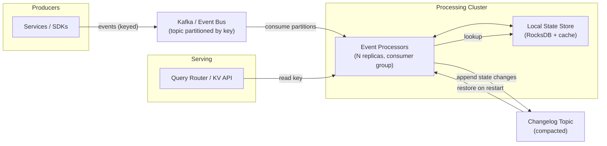
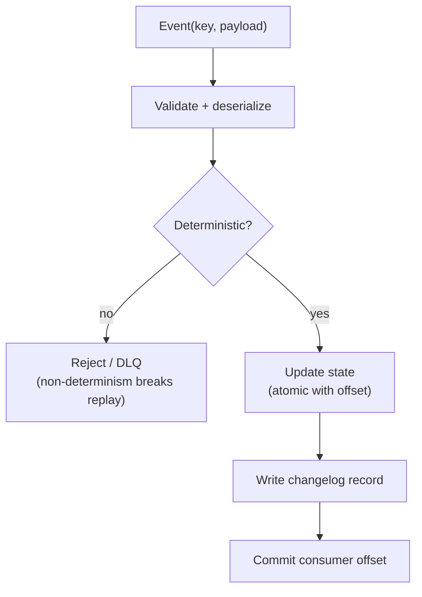
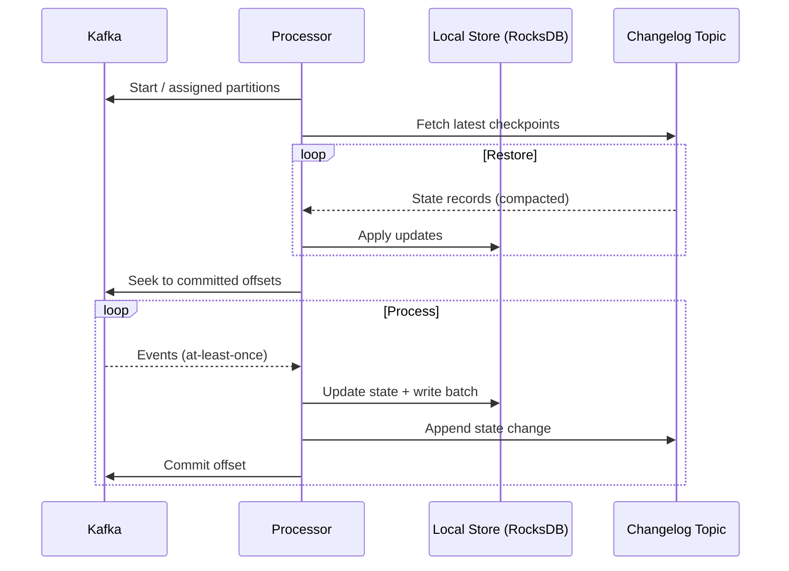
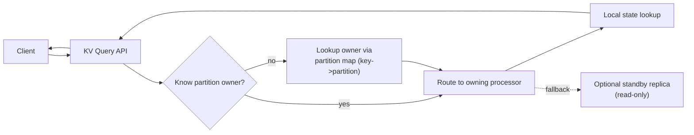
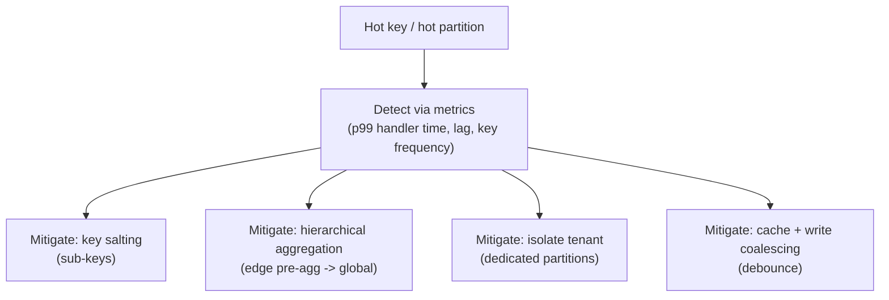

# Designing a high-volume Key-Value state store + event processing system

This is a practical design for a **high-throughput event processor** that maintains **per-key state** and serves that state through a **key-value query interface**.

Think: pacing counters per campaign, fraud features per user, budgets per account, rate-limiter tokens per API key, or rolling aggregates per ad/placement.

The key design choice is whether state is:

* **Processor-local** (embedded store like RocksDB with a changelog), or
* **Remote** (Redis/Cassandra/DynamoDB as the shared state store).

At very high write rates, the most scalable pattern is usually **local state + changelog** (what Kafka Streams / Flink state backends effectively do), with a serving layer for reads.

***

**1) Requirements (make them explicit)**

Before you pick technology, pin down the workload:

* **Event rate**: e.g. 1–10M events/sec peak
* **Key cardinality**: 10M–1B keys, skewed distribution
* **State size per key**: tiny counters vs multi-KB blobs
* **Update semantics**: commutative (counter++) vs non-commutative (set-if-newer)
* **Read path**: do you need low-latency reads (p95 < 10ms) or batch exports?
* **Durability**: can you drop? must you replay? what’s your retention?
* **Consistency**: is it OK to be eventually consistent? per-key linearizability?
* **Multi-region**: active-passive vs active-active

What I assume for this design:

* High-volume stream ingestion
* Per-key updates with **at-least-once** delivery
* Low-latency reads for most keys
* Correctness under retries and reordering
* Rebuildable derived state

***

**2) High-level architecture**

Core idea:

1. **Events are partitioned by key** (so updates for a key are processed in order per partition).
2. Processors maintain **local state** (RocksDB + cache) for low-latency updates.
3. Every state change is appended to a **compacted changelog** for recovery.
4. A query API routes reads to the owning processor (and optionally a standby).

This is the same fundamental blueprint behind mature systems:

* Kafka Streams (RocksDB + changelog)
* Flink state backend + checkpoints
* Samza + local store + changelog

***

**3) Data model and partitioning**

**Key design** determines scalability.

* Partition by `hash(key) % numPartitions`.
* Keep updates for a given key in **one partition** to preserve per-key order.
* For hot tenants, consider `tenantId` as a prefix and isolate their keys to dedicated partitions.

State record layout in RocksDB (conceptually):

* `key -> {value, version, updatedAt, metadata}`

Common production trick: store a **monotonic version** per key (event version, logical clock, or producer sequence) so consumers can ignore stale/out-of-order updates.

***

**4) Processing semantics: at-least-once vs exactly-once**

At high scale, **at-least-once + idempotent effects** is the default. Exactly-once is possible, but it increases complexity and often reduces throughput.

**At-least-once** requirements:

* Handler must be safe on duplicates.
* State updates must be deterministic to support replay.
* Side effects must be idempotent or deduplicated.

Processing pipeline per event:

Important: “atomic with offset” is the correctness hinge. The system must not:

* commit offsets without persisting state, or
* persist state without eventually committing offsets.

Implementation options:

* For local RocksDB, use a write batch to store updated state and a “last processed offset” per partition.
* For Kafka, offsets can be committed after the local batch is durable, plus changelog append succeeds.

***

**5) State store design (fast path)**

**Local store** is typically:

* RocksDB (LSM-tree) for high write throughput
* In-memory cache for hot keys
* TTL support for expiring state (either via compaction filters or periodic sweep)

Key production considerations:

* **Write amplification**: LSM stores trade CPU/disk for write throughput. Tune memtables, compaction, and block cache.
* **State size growth**: enforce TTLs and bounded value sizes; otherwise compaction costs explode.
* **Serialization**: use stable, schema-evolvable formats (protobuf/avro) and keep it deterministic.

***

**6) Changelog and recovery**

The changelog topic is the recovery backbone:

* Compacted topic keyed by `stateKey` (or by `partition + stateKey` depending on design)
* Retention set to meet rebuild needs
* Produced synchronously (or with strong delivery guarantees) from processors

Recovery flow:

To improve MTTR and reduce “cold start” blast radius:

* **Standby replicas**: keep a warm copy of state by consuming the changelog.
* **Incremental checkpoints**: periodic snapshots to object storage for faster bootstrap.
* **Partition-sticky assignment**: minimize rebalances that force state movement.

***

**7) Serving reads (KV API)**

Serving reads has two common modes:

1. **Read-your-own-processor** (route queries to the owning partition’s processor)
2. **Dedicated serving layer** (replicate state into a read-optimized store)

For low-latency and freshness, (1) is simplest:

Practical serving guidance:

* Keep a consistent `key -> partition` mapping (same hash function everywhere).
* Maintain a fast “partition owner map” (from consumer group membership / service discovery).
* For availability, route to a **standby** if the active owner is restarting.

When you need global reads (any key, any region) or you can tolerate staleness, replicate into a remote read store.

***

**8) Scaling strategy**

Scaling happens along three axes:

* **Partitions**: the primary unit of parallelism. You can’t exceed it.
* **Processor replicas**: scale up to match partitions (plus standby capacity).
* **Per-partition concurrency**: bounded, to avoid sink overload.

Rules of thumb:

* Increase partitions early; changing later is expensive.
* Don’t scale replicas above partitions for a single consumer group.
* Use backpressure: if downstream sinks are slow, processors must pause or reduce concurrency.

***

**9) Hot keys and skew (the most common real issue)**

Even with billions of keys, a few keys can dominate traffic.

Mitigation selection depends on semantics:

* If updates are commutative (sum/count), you can shard a hot key into subkeys and periodically merge.
* If updates must be strictly ordered, you may need dedicated capacity or move the invariant into a single owner service.

***

**10) Multi-region**

There are two practical options:

* **Active-passive**: one region owns processing; replicate event topics and serve reads locally from replicated state.
* **Active-active**: split keyspace ownership by region (consistent hashing / routing) to avoid dual-writers.

Active-active is hard because you must prevent two regions from concurrently mutating the same key unless your state updates are CRDT-like (commutative/associative) or you have a conflict resolution policy.

***

**11) Observability and operations**

Minimum metrics (you will use them in every incident):

* Consumer lag per partition, plus age of oldest event
* Changelog producer error rate + outbox/backlog (if applicable)
* RocksDB compaction stats, write stalls, cache hit rate
* p95/p99 handler latency and per-key skew metrics
* DLQ volume/age and top failure reasons
* Rebalance frequency and time to restore state

Runbooks to have on day 1:

* Lag spike: identify if bottleneck is CPU, sink, compaction, or hot partition
* Processor restart storm: stabilize rebalances, route reads to standby
* Poison events: DLQ + replay strategy + schema rollback

***

**12) When to use a remote KV store instead**

Use a remote store (Redis/Cassandra/DynamoDB) when:

* reads dominate and you need globally routable reads without processor affinity
* state is large and doesn’t fit on local disks comfortably
* update rate is moderate and you can afford network hops

But for very high write rates, remote stores often become the bottleneck (network + per-write consensus/replication costs). Local state + changelog tends to win on throughput.

***

**Summary**

For high volume KV state derived from events, the most scalable design is:

* key-partitioned event log
* processor-local embedded state store
* compacted changelog for recovery + replays
* query routing to partition owners (plus standby)

If you make handlers deterministic and idempotent, and you design for hot-key skew and recovery, this architecture scales to very large throughput while staying operable.
