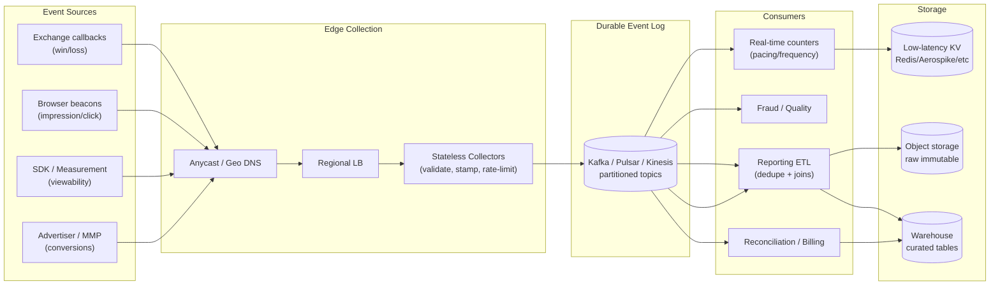
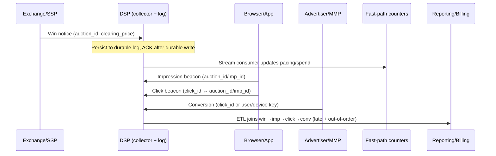

# Designing High-Throughput Event Ingestion (DSP-side RTB)

This document describes how I would design a high-throughput event ingestion system on the DSP side of RTB. The goal is to ingest _edge events_ (win notices, impressions, clicks, viewability, conversions) at very high QPS with low latency, preserve data quality, enable near-real-time optimization/pacing, and produce durable, queryable datasets for reporting and billing reconciliation.

I’ll emphasize **requirements → architecture → key decisions with rationale → trade-offs**.

***

### 1) Requirements (start here)

#### Functional

* Accept events from multiple sources:
  * exchange/server callbacks (win/loss)
  * browser beacons (impression/click)
  * SDK/measurement (viewability)
  * advertiser/MMP/server-to-server postbacks (conversions)
* Provide **idempotent writes** (handle retries) and **deduplication** (bots, double-fires).
* Joinability: support linking `win → impression → click → conversion`.
* Support **late/out-of-order** arrivals (conversions can come hours/days later).

#### Non-functional (what actually shapes the design)

* **Throughput**: sustained high QPS with burst tolerance (traffic spikes during peak hours).
* **Latency**:
  * “fast path” signals for pacing/optimizer within seconds
  * reporting can be minutes-hours
* **Reliability**: no data loss across AZ failures; graceful degradation.
* **Cost**: avoid over-provisioning; use batching/compression.
* **Security & privacy**: consent handling, PII minimization, retention controls.
* **Observability**: real-time visibility into drops, dedupe rates, lag, and schema failures.

#### Suggested SLOs (example targets)

* Ingestion endpoint availability: 99.9%+
* Accepted-event durability: 99.99% (once ACK’d, it’s persisted)
* P95 ingest API latency: < 50ms at the edge (excluding client RTT)
* End-to-end “fast path” updates: < 5–30s

***

### 2) The core idea: separate concerns (fast edge, durable log, multiple consumers)

At scale, you do **not** want the ingestion API tightly coupled to downstream ETL, joins, or analytics. The ingestion layer should be:

* stateless
* horizontally scalable
* “ACK only after durable write”
* able to shed load safely

The central primitive is a **durable append-only event log** (Kafka/Pulsar/Kinesis) that decouples producers from many consumers.

***

### 3) High-level architecture

#### A) Edge collection layer

**Why**: minimize latency and maximize availability close to event sources.

* Anycast / Geo DNS → regional load balancers
* Stateless **collector service** instances
* TLS termination + lightweight auth/validation
* Fast serialization format (JSON is ok to start; at scale consider Protobuf)

Collector responsibilities (intentionally limited):

* parse + validate minimal schema
* attach server timestamps and derived fields
* enforce rate limits / abuse controls
* generate or validate event IDs
* write to the durable log

#### B) Durable event log (stream)

**Why**: a log-based backbone handles bursts, enables replay, and supports multiple independent consumers.

* Topic per event family (wins, impressions, clicks, conversions, viewability) or one unified topic with eventType
* Partitioning strategy aligned with join keys and scalability
* Retention long enough for replay/backfills (e.g., 3–14 days depending on storage)

#### C) Consumers (multiple, purpose-built)

**Why**: different products need different latency/correctness trade-offs.

1. **Real-time counters** (fast path)
   * updates pacing, frequency caps, budget spend estimates
   * emits aggregates to a low-latency store
2. **Fraud/quality pipeline**
   * bot heuristics, anomaly detection, IVT filtering signals
3. **Reporting ETL** (slow path)
   * canonical tables, joins, dedupe, late event handling
   * outputs to warehouse/lake
4. **Reconciliation/billing**
   * exchange log joins
   * discrepancy analysis

#### Architecture diagram

#### Event lifecycle diagram (join keys in practice)

***

### 4) Ingestion API design (what hits your servers)

#### Endpoints

Keep endpoints explicit by event type for operational clarity:

* `POST /v1/events/win`
* `POST /v1/events/impression`
* `POST /v1/events/click`
* `POST /v1/events/conversion`

**Rationale**: Different validation rules, auth models, and abuse profiles per event type.

#### Payload principles

* **Small and stable**: only accept what you need; derive the rest.
* **Versioned schema**: `schema_version` in payload.
* **Strong IDs**: include `auction_id` / `imp_id` / `click_id` where possible.

#### Authentication / integrity

* For exchange callbacks: signed requests / IP allowlists / mTLS (depends on partner).
* For browser beacons: treat as untrusted; use signed click/impression URLs with short-lived tokens.

**Trade-off**: Stronger auth reduces fraud but increases integration complexity and can reduce measured events due to failures.

#### ACK semantics

* ACK only after the event is durably placed onto the log.
* Return `202 Accepted` (or `200 OK`) with a server-generated receipt ID.

**Rationale**: prevents acknowledging events that are later dropped during overload.

***

### 5) IDs, idempotency, and deduplication (the hardest part)

#### Event IDs

Goal: the same “real-world event” should map to the same ID across retries.

Approach:

* Prefer upstream IDs when reliable:
  * exchanges often provide auction/win identifiers
  * click redirect can mint a click ID
* Otherwise mint deterministic IDs:
  * e.g., hash of `(auction_id, event_type, timestamp_bucket, creative_id, device_key)`

**Trade-off**: Deterministic hashes reduce duplicates but risk false-dedup if the chosen key is not unique enough.

#### Dedupe strategy (multi-layer)

1. **Edge best-effort dedupe** (optional): tiny TTL cache to drop obvious immediate retries.
2. **Stream-level idempotency**:
   * use the event ID as message key
   * producer idempotence if supported
3. **Consumer-side dedupe (authoritative)**:
   * maintain a dedupe store keyed by event ID with TTL

**Rationale**: Edge caches are fast but lossy. The authoritative dedupe belongs downstream where you can afford state.

***

### 6) Partitioning and ordering (how you scale and still join)

Partition by the key you most often join on.

Common choice:

* Partition key = `auction_id` or `imp_id`

**Rationale**:

* Events for the same impression are more likely to land in the same partition, improving join locality for stream processing.

**Trade-offs**:

* If a single key becomes “hot” (rare but possible), it can overload one partition.
* Using `user_id` can improve user-level frequency queries but makes impression-join harder.

Mitigation:

* Use a composite key with stable sharding (e.g., `hash(auction_id)`) and ensure enough partitions.

***

### 7) Handling bursts and backpressure (survive the real world)

#### Edge protections

* Rate limit per source (partner, token, IP ranges)
* Enforce max payload size
* Prefer **batch ingestion** for trusted partners (reduce overhead)

#### Log as a buffer

* The stream absorbs bursts; consumers can lag temporarily.
* Monitor consumer lag; autoscale consumers based on lag and processing time.

#### Degradation strategy

Define what you will sacrifice first:

* Drop optional fields/features rather than whole events
* For untrusted sources (browser): prioritize availability but accept that some events may be blocked by client constraints anyway

**Key staff-level point**: explicitly decide “what happens when we’re on fire” and encode it (instead of discovering it in production).

***

### 8) Storage model (hot vs cold, raw vs curated)

#### Raw immutable storage (data lake)

* Store the raw log to cheap object storage (S3/GCS) partitioned by time/event type.

**Rationale**: replay, audits, backfills, and debugging.

#### Curated warehouse tables

* Cleaned, deduped, joined fact tables (impressions/clicks/conversions) in a warehouse.

**Trade-off**: Warehouse is expensive; store only what’s needed for analytics and keep raw elsewhere.

#### Low-latency operational stores

For real-time decisions:

* counters in Redis/KeyDB/Aerospike/Scylla (depending on scale)
* use TTL and time-bucketed keys to control memory

**Rationale**: pacing and frequency need quick reads/writes.

***

### 9) Stream processing design (near-real-time)

Use a stream processor (Flink/Spark Streaming/Kafka Streams) to compute:

* spend/impression/click counters per campaign/creative/site
* frequency caps per user/device key
* anomaly signals (sudden CTR spikes, botty patterns)

Key techniques:

* **Windowing**: tumbling/sliding windows for KPIs
* **Exactly-once vs at-least-once**:
  * for counters used in bidding, you want _effective_ correctness
  * exactly-once is great but operationally heavier; many teams choose at-least-once + idempotent updates

Trade-off framing:

* Exactly-once simplifies reasoning but increases complexity and can reduce throughput.
* At-least-once scales well but requires careful idempotency keys and dedupe.

***

### 10) Late events and retractions

Conversions arrive late and sometimes need corrections.

Design choices:

* Treat events as immutable; represent corrections as **new events** (e.g., `conversion_adjusted`).
* Maintain derived “truth” tables that can be recomputed from raw log.

**Rationale**: Immutability + replayability are your escape hatches when the business logic evolves.

***

### 11) Data quality and schema evolution

#### Schema registry + compatibility

* Version schemas; require backward compatibility.
* Route unknown versions to a quarantine topic.

#### Validation tiers

* **Hard validation**: reject events missing critical join keys.
* **Soft validation**: accept event but flag issues (e.g., missing optional fields).

**Trade-off**:

* Rejecting improves quality but can permanently lose data.
* Accepting preserves data but can pollute reports unless quarantined/flagged.

***

### 12) Multi-region and disaster recovery

Two common approaches:

#### Option A: Active-active ingestion, regional processing

* Each region ingests locally; replicate the log cross-region.
* Consumers run per region; global reporting merges later.

Pros: low latency, resilient to region failure. Cons: cross-region consistency complexity.

#### Option B: Active-active ingestion, centralized log

* Regions ingest but forward to a single “home” region stream.

Pros: simpler global joins. Cons: higher latency and dependency on the home region.

Staff-level call: pick based on your business tolerance for regional isolation vs simplicity.

***

### 13) Observability (how you know it works)

Must-have metrics:

* ingest QPS, error rates, P50/P95/P99 latency
* stream produce success rate
* consumer lag per topic/partition
* dedupe rate and top duplicate sources
* schema validation failures/quarantine counts
* join rates (wins→imps, imps→clicks, clicks→conversions)

Must-have tooling:

* sampled end-to-end tracing via `event_id`
* dashboards per event type
* alerting on lag and sudden drops in join rate

***

### 14) Concrete trade-offs (how I’d explain decisions in an interview)

* **Use a durable log (Kafka/Pulsar/Kinesis)**
  * Pro: decouples ingestion from processing; enables replay; handles bursts
  * Con: operational overhead; partitioning strategy matters
* **Keep collectors stateless and minimal**
  * Pro: easy to scale and harden; fewer failure modes
  * Con: pushes complexity to downstream consumers
* **Idempotency and dedupe are multi-layered**
  * Pro: robust under retries and client weirdness
  * Con: stateful dedupe stores cost money and can become hotspots
* **Separate fast path (pacing) from slow path (reporting)**
  * Pro: meet tight optimization latency without sacrificing correctness in reporting
  * Con: two systems to maintain; numbers can differ until reconciled

***

### 15) Interview-ready “system in one minute”

We run globally distributed stateless collectors that validate and durably enqueue RTB events into a partitioned event log. From there, multiple consumers power (1) near-real-time pacing/frequency counters in a low-latency store, (2) fraud/quality detection, and (3) batch ETL that dedupes and joins events into warehouse tables for reporting and reconciliation. The key design points are explicit ACK-after-durable-write semantics, strong event IDs for idempotency, partitioning on impression/auction keys for join locality, and operational guardrails for bursts, schema evolution, and multi-region resilience.
