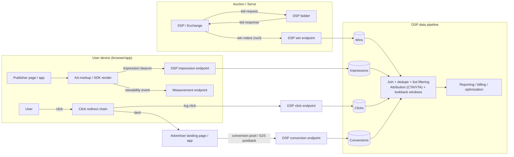

# Impression / Click / Conversion Tracking in RTB (Pipeline)

In RTB, “tracking” is the set of signals that prove an ad was served/seen/clicked and whether it drove a downstream outcome (conversion). These signals power reporting, optimization, fraud detection, and billing reconciliation.

This doc focuses on: what fires, who receives it, and how it flows through DSP/SSP systems.

***

### 1) Event taxonomy (what you’re actually measuring)

#### A) Bid, win, loss (pre-serve)

* **Bid request**: SSP → DSP (opportunity description)
* **Bid response**: DSP → SSP (price + creative)
* **Win notice** (nurl): SSP → winning DSP (you won, clearing price, auction ID)
* **Loss notice** (lurl, optional): SSP → losing DSPs (you lost)

These are crucial for:

* pacing (how often you’re eligible vs winning)
* bid shading / auction strategy
* debugging delivery

#### B) Impression (serve-time)

Two common interpretations:

* **Served impression**: creative was returned and the impression tracker fired.
* **Viewable impression**: met a viewability threshold (e.g., 50% pixels for 1s display; video often 2s), usually measured separately.

Most RTB billing/reporting begins with served impressions, while quality KPIs often emphasize viewable.

#### C) Click

* User clicks; click tracker fires (often as a redirect chain) and then lands on the advertiser’s destination.

#### D) Conversion (post-click / post-view)

* A downstream event on the advertiser side (purchase, signup, lead, app install, etc.).
* May be attributed to a prior click or impression depending on attribution rules.

***

### 2) Tracking pixels and URLs (what gets embedded where)

In programmatic, tracking typically happens via URLs embedded in the returned ad markup and/or SDK callbacks.

Common mechanisms:

* **Image pixel**: `https://tracker/...` returning a 1x1 image.
* **JavaScript tag**: runs to fire trackers or measure viewability.
* **Server-to-server callbacks**: logs events without relying on browser rendering.

Most systems include unique IDs for joining events:

* auction/request IDs
* impression IDs
* click IDs
* user/device IDs (when permitted)

***

### 3) End-to-end pipelines

#### Diagram — signal flow (SSP ↔ DSP ↔ user ↔ advertiser)

#### Pipeline 1 — Win notice (server-side)

1. Exchange/SSP runs auction.
2. Winning DSP receives a **win notice** (nurl) with details like clearing price and auction ID.
3. DSP logs the win and may:
   * increment spend counters (provisional)
   * lock budget/pacing state
   * begin creative readiness checks

Notes:

* Win notice ≠ impression. You can win and still not serve (timeouts, user leaves, render fails).

#### Pipeline 2 — Impression (client-side + server-side logging)

1. Creative is returned to the page/app.
2. When the ad renders, an **impression tracker** fires.
3. The receiver (DSP/3P tracker) logs the impression.
4. The publisher/SSP also logs impression on their side (often independently).
5. Later, reports are reconciled (DSP vs SSP vs publisher counts).

Common failure modes:

* render blocked by ad blockers
* slow creative load → timeout
* page navigation before render
* invalid/malicious traffic filtered later

#### Pipeline 3 — Viewability (measurement)

1. A viewability script/SDK measures whether the impression became “viewable.”
2. It fires a **viewability event** to measurement endpoints.
3. DSP aggregates viewability by site/app, placement, creative, etc.

Important detail:

* Viewability is often **modeled/estimated** when measurement is not available.

#### Pipeline 4 — Click (redirect chain)

1. User clicks the ad.
2. Click goes through one or more redirect trackers:
   * publisher click tracker
   * SSP click tracker
   * DSP/3P click tracker
3. Each hop logs the click with a shared click/impression ID.
4. User reaches landing page.

Why redirects exist:

* reliable counting
* fraud detection (rate limiting, bot heuristics)
* attaching click IDs for attribution

#### Pipeline 5 — Conversion (advertiser side → DSP)

1. User converts on advertiser site/app.
2. Advertiser sends a conversion event via:
   * browser pixel
   * server-to-server postback
   * mobile measurement provider (MMP)
3. DSP matches conversion to prior ad exposure using IDs and attribution rules.
4. DSP reports conversions and uses them to optimize bidding.

***

### 4) Attribution basics (how a conversion gets credit)

Attribution typically depends on:

* **lookback window** (e.g., 7 days post-click, 1 day post-view)
* **priority rules** (click-through often prioritized over view-through)
* **deduplication** (multiple impressions/clicks → single conversion)

Two common attribution types:

* **CTA (click-through attribution)**: credit if conversion follows a click.
* **VTA (view-through attribution)**: credit if conversion follows an impression without a click.

Practical note:

* Modern privacy constraints make deterministic identity harder; expect more aggregation, modeling, and consent-dependent measurement.

***

### 5) Data plumbing inside a DSP (how it becomes “a pipeline”)

Even though events fire via URLs, internally they become streams/tables.

Typical DSP dataflow:

* **Online logging** (milliseconds–seconds)
  * win notices, impression beacons, click beacons hit edge endpoints
  * logs written to durable storage/queue
* **Stream processing** (seconds–minutes)
  * validate schema, dedupe, bot filtering signals
  * update pacing counters and near-real-time dashboards
* **Batch ETL** (minutes–hours)
  * join wins ↔ impressions ↔ clicks ↔ conversions
  * compute spend, KPIs, frequency, cohorts
* **Model/optimizer inputs**
  * training datasets (CTR/CVR)
  * site/app quality scoring
  * bidder feature stores

Key joins usually rely on:

* auction ID / imp ID
* click ID
* device/user ID (when available)

***

### 6) Discrepancies (why numbers rarely match perfectly)

It’s normal for SSP/DSP/publisher counts to differ due to:

* impression definition differences (served vs viewable)
* timeouts and render failures
* ad blockers / tracking prevention
* invalid traffic filtering done at different stages
* clock skew / log delays

Most orgs pick a “source of truth” for billing (often exchange/SSP) and use DSP logs for optimization and diagnostics.

***

### 7) Interview-ready summary

* **Win notice** proves you won the auction.
* **Impression beacon** proves the ad rendered/served.
* **Viewability** proves it was likely seen.
* **Click** proves engagement.
* **Conversion** proves outcome and feeds attribution + optimization.
