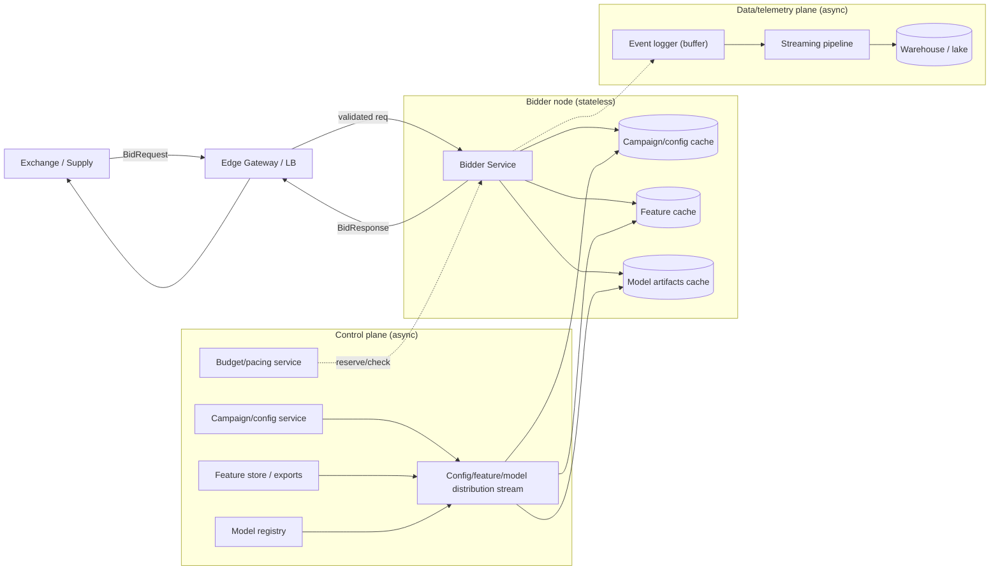
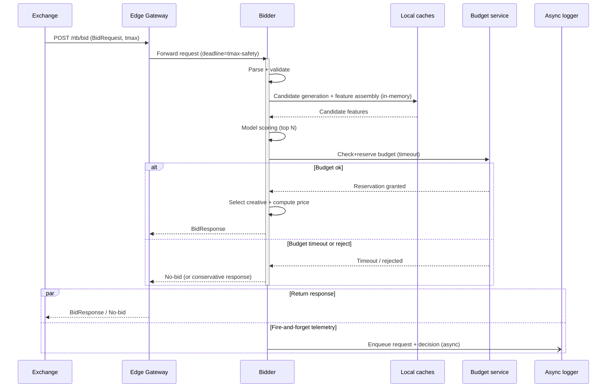
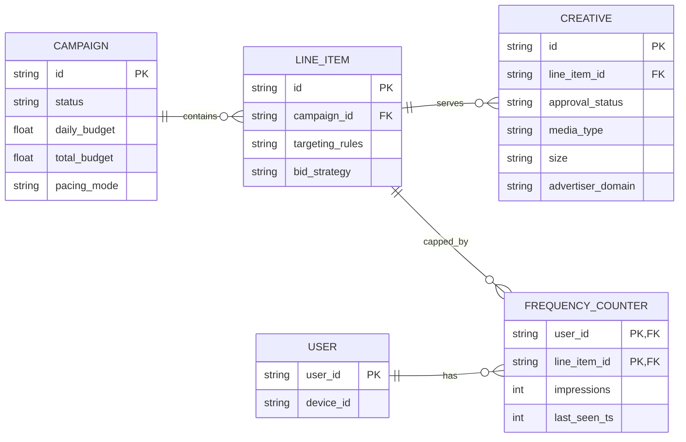

# Real-time Bidding System (RTB)

This document designs a real-time bidding (RTB) system that receives an ad opportunity (bid request), validates it, fetches features, runs model scoring, and returns a bid decision within a strict latency budget.

The goal is to be understandable to an audience unfamiliar with ad-tech, while being explicit about trade-offs and operational concerns.

***

#### 1) Problem statement

Build a service that, for each incoming bid request, decides whether to bid and at what price. The decision must be made under tight deadlines (typical for RTB exchanges) with end-to-end latency under **100ms**.

At a high level the online path is:

1. **Request validation**
2. **Feature fetching**
3. **Model scoring**
4. **Bid decision**

***

#### 2) Functional requirements

Minimum online (synchronous) requirements:

* Accept bid requests and return bid responses.
* Validate request structure + required fields + policy constraints.
* Fetch features (user, context, campaign, creative, inventory, frequency cap, etc.).
* Score eligibility and predicted value (CTR/CVR/value) using a model.
* Decide bid: select campaign/creative, compute bid price, and generate a response.

Common RTB-adjacent requirements (often expected in interviews / production):

* Budget and pacing enforcement (campaign daily/total budgets).
* Frequency capping / user suppression.
* Targeting rules (geo/device/domain/app bundle/segments).
* Creative approval / policy enforcement.
* Experimentation (A/B, model versioning, feature toggles).
* Observability (traces/metrics/logs) without slowing the hot path.

***

#### 3) Non-functional requirements

* **Latency:** p99 < 100ms end-to-end for the online decision.
* **Availability:** extremely high; exchanges retry rarely and timeouts are lost revenue.
* **Scalability:** handle high QPS bursts (traffic is spiky).
* **Correctness under partial failure:** degrade safely (no overspend, no invalid bids).
* **Cost:** scoring and feature lookup must be efficient; avoid expensive per-request I/O.

***

#### 4) Scope + assumptions (explicit)

To keep the design crisp, I’ll assume:

* We are a **DSP / bidder** responding to external exchanges.
* Requests resemble OpenRTB (but exact schema is not critical).
* The bidder can do **in-memory work** cheaply; remote calls are expensive.
* We can precompute and push most campaign/config data to edge nodes.

Out of scope for this doc (but we’ll mention integration points):

* Offline model training pipeline and data science details.
* Full advertiser UI.
* Billing and payment systems.

***

#### 5) High-level architecture

Key idea: **keep the online path mostly in-memory** and reserve storage/network calls for asynchronous pipelines.

**Architecture diagram**

**Online components (hot path)**

* **Edge Gateway / Load balancer**: terminates TLS, enforces basic rate limits.
* **Bidder service** (stateless, horizontally scalable): performs validation → targeting → scoring → auction → bid.
* **Local caches** inside bidder:
  * Campaign/config cache (pushed via streaming control plane)
  * Feature cache (small, short TTL)
  * Model artifacts cache (weights/trees/embeddings)

**Control plane (not on hot path)**

* **Campaign/config service**: stores campaigns, creatives, targeting, budgets.
* **Budget/pacing service**: maintains spend counters and pacing state.
* **Feature store (offline/nearline)**: computes user and context features; exports to online cacheable form.
* **Model registry**: versioned model artifacts and metadata.

**Data/telemetry plane**

* **Event logging pipeline**: stream bid requests, decisions, impressions/clicks for analytics and training.

Rationale:

* Remote lookups (DB/Redis) per request quickly dominate p99 latency.
* RTB systems are typically designed as **stateless bidders with aggressively preloaded state**.

***

#### 6) Request/response (API)

**Endpoint**

* `POST /rtb/bid`

**BidRequest (simplified)**

* `id`: request id
* `imp[]`: impression opportunities
* `site`/`app`
* `device` (ua, ip)
* `user` (id, segments if provided)
* `tmax`: exchange timeout hint (ms)

**BidResponse (simplified)**

* `id`
* `seatbid[]`: list of bids
* `bid`: `{ impid, price, crid, adm, adomain, w, h }`

Notes:

* Many exchanges send `tmax` (e.g., 80–120ms). We must enforce our own internal deadline, typically **min(100ms, tmax - safety\_margin)**.

***

#### 7) End-to-end hot path flow

Below is the core online pipeline with strict timeouts at each step.

**Hot path sequence diagram**

**Step A — Request validation**

What we do:

* Parse JSON/protobuf.
* Enforce size limits.
* Verify required fields (`id`, at least one `imp`, supported media types).
* Basic fraud/policy checks (blocked domains/apps, invalid IPs).
* Deduplicate if exchanges retry with same request id (optional, best-effort).

Trade-offs:

* **Strict validation** reduces bad traffic and downstream work, but risks rejecting borderline requests.
* Deduplication typically requires a shared cache; in a tight latency budget, prefer **best-effort** or sampling.

**Step B — Candidate generation (targeting)**

Goal: reduce the search space before expensive scoring.

Inputs:

* Request context (geo/device/site/app).
* Campaign/line-item configuration (targeting rules, creatives).

Approach:

* Maintain an in-memory index for targeting (e.g., by geo, device, domain/app bundle, ad format).
* Quickly produce a candidate set (e.g., top N line items) per impression.

Trade-offs:

* More indexing complexity reduces CPU at runtime.
* Simpler filtering is easier to maintain but may increase compute under high QPS.

**Step C — Feature fetching**

Goal: produce the feature vector required by the scoring model.

Principles:

* Avoid per-request DB calls.
* Prefer **precomputed** features and small online lookups.

Feature sources:

1. **Request-derived**: device, time, publisher, placement, format.
2. **Campaign-derived**: advertiser metadata, creative attributes.
3. **User-derived** (if available): segments, frequency, recency.

Implementation options:

* (Preferred) **Local feature cache** populated by:
  * periodic snapshot + incremental streaming updates
  * keyed by stable identifiers (user id / device id / segment ids)
* (Fallback) A remote cache like Redis for features.

Trade-offs:

* Local cache gives best latency but increases memory footprint and warmup complexity.
* Remote cache simplifies state sharing but adds network p99 risk.

**Step D — Model scoring**

Goal: estimate value (e.g., pCTR, pCVR) and compute an expected utility.

Implementation:

* Load model artifacts into memory (trees/linear/NN embeddings).
* Score top candidates only (after filtering).
* Hard deadline: stop scoring once budget is near exhaustion.

Trade-offs:

* Complex models may improve ROI but increase CPU and tail latency.
* For <100ms budget, common choices are GBDT/linear or compact NN with optimized inference.
* If using a separate model service, you add network hops; prefer **in-process inference** for strict SLAs.

**Step E — Bid decision (auction + pricing + budgets)**

Typical steps:

* Eligibility checks: policy, creative approval, category blocks.
* Frequency cap and user suppression.
* Budget/pacing check and reservation.
* Select best creative.
* Compute price (e.g., value-based bidding):
  * `bid = base * pCTR * value_per_click` (illustrative)
  * enforce min/max, floors, and campaign constraints

Budget/pacing strategy (important):

* Use a **two-level** approach:
  1. Local “soft” budget estimation to quickly drop obviously exhausted campaigns.
  2. Central budget authority (or sharded counters) to prevent overspend.

Trade-offs:

* Strong consistency for budget prevents overspend but increases latency.
* Purely local counters are fast but can overspend during bursts.
* A practical compromise: **sharded atomic counters** (e.g., Redis cluster or custom counter service) with tiny timeouts and graceful failure.

**Step F — Response**

* Construct response and return before deadline.
* Fire-and-forget logging (buffered, async); never block response on logging.

***

#### 8) Latency budget (example)

To meet p99 < 100ms, we explicitly partition time and enforce deadlines.

Example budget (p99 targets):

* Network + LB overhead: 5–10ms
* Parsing + validation: 2–5ms
* Candidate generation: 2–8ms
* Feature assembly (mostly in-memory): 5–15ms
* Model scoring (top N): 10–35ms
* Budget/pacing check (fast path): 2–10ms
* Response build + serialization: 1–3ms
* Safety margin (GC pauses, jitter): 10–20ms

Rationale:

* You need a **margin**; otherwise tail latency kills win rate.
* The system should use a single request “deadline” propagated to all subcalls.

***

#### 9) Data model (conceptual)

**Campaign / Line Item**

* id, status
* targeting rules (geo/device/domain/app/category)
* creatives\[]
* bid strategy parameters
* budgets (daily/total), pacing mode

**Creative**

* id, approval status
* media type, size, markup template
* advertiser domain

**User state (online features)**

* user\_id/device\_id
* segment ids
* frequency counts (per campaign/adgroup)
* recency features

**Data model diagram**

***

#### 10) Storage and state strategy

Because hot-path latency is tight, the design separates:

**(A) Read-mostly config state** (campaigns, creatives, targeting)

* Source of truth: a transactional DB (Postgres/MySQL) in control plane.
* Distribution to bidders: publish snapshots + incremental updates over a stream (Kafka/PubSub) or a config push system.
* On bidder: in-memory maps + indexes.

Trade-off:

* Push-based config is more complex than querying a DB, but it is standard for RTB to avoid per-request DB calls.

**(B) Fast-changing counters/state** (budgets, frequency) Options:

1. Central counter service with sharded keys and atomic increments.
2. Redis cluster with Lua scripts for atomic check+reserve.
3. Hybrid: local approximate counters + periodic reconciliation.

Recommended compromise:

* Use sharded atomic counters for “must-not-overspend” decisions (budget reserve).
* Use local estimates to prune candidates early.

***

#### 11) Failure modes and graceful degradation

The system must fail “safe”:

* **Feature missing/unavailable**: fallback to default features; reduce bid aggressiveness.
* **Budget service timeout**:
  * Conservative mode: do not bid for campaigns requiring strict budget enforcement.
  * Or allow tiny risk with circuit breaker + capped exposure (depends on business tolerance).
* **Model artifact unavailable**: fallback to previous version; keep last-known-good loaded.
* **Config out of date**: keep serving with last snapshot and alert; block newly created campaigns until synced.
* **Overload**: shed load early:
  * reject low-quality traffic
  * cap candidate N
  * skip expensive model features
  * use simpler heuristic scoring

Trade-off framing:

* In RTB, “better to respond fast with a slightly worse bid” than to timeout.

***

#### 12) Correctness and consistency

Key invariants:

* Never return an invalid bid (malformed response, unapproved creative).
* Avoid overspend beyond a small bounded window.

Consistency choices:

* Campaign config is **eventually consistent** across bidders (push updates). This is acceptable if changes propagate quickly and are versioned.
* Budgets require **stronger guarantees**, typically atomic reserve per impression/win event.

***

#### 13) Observability

Must-have metrics:

* Request QPS, success rate, timeout rate
* p50/p95/p99 latency, and per-stage latency breakdown
* Candidate counts (pre/post filtering)
* Model scoring time + fallback rate
* Budget service latency + error rate
* Win rate and effective CPM (offline aggregated)

Logging/tracing:

* Sampled distributed traces (keep overhead low).
* Structured logs for errors and policy rejections.
* Asynchronous event pipeline for full-fidelity training logs.

***

#### 14) Security and abuse considerations

* Validate input size and schema to prevent CPU/memory abuse.
* Rate-limit by exchange/source.
* Detect obviously fraudulent signals (invalid IP ranges, malformed device IDs) in cheap checks.
* Keep allow/block lists in pushed config for fast enforcement.

***

#### 15) Scaling strategy

* Bidder is stateless → scale horizontally behind a load balancer.
* Co-locate bidders in multiple regions near exchanges to reduce network RTT.
* Pre-warm instances with snapshots; avoid cold-start serving.
* Use consistent hashing / partitioning only for stateful components (budget counters).

***

#### 16) Concrete trade-offs summary

* **In-process inference vs model RPC**: in-process wins latency; RPC improves separation of concerns but risks p99.
* **Local feature/config caches vs remote lookups**: local wins p99; remote simplifies correctness but adds jitter.
* **Strong budget consistency vs speed**: strong reserve prevents overspend; hybrid + bounded risk is often the pragmatic choice.
* **More candidates vs deeper scoring**: candidate explosion hurts CPU; strict top-N and early pruning are key.

***

#### 17) What I’d ask in an interview (clarifying questions)

If requirements are ambiguous, I’d confirm:

* Which protocol/schema (OpenRTB?) and expected QPS/regions.
* Is strict no-overspend required, or is bounded overspend acceptable?
* What model type/complexity and how often it updates?
* What user identifiers are available (cookie/device ID) and privacy constraints?
