# Distributed transactions

A **transaction** is a sequence of operations performed as a single logical unit of work. In traditional database systems, this is defined by the **ACID** properties: **Atomicity** (all or nothing), **Consistency** (valid state transitions), **Isolation** (concurrent transactions don't interfere), and **Durability** (committed data persists).

If network, storage, service work as expected all the time, we can use ACID properties to ensure data consistency. However, in distributed systems, these components can fail in various ways, leading to partial failures. Distributed systems rarely fail in clean, binary ways. They fail _mid-flight_: after one service commits and another times out, after a deploy rolls a single shard, after a retry storms a dependency, after a consumer reprocesses a message. A “distributed transaction” is what we call the set of design patterns that keep these messy, real-world partial failures from corrupting user-visible state.

At internet scale, you almost never get global ACID across services. Instead, you build a system that is:

* **Correct under retries** (idempotency, dedupe, replay safety)
* **Correct under reordering** (events arrive out of order)
* **Correct under partial failure** (compensation, reconciliation)
* **Observable and operable** (you can answer: _what happened to request X?_)

This article focuses on practical patterns used in production: saga workflows, idempotency keys, inbox/outbox, reconciliation, and the operational practices that prevent your “eventually consistent” system from becoming “eventually incorrect.”

***

### Why 2PC is rare in practice

Two-phase commit (2PC) gives you strong atomicity across multiple participants: prepare everywhere, then commit everywhere. In practice, it is uncommon for application-level microservices because:

* **Blocking and coordinator dependency**: if the coordinator or a participant becomes unavailable during the commit window, resources remain locked or participants remain in uncertain states.
* **Operational coupling**: services become tightly coupled in availability and rollout cadence.
* **Heterogeneous storage**: once you span different databases, queues, caches, and external APIs, “transactional” semantics become leaky or unavailable.

You may still see 2PC inside a single database stack or within a narrow boundary (e.g., a single RDBMS cluster). But across independently deployed services, most teams choose patterns that trade strict atomicity for availability and operability.

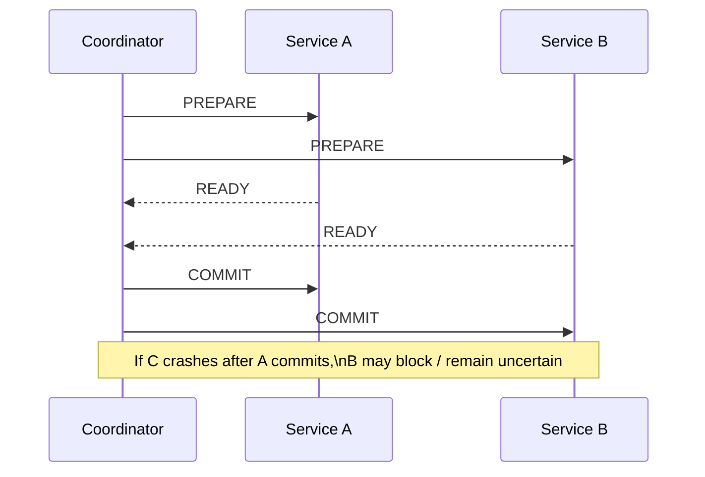

***

### The goal: define the transaction boundary

Before attempting to coordinate complex operations across services, you need to draw a hard line between what must be _atomically consistent_ (Source of Truth) and what can be _eventually consistent_ (Side Effects).

In practice, every transaction is triggered by an event. As the system processes this event, it transitions state and generates side effects. To manage this complexity, we can decompose a transaction into three distinct layers:

1. **The User Intent ("What do they want to do?")**
   * Examples: "Place Order #123", "Refund Transaction #456", "Activate Campaign #789".
   * _Requirement:_ This intent must be captured durably and exactly once. It is the trigger for everything else.
2. **Core Business State ("What are the hard facts?")**
   * Examples: Inventory count, Wallet balance, Order status (`PENDING` -> `CONFIRMED`).
   * _Requirement:_ These must be strongly consistent within their respective boundaries. You cannot have "half a payment" or "negative inventory" due to a race condition. These are the _Source of Truth_.
3. **Side Effects ("What happens as a result?")**
   * Examples: Sending an email confirmation, updating a search index, warming a cache, firing a webhook, updating an analytics dashboard.
   * _Requirement:_ These can lag behind the core state. They do _not_ need to happen in the exact same database transaction as the payment deduction.

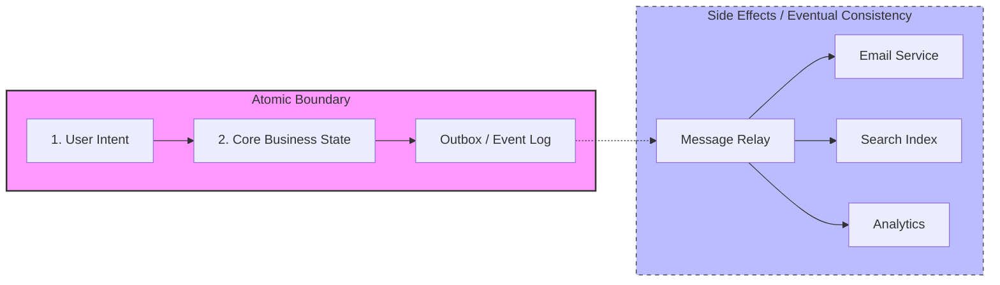

**The Golden Rule:** Never couple Side Effects to your Core State's atomicity.

* **Bad Design:** "Update Inventory AND Send Email" in one atomic block. If the email server is slow, your inventory lock is held hostage. If the email fails, do you roll back the inventory? No, that would be absurd.
* **Good Design:** "Update Inventory" is the atomic unit. "Send Email" is an eventual action triggered by the success of the inventory update (often via the Outbox pattern).

By treating side effects as _replayable_ and _eventual_, you decouple your system's availability from the availability of your email provider, search cluster, or cache nodes.

The pattern Intent/Core Business State/Side Effects is the foundation of most distributed transaction patterns. And it can be applied flexibly to expand the scope of transactions to include multiple services and databases.

* Outbox from a transactional system can be intent to other system.
* Outbox can be intent to multiple systems.
* Multiple outbox can be intent to same system.
* Multiple transactional systems and work together to complete a transaction of a bigger systems.

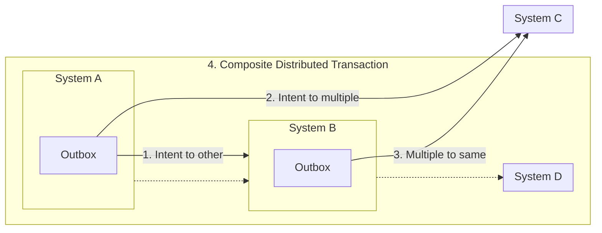

***

### Sagas: the workhorse pattern

A **saga** decomposes a distributed transaction into a sequence of **local transactions**. Each step commits within a single service’s database boundary. If a later step fails, the saga triggers **compensating actions** to semantically “undo” previously completed work.

There are two common saga styles:

1. **Orchestration (central coordinator / workflow engine)**

* A coordinator owns the state machine for the transaction.
* It issues commands (“reserve budget”, “provision topics”) and waits for replies/events.
* It decides the next step or compensation.

This is usually easier to reason about and operate because there’s one place to inspect the transaction state.

2. **Choreography (event-driven, decentralized)**

* Services react to events and emit the next event.
* There is no single controller; the “workflow” emerges from event subscriptions.

This reduces central hotspots but can become hard to debug: you trade a single coordinator for a graph of event handlers.

In practice, teams often start with orchestration for correctness and operability, then move toward more decentralized designs when the coordinator becomes a scaling or reliability bottleneck.

Example of local transaction make up a distributed transaction:

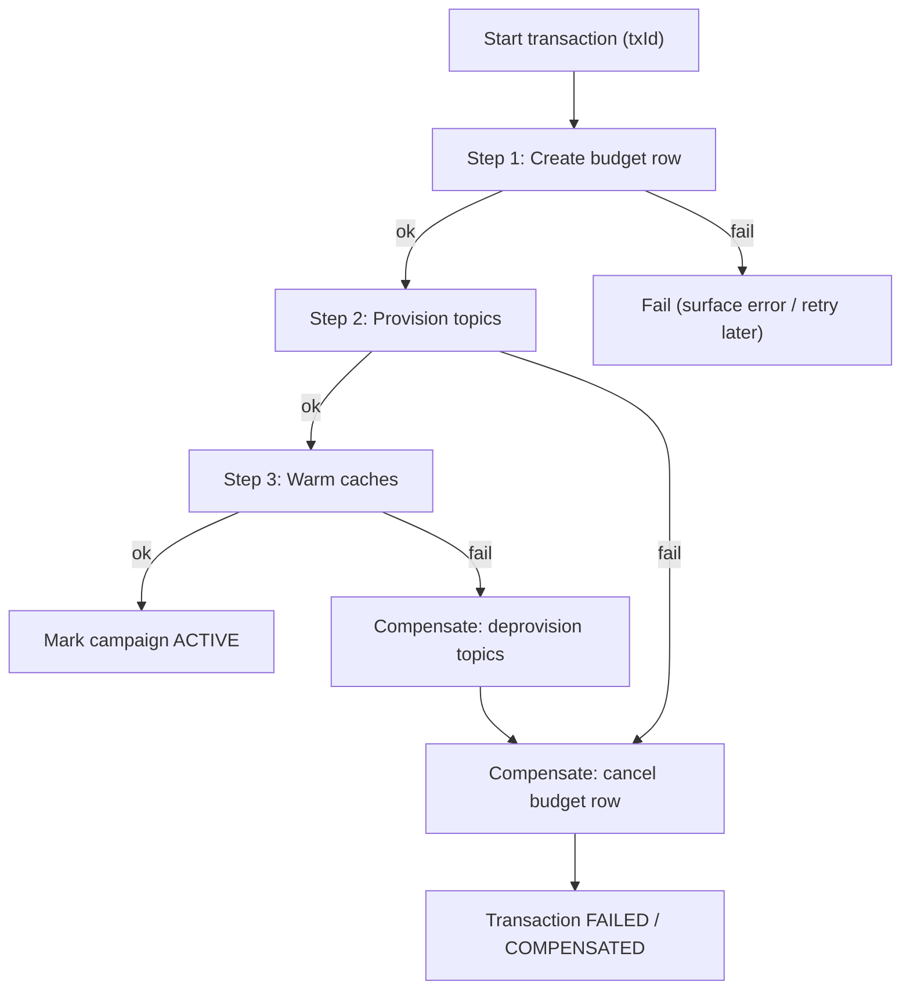

***

#### Compensation is not rollback (The "Apology" Pattern)

In a traditional ACID database, a `ROLLBACK` is like a time machine: it magically erases the past. You go back to exactly how things were before the transaction started.

In a Distributed System (Saga), **time only moves forward**. You cannot un-send an email or un-fire a request. "Rolling back" is actually "Running a new transaction to fix the mess."

**Key Differences:**

* **Database Rollback:** "It never happened." (Invisible to user)
* **Saga Compensation:** "It happened, but now we are fixing it." (Visible to user)

**The Problem of Irreversibility:** Some actions are like toothpaste—you can't put them back in the tube. Action cause the side effect that escape your system boundary (your control) is generally irreversible.

* **Email:** You can't un-send "Welcome to the platform!"
* **Money:** You can't just delete a bank transfer record; you have to create a _new_ "Correction" record.
* **External APIs:** You can't undo a POST request to a third-party vendor unless they support a specific undo endpoint.

**Strategy: Semantic Locking (Authorize, Then Capture)** To avoid messy compensations, **don't commit irreversible actions until the very end.**

1. **Authorize (Reversible):** Reserve the money / Hold the inventory. (Easy to cancel).
2. **Verify:** Check all other conditions.
3. **Capture (Irreversible):** Actually charge the card / Ship the item. (Hard to cancel).

If you fail during step 2, you just "Void the Auth". Simple. If you charge the card in step 1 and fail in step 2, you have to issue a Refund, send an apology email, and pay transaction fees.

**Rule of Thumb:** Push the "Point of No Return" as late in the transaction as possible.

***

#### Idempotency: the non-negotiable foundation

In a distributed transaction, **retries are inevitable**. If a service executes a command but the network fails before the acknowledgment reaches the orchestrator, the orchestrator will trigger a retry.

Without idempotency:

* **Duplicate Side Effects:** A customer might be charged twice, or inventory might be deducted multiple times for a single order.
* **Corrupted State:** The Saga state machine may become inconsistent if it receives multiple "success" or "failure" signals for the same step.
* **Compensation Loops:** If a compensation action (like a refund) is not idempotent, retrying a failed refund could result in multiple refunds being issued.

**Idempotency ensures that performing an operation multiple times has the same effect as performing it once.** This allows the system to achieve eventual consistency by safely retrying any step until it succeeds or is successfully compensated.

At scale, “exactly once” is usually an illusion. You will have retries due to:

* Client timeouts
* Service restarts
* Load balancers retrying
* At-least-once message delivery
* Consumer rebalances

**Idempotency keys** make retries safe.

**Pattern:** for a request that creates/changes state, the client provides an idempotency key. The service stores:

* key
* request fingerprint (optional but useful)
* result payload (or a reference)
* status (in-progress/succeeded/failed)
* timestamps / expiry

On retry with the same key, the service returns the stored result instead of repeating side effects.

Practical lessons from production:

* **Make the key scoped** (e.g., per user or per account). Otherwise collisions become a security/correctness risk.
* **Return the same response** for the same key. Clients rely on this.
* **Store “in-progress” state** to collapse concurrent duplicates and prevent double-execution.
* **Define TTL and storage strategy**. Keys can be large in volume; you can often expire them after the business window.
* **Include a request hash** (optional) so you can detect “same key, different request,” which indicates client bugs.

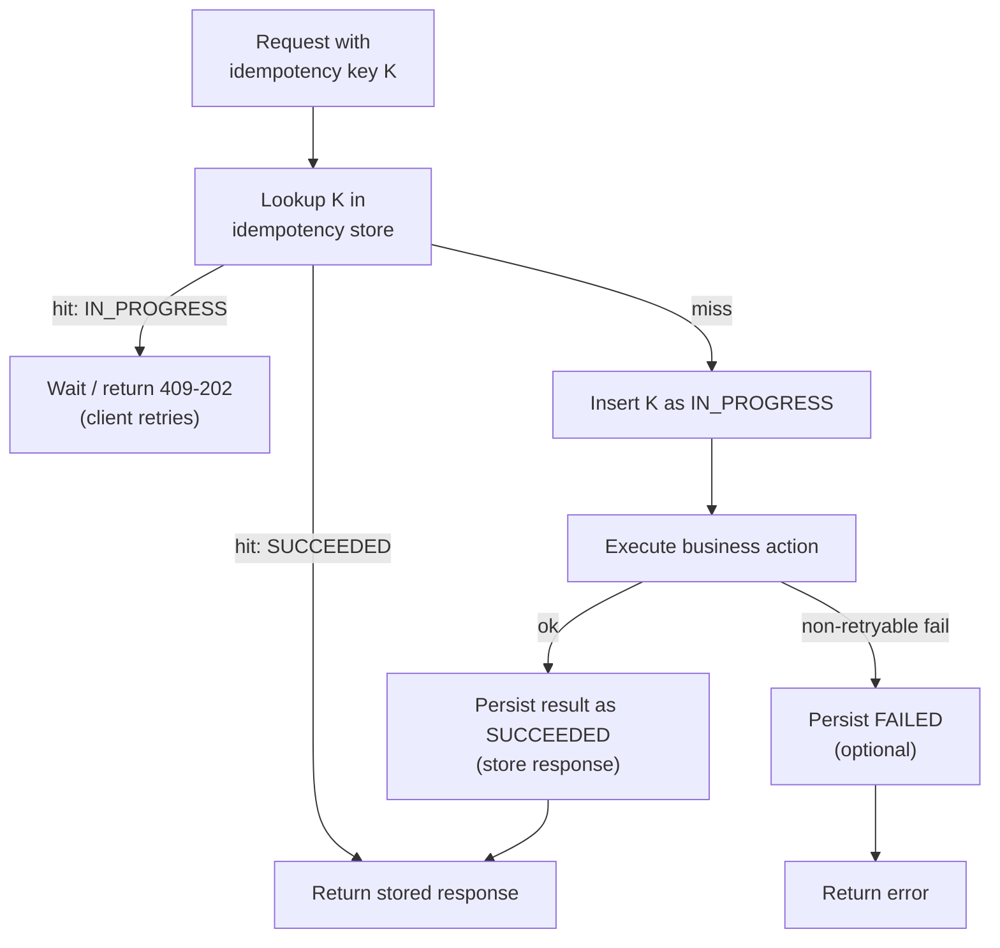

***

#### Inbox/Outbox: making side effects consistent with local commits

The **Dual Write Problem** is the classic distributed systems trap: you need to update your database AND publish a message to a queue (e.g., Kafka/SQS).

* If you commit to DB first and then fail to publish: other services never hear about the change.
* If you publish first and then fail to commit to DB: other services act on a "ghost" transaction that doesn't exist.

You cannot do both atomically without Two-Phase Commit (2PC), which we want to avoid.

**1. The Outbox Pattern (Guaranteed At-Least-Once Delivery)**

Instead of dual-writing, you write **everything to the database**.

1. Begin Local Transaction.
2. Update `Orders` table (business state).
3. Insert `Event` into an `Outbox` table (intent to publish).
4. Commit Transaction.

Since both are in the same DB, they commit or fail together.

A separate **Relay** process (or Debezium connector) then:

* Polls the `Outbox` table.
* Publishes to the message bus.
* Marks the row as 'sent' (or deletes it) _only after_ the bus confirms receipt.

**Result:** You trade latency for consistency. The event _will_ be published eventually.

**2. The Inbox Pattern (Idempotency for Consumers)**

Since the Outbox/Relay might crash after publishing but before marking 'sent', it might resend the same message. Consumers **must handle at-least-once delivery**. To process safely:

1. Begin Local Transaction.
2. Check `Inbox` table for this `MessageID`. If found, ignore.
3. Execute business logic.
4. Insert `MessageID` into `Inbox`.
5. Commit Transaction.

**Result:** Exactly-once processing. This pattern pairs perfectly with the Outbox to ensure data integrity across services.

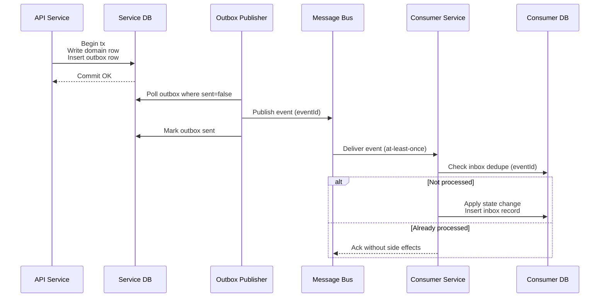

***

### Concrete examples:

#### Campaign activation

Imagine a multi-step campaign activation that requires:

1. Creating a budget record in the database.
2. Provisioning Kafka topics for ad events.
3. Warming targeting caches on edge nodes.
4. Finally, marking the campaign as `ACTIVE`.

**The Anti-Pattern (Distributed Monolith):** If you wrap all these in a single monolithic function (or distributed lock), you couple the availability of your database, your Kafka cluster, and your cache fleet.

* **Latency:** The user waits for Kafka topic creation (seconds) before the HTTP request returns.
* **Fragility:** If the cache warming fails, do you roll back the budget creation? If you do, the user loses their work.
* **Lock Contention:** You might be holding database locks while waiting for network calls to finish.

**The Production-Friendly Approach (Saga Orchestration):** Decouple the _intent_ from the _execution_.

1. **Synchronous Phase (User Intent):**
   * The Campaign Service validates the request and creates the budget row in a **local database transaction**.
   * It sets the campaign status to `PENDING_ACTIVATION`.
   * It writes an `ActivationRequested` event to the Outbox table in the _same_ transaction.
   * It returns `202 Accepted` to the user immediately. The UI shows "Activating...".
2. **Asynchronous Phase (Orchestration):**
   * The **Saga Orchestrator** picks up the event.
   * **Step 1:** Call Provisioning Service. (Idempotent: "Ensure topic exists").
   * **Step 2:** Call Cache Service. (Retryable: "Warm this ID").
   * **Step 3:** Call Campaign Service to finalize state `PENDING` → `ACTIVE`.
3. **Failure Handling (Compensations):**
   * If Provisioning fails retries, the Orchestrator marks the campaign `ACTIVATION_FAILED`.
   * We do _not_ delete the budget row (User Intent); we just stop the process so the user can "Retry Activation" later or fix the config.

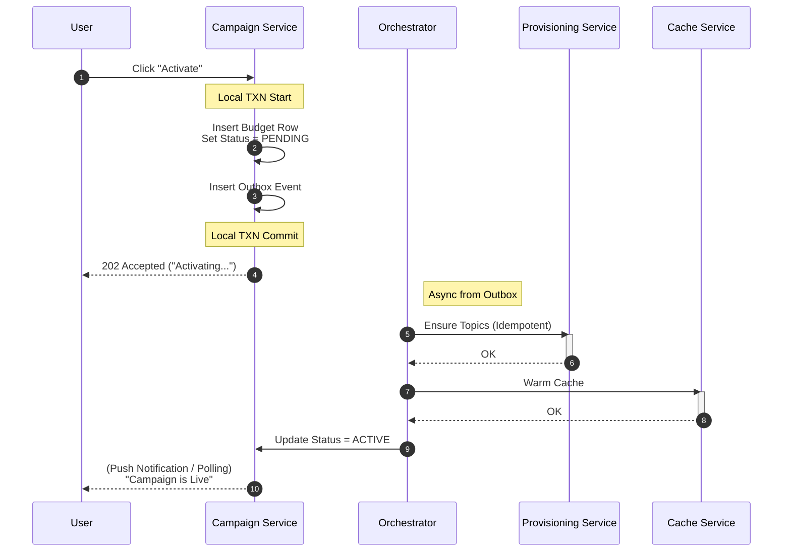

Operationally, you want the orchestrator to answer:

* **Where is it stuck?** (e.g., "Waiting on Cache Service since 10:05 AM")
* **Is it retrying?** (e.g., "Attempt 3/5 for Provisioning")
* **Is it safe to replay?** (Yes, because every step is idempotent)
* **What is the final state?** (Budget exists, but topics failed -> `ACTIVATION_FAILED`)

***

#### Payments and refunds: where partial success is unacceptable

Payments add two unique constraints:

1. **Dependency on External Systems:** You cannot `ROLLBACK` a Stripe charge or a bank transfer.
2. **Zero-Tolerance for Inconsistency:** You cannot lose money or double-charge.

**1. The Two-Phase Payment (Auth & Capture)**

To prevent "Ghost Charges" (money taken but order failed), use the **Authorize-Capture** pattern supported by most payment gateways.

* **Phase 1: Authorization (Hold).** Check validity and verify funds. The bank puts a "hold" on the money. This is **reversible** (void).
* **Phase 2: Internal Processing.** Do your risky work (checking inventory, saving records).
* **Phase 3: Capture.** Only when _everything else_ is secure, tell the bank to actually take the money.

If Phase 2 fails, you simply **Void** the Authorization. The customer never sees a charge on their statement, only a temporary hold that disappears.

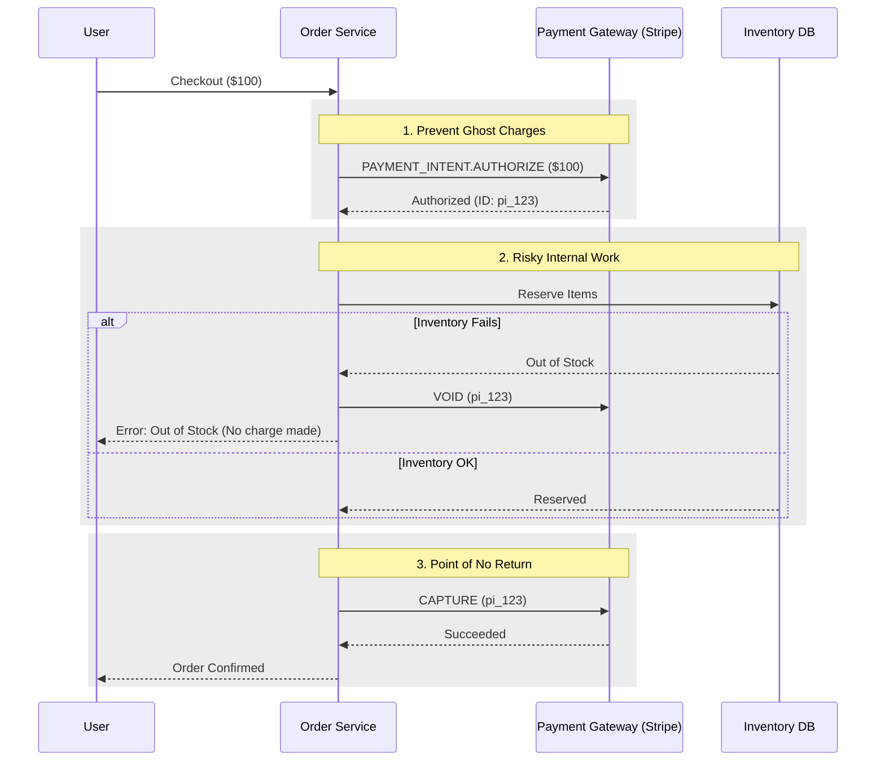

**2. The Ledger Pattern (Double-Entry Accounting)**

Never store a user's balance as a single mutable number (`balance = 100`). If you have a race condition, you lose money. Instead, use an **Event Sourcing** approach called a **Ledger**.

* **Table:** `LedgerEntries` (ID, AccountID, Amount, Type, ReferenceID)
* **Balance:** `SUM(Amount) WHERE AccountID = X`

To move $50 from User A to User B, you insert **two** immutable rows in a single DB transaction:

1. `{ Account: A, Amount: -50, Type: DEBIT, Ref: Transfer_123 }`
2. `{ Account: B, Amount: +50, Type: CREDIT, Ref: Transfer_123 }`

This provides auditability. If the sum is non-zero, you have a bug.

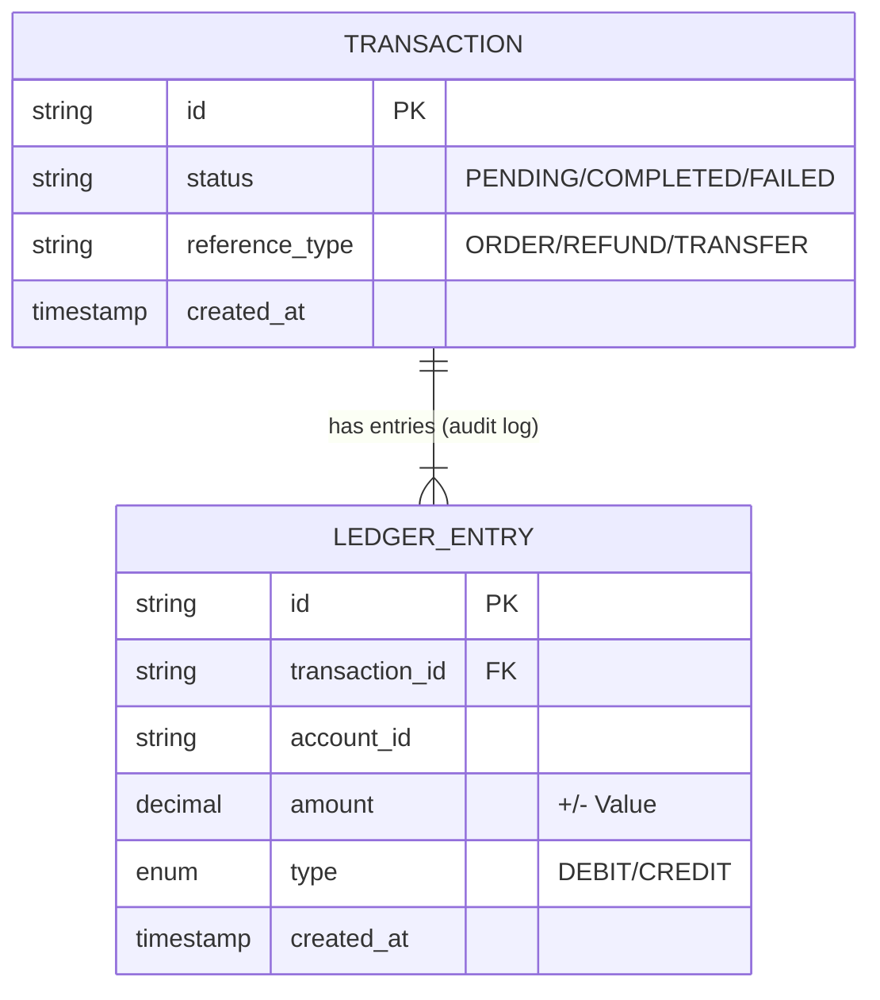

**3. Handling Refunds**

A refund is **not** a deletion of the original charge. It is a **new transaction** with a negative amount.

* Original: `CHARGE $50`
* Refund: `REFUND $50` (distinct ID, distinct lifecycle).

This preserves history: "You bought this, then you returned it."

When you can’t guarantee a compensating action (provider is down, network partition), **Reconciliation** becomes mandatory. You must run a daily job that downloads the settlement report from the payment provider and compares it line-by-line with your internal ledger.

***

**Designing for the real failure modes**

Distributed transactions fail in patterns. Design explicitly for these:

**1. Timeout but success**

* Service A calls Service B to process a transaction.
* Service B processes the request successfully but the network response is lost or delayed beyond Service A's timeout threshold.
* Service A assumes failure and retries. Without protection, Service B might process the transaction a second time (e.g., double-charging a user).

**Solution**:

* **Client-Generated Idempotency Keys**: The caller (Service A) must attach a unique `idempotency_key` (e.g., a UUID) to the request. This key should be persisted in Service A's database alongside the intent to ensure the same key is used across retries.
* **Server-Side Deduplication**: Service B checks for the existence of the `idempotency_key` in its own database before executing any logic. This check and the subsequent record insertion must be part of the same atomic database transaction.
* **Consistent Responses**: If a duplicate key is detected, Service B should not return an error. Instead, it should return the cached result of the _original_ successful operation (e.g., `200 OK` with the original transaction ID). This allows Service A to transition its state to "Complete" and stop retrying.
* **Storage TTL**: Idempotency records should have a Time-To-Live (TTL) long enough to cover the maximum possible retry window (e.g., 24–48 hours).

**2. Out-of-order events**

* A consumer receives a `PAYMENT_CAPTURED` event before the `PAYMENT_AUTHORIZED` event because the authorization message was delayed by a network partition or stuck in a retry loop.

**Solution**:

* **Monotonic State Transitions**: Define a strict state machine (e.g., `CREATED` -> `AUTHORIZED` -> `CAPTURED`). If the database is already in `CAPTURED` state, any incoming `AUTHORIZED` event is ignored as "stale."
* **Versioning / Sequence Numbers**: Attach a version number or a high-precision timestamp to every event. The database only applies an update if `incoming_version > current_version`.
* **Event Buffering**: If a "future" event arrives (e.g., Capture before Auth), store it in a temporary "out-of-order" table and re-evaluate it once the missing prerequisite event arrives.

**3. Poison messages / non-retryable failures**

* A consumer fails deterministically on a specific payload (e.g., malformed data, logic bug triggered by specific input). Retrying will never succeed and will block the queue (Head-of-Line blocking).

**Solution**:

* **Dead Letter Queues (DLQ)**: Move failing messages to a separate queue after a fixed number of retries to unblock the main pipeline.
* **Structured Triage**: Implement tooling to inspect, modify, and replay messages from the DLQ once the underlying bug is fixed.
* **Schema Evolution**: Use strict versioning (Protobuf/Avro) to prevent producers from sending data that consumers cannot parse.
* **Observability**: Alert on DLQ growth to catch systemic issues early.

**4. Coordinator hotspot / thundering herd**

* A central orchestrator or state store becomes a single point of failure or performance bottleneck.
* When a downstream service slows down, the coordinator holds resources (threads, DB connections) longer, leading to resource exhaustion.
* Retries from many instances hit the failing service simultaneously, creating a "thundering herd" that prevents recovery.

**Solution**:

* **Partitioning**: Shard the orchestrator's state and processing by `TransactionID` to distribute the load across multiple nodes.
* **Exponential Backoff with Jitter**: Ensure retries are spread out over time to avoid synchronized spikes in traffic.
* **Circuit Breakers**: Fail fast when a downstream service is unhealthy to protect the coordinator's resources.
* **Bulkheads**: Isolate resources for different transaction types so a failure in one doesn't starve the entire system.

**5. Split brain in business decisions**

* Two services both believe they are the authority for a decision, often due to overlapping logic or reading from different stale replicas.
* **Example**: Both the `InventoryService` and `OrderService` independently decide if a product is "In Stock" based on different database views, leading to overselling.

**Solution**:

* **Single Source of Truth (SSOT)**: Assign exactly one service to own a specific business invariant. Only that service can mutate that state.
* **Fact-Based Propagation**: Other services must subscribe to "Fact" events (e.g., `InventoryAllocated`) rather than re-calculating the logic themselves.
* **Fencing Tokens**: Use version numbers or monotonic counters. If a service attempts to make a decision based on an old version, the write is rejected.

***

**Practical state machine design**

Building a robust Saga Orchestrator requires a formal State Machine. It should not be a bunch of `if/else` statements in code; it should be a data model that operators can query.

**Key Design Principles:**

1. **Immutable Transaction ID (Correlation ID):**
   * **Rule:** Generate a UUID at the _very_ beginning (User Intent).
   * **Why:** This ID is the "index key" for your entire distributed system. It must be passed to every downstream service, every log line, and every message queue. Without it, you cannot debug "what happened to request X?" across 5 microservices.
2. **Explicit Step Status:** Every step in the saga (e.g., "ProvisionTopic", "ChargeCard") tracks its own state independently.
   * `NOT_STARTED`: Ready to run.
   * `IN_PROGRESS`: Command sent, waiting for reply / polling.
   * `SUCCEEDED`: Done. Output captured.
   * `FAILED_RETRYABLE`: Transient error (timeout). Backoff and retry.
   * `FAILED_PERMANENT`: Logic error or max retries hit. Trigger compensation.
   * `COMPENSATED`: Undo action completed successfully.
3. **Monotonic Transitions (The Ratchet):**
   * **Rule:** Time only moves forward. You never go "back" to a previous state.
   * **Example:** If a step fails, you don't reset it to `NOT_STARTED`. You transition it to `FAILED`, which triggers a _new_ step called `COMPENSATE`. This leaves a perfect audit trail of "Try -> Fail -> Fix".
4. **Deadlines (SLA Enforcement):**
   * **Rule:** Every transaction needs a `timeout_at` timestamp.
   * **Why:** If a message is lost or a service hangs forever, the Saga must eventually "wake up" and abort. A background "Reaper" process scans for expired transactions (`now > timeout_at AND status != FINAL`) and forces them to `FAILED` or alerts humans.

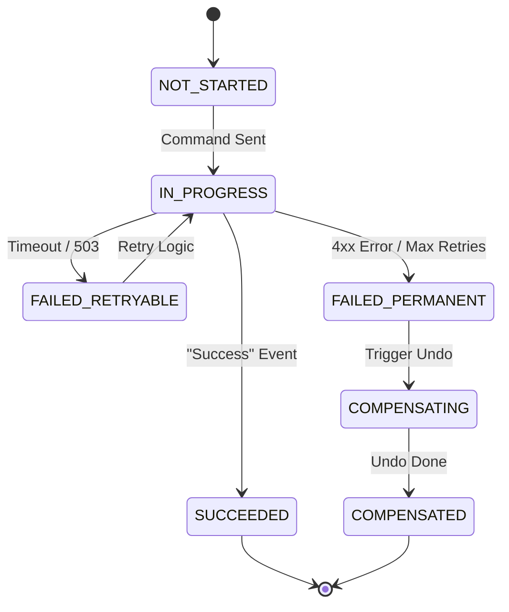

This state machine becomes an operational tool: it’s the source for UIs, dashboards, and support workflows.

***

**Observability you will wish you had (until you add it)**

In a synchronous monolith, a stack trace tells you everything. In a distributed async system, a stack trace only tells you about one local crash. To debug "Why is Order #123 still Pending after 4 hours?", you need three specific layers of observability.

**1. Distributed Tracing (The "Where")**

You must propagate a `TraceContext` (Trace ID + Span ID) across every boundary (HTTP headers, Kafka headers, DB metadata).

* **The Trap:** Most APM tools break traces at the message queue. You must manually extract the context from the Kafka message header and inject it into the consumer's thread local storage.
* **The Goal:** A single waterfall view in Jaeger/Datadog showing: `API -> DB -> Outbox -> Kafka -> Consumer -> Payment Gateway`.

**2. The Golden Signals for Sagas (The "Health")**

Dashboard widgets you should alert on:

* **Stalled Transactions:** `Max(Now - CreatedAt) WHERE status = 'IN_PROGRESS'`. If this exceeds 10 minutes, your consumers are stuck or backlogged.
* **Retry Pressure:** The ratio of `RetryAttempts` vs `NewTransactions`. A spike here indicates a downstream dependency partial outage.
* **Dead Letter Queue (DLQ) Velocity:** How fast is the "Hospital" queue filling up? 1/hour is noise; 100/minute is an incident.
* **Reconciliation Lag:** `Count(UnreconciledRecords)`. If this grows, your safety net is broken.

**3. The "Operator View" (The "What Happened")**

When a support ticket arrives ("My campaign is stuck"), your tool should render a timeline, not just raw logs.

```mermaid
gantt
    title Transaction 123 Lifecycle (trace_id: abc-999)
    dateFormat  HH:mm:ss
    axisFormat  %H:%M:%S

    section Campaign Svc
    "Create Budget Row"       :done,    des1, 10:00:00, 10:00:01
    "Emit Outbox Event"       :done,    des2, 10:00:01, 10:00:01
    
    section Orchestrator
    "Consume Event" 	          :done,    orch1, 10:00:02, 10:00:03
    "Call Provisioning Try 1" :crit,    prov1, 10:00:03, 10:00:08
    "Call Provisioning Try 2" :active,  prov2, 10:00:09, 10:00:10
    
    section Provisioning Svc
    "Timeout 503"             :crit,    err1, 10:00:03, 10:00:08
    "Success 200"             :         ok1,  10:00:09, 10:00:10
```

**Key Debugging queries:**

* "Show me all logs where `correlation_id = abc-999`"
* "Show me the payload state at step 'Provisioning'" (Did we send the correct arguments?)

***

**Reconciliation: the safety net, not the exception**

Building distributed systems without reconciliation is like flying a plane without an altimeter—you _hope_ you are where you think you are.

Failures like **dropped ACKs**, **missed webhooks**, or **buggy consumers** are not anomalies; they are statistical certainties. Use reconciliation to turn "data corruption" into "latency."

**1. The "Sweeper" Pattern (Internal Consistency)**

Background processes (cron jobs) that monitor the _age_ of transaction states.

* **Goal:** Detect stuck transactions.
* **Logic:** `SELECT * FROM Orders WHERE status = 'PENDING' AND updated_at < NOW() - INTERVAL '10 minutes'`
* **Action:** actively poll the downstream service or re-queue the event.

**2. The "Settlement" Pattern (External Consistency)**

You cannot trust your own database for the state of external systems (e.g., Stripe, Ad Servers).

* **Goal:** Align internal truth with external truth.
* **Method:**
  1. Download the "Settlement Report" or "vCenter State" (the source of truth) periodically.
  2. **Diff** against your local database.
  3. **Patch:** If Stripe says "Paid" but you say "Pending", update to "Paid". If Stripe says "Failed", trigger your failure handler.

**3. Deterministic Replay**

When a reconciliation job finds a mismatch, do not "hack" the database state. Instead, **re-emit the original event**.

* This ensures the _entire_ side-effect chain (emails, analytics, cache invalidation) runs correctly.
* This relies heavily on **Idempotency** in your consumers.

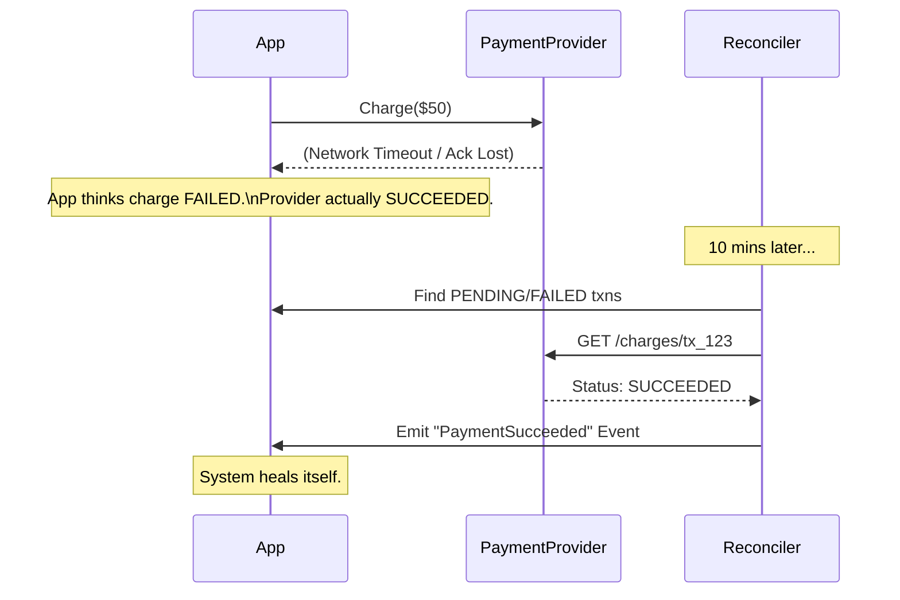

In high-volume systems, reconciliation is often the difference between "we had a massive data outage" and "the system had 10 minutes of lag."

***

**Coordinators as hotspots (and how to avoid them)**

A centralized Orchestrator is easy to reason about but can become a bottleneck because it requires a **write lock** on the saga state for every step transition.

**The "Hot Neighbor" Problem:** If Tenant A triggers 10k campaigns/sec, Tenant B's single campaign might get starved because they share the same database partition.

**Mitigations:**

1. **Sharding (Partitioning):** Do not put all saga states in one monolithic table. Shard by `account_id` or `transaction_id`.
2. **Push, Don't Poll:** Instead of the Orchestrator periodically polling "Is the cache warm?", have the Cache Service fire a `CacheWarmed` event back to the Orchestrator. The Orchestrator "sleeps" (consuming 0 resources) until that specific event wakes it up.
3. **Lightweight State:** Don't store the full payload in the coordinator. Store references (IDs) to blobs in S3/Redis to keep DB pages small.

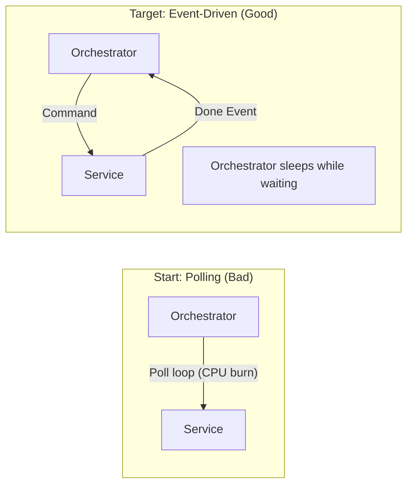

***

**Design trade-offs (what you actually choose in production)**

| Trade-off         | Option A (Strict)                                             | Option B (Available/Saga)                                                   | Verdict                                                                    |
| ----------------- | ------------------------------------------------------------- | --------------------------------------------------------------------------- | -------------------------------------------------------------------------- |
| **Consistency**   | **2PC / Distributed Lock:** Guaranteed immediate consistency. | **Saga:** Intermediate states visible (Order created, but payment pending). | Use Sagas. Users accept "Pending" states; they don't accept "System Down". |
| **Complexity**    | **Monolith:** Function calls are simple.                      | **Async Messaging:** Requires queues, outbox, correlation IDs.              | You pay the "Complexity Tax" to buy "Scalability".                         |
| **Data Volume**   | **Ephemeral:** Once done, it's gone.                          | **Event Sourcing:** Infinite history of every change.                       | Storage is cheap; debugging lost data is expensive. Keep the events.       |
| **Response Time** | **Fast:** Fail fast if any dependency is down.                | **Slow(er):** Queue and retry until success.                                | For essential revenue flows (Payments), prefer Retries (Saga).             |

***

**A checklist: Are you ready for production?**

**Phase 1: Design**

* [ ] **Single Owner:** Every data field has exactly one service allowed to write to it.
* [ ] **State Machine:** Explicit `PENDING`, `SUCCESS`, `FAILED` states defined.
* [ ] **Idempotency:** Every receiver checks `if (processed(id)) return cached_response`.

**Phase 2: Implementation**

* [ ] **Outbox Pattern:** No dual writes. DB transaction includes the message intent.
* [ ] **Correlation IDs:** Passed deeply through headers (HTTP/Kafka).
* [ ] **Timeouts:** Every step has a `timeout_at` value.

**Phase 3: Operations**

* [ ] **Dead Letter Queue (DLQ):** There is a UI/Script to view and replay failed messages.
* [ ] **Reconciliation:** A cron job exists to fix "stuck" transactions.
* [ ] **Metrics:** Alerts are set for "Stalled Sagas" (> 10 mins).

If you do these consistently, you’ll find that the system behaves predictably under failure—and that’s the real definition of correctness in distributed transaction systems.
