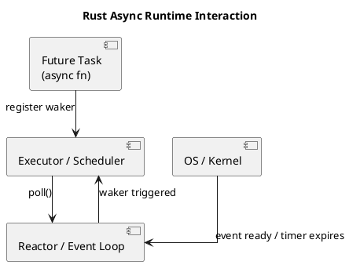

# How does Rust async?

## Understanding Rust Async Runtime

Rust's async system is designed to be highly efficient and flexible, but it requires understanding a few core concepts: futures, executors, wakers, and runtime choice. This article walks through a minimal async runtime, how Rust executes async functions, and how runtimes are selected.

### 1. Minimal Async Runtime Example

In Rust, `async fn` produces a Future, a state machine that must be polled to make progress. To illustrate, here’s a super minimal runtime:

```rust
use std::future::Future;
use std::pin::Pin;
use std::task::{Context, Poll};
use std::sync::{Arc, Mutex};
use std::collections::VecDeque;

// Simple task executor
struct Executor {
    tasks: Arc<Mutex<VecDeque<Pin<Box<dyn Future<Output=()> + Send>>>>>,
}

impl Executor {
    fn new() -> Self {
        Executor {
            tasks: Arc::new(Mutex::new(VecDeque::new())),
        }
    }

    fn spawn<F>(&self, fut: F)
    where
        F: Future<Output=()> + Send + 'static,
    {
        self.tasks.lock().unwrap().push_back(Box::pin(fut));
    }

    fn run(&self) {
        while let Some(mut task) = self.tasks.lock().unwrap().pop_front() {
            let waker = futures::task::noop_waker();
            let mut ctx = Context::from_waker(&waker);

            match task.as_mut().poll(&mut ctx) {
                Poll::Ready(_) => {},
                Poll::Pending => self.tasks.lock().unwrap().push_back(task),
            }
        }
    }
}
```

#### Example async function

```rust
use std::time::Duration;
use futures_timer::Delay; // simple async sleep

async fn say_hello() {
    println!("Hello...");
    Delay::new(Duration::from_secs(1)).await;
    println!("...world!");
}
```

#### Running the executor

```rust
fn main() {
    let executor = Executor::new();
    executor.spawn(say_hello());
    executor.run();
}
```

Explanation:

1. `say_hello()` returns a future, not executed immediately.
2. `Executor::spawn` stores the pinned future in a queue.
3. `Executor::run` polls each future:
   * Poll::Ready → done
   * Poll::Pending → push back to queue
4. `futures_timer::Delay` registers a waker so the executor knows when to poll again.

> Note: This minimal runtime uses noop\_waker and does not integrate with the OS. Production runtimes like Tokio have a full reactor system.

### 2. How Rust Selects an Async Runtime

#### Async/await is runtime-agnostic

```rust
async fn foo() -> i32 { 42 }
let result = foo().await;
```

* Writing `async fn` does not run anything automatically.
* `async fn` returns a future — a lazy state machine.
* Execution only happens when polled.

#### Runtime selection is explicit

You choose the runtime by using an executor:

* Tokio runtime:

```rust
#[tokio::main]
async fn main() {
    let val = foo().await;
    println!("{}", val);
}
```

* async-std runtime:

```rust
#[async_std::main]
async fn main() {
    let val = foo().await;
    println!("{}", val);
}
```

* Manual executor (futures crate):

```rust
use futures::executor::block_on;

fn main() {
    let result = block_on(foo());
    println!("{}", result);
}
```

#### Important points

* You cannot mix runtimes freely; doing so may produce runtime errors.
* Some libraries require a specific runtime (e.g., tokio::time::sleep).
* The future itself is generic; only polling and I/O integration are runtime-specific.

### 3. Rust Async Runtime Internals

Rust async runtime components:

1. Futures (State Machines)
   * Generated by async fn.
   * Implement Future trait with a poll method.
2. Wakers
   * Futures register wakers when they are pending.
   * The runtime calls the waker when a task can make progress.
3. Executor / Scheduler
   * Polls futures until they complete.
   * Can be single-threaded or multi-threaded.
   * Uses a task queue (often work-stealing in production runtimes like Tokio).
4. Reactor
   * Integrates with the OS for asynchronous I/O.
   * Linux: epoll, macOS: kqueue, Windows: IOCP.
   * Notifies wakers when I/O is ready.

#### Summary

* Rust async/await produces futures; nothing runs automatically.
* Executors / runtimes drive these futures to completion.
* Wakers and reactors handle async events and I/O notifications.
* Runtimes like Tokio, async-std, or smol provide the infrastructure for scheduling, timers, and I/O integration.

## Does Rust Async Runtime Use epoll or Event Loop?

Most Rust async runtimes use **an event loop with OS-specific mechanisms like `epoll` (Linux), `kqueue` (macOS/BSD), or IOCP (Windows)** under the hood to implement non-blocking I/O efficiently. Here’s how it works:

***

### 1. Async runtime architecture

A typical async runtime has **three main layers**:

1. **Executor / Scheduler**
   * Manages futures/tasks.
   * Polls tasks repeatedly until they complete.
2. **Reactor (event loop)**
   * Integrates with the OS’s async I/O APIs.
   * Waits for sockets, timers, or file events to become ready.
   * When an event is ready, it **wakes the corresponding future**.
3. **Futures / Wakers**
   * Each async operation is a future.
   * When a future cannot make progress, it registers a **waker** with the reactor.
   * The reactor triggers the waker when I/O is ready, putting the future back on the executor queue.

***

### 2. How `epoll` / event loop fits in

On Linux:

* The runtime creates an **`epoll` instance**.
* Async I/O (e.g., TCP read/write) registers the file descriptors with `epoll`.
* The executor calls `epoll_wait`, blocking until any registered descriptor is ready.
* When `epoll_wait` returns, the runtime polls all affected futures, letting them make progress.

Other OSes:

* macOS/BSD → `kqueue`
* Windows → IOCP
* Linux → `epoll`
* FreeBSD → `kevent`

> This is why runtimes like **Tokio** or **async-std** are extremely efficient: a single thread can handle **thousands of sockets** without creating one OS thread per socket.

***

### 3. Event loop vs thread-per-task

* Traditional blocking I/O uses **one thread per connection** → high memory overhead.
* Async runtimes use **one event loop (or a few threads) to handle many tasks**, waking them only when their I/O is ready.
* This is sometimes called the **reactor pattern**.

***

Below is a diagram showing how **Executor/Scheduler**, **Reactor (Event Loop)**, and **Futures/Wakers** interact in a typical Rust async runtime like Tokio:



#### Explanation

1. **Futures (async tasks)**
   * Represent suspended computations.
   * When they cannot make progress (e.g., waiting on I/O), they register a **waker** with the reactor.
2. **Executor / Scheduler**
   * Maintains a queue of runnable tasks.
   * Polls each future repeatedly.
   * Moves futures back to the queue when wakers are triggered.
3. **Reactor (Event Loop)**
   * Waits for OS events (`epoll`, `kqueue`, `IOCP`).
   * When an event is ready (e.g., TCP socket is readable), it **calls the waker** to notify the executor.
   * The executor then polls the ready future, allowing it to make progress.

***

#### Flow Summary

1. Executor polls futures in its queue.
2. Future cannot proceed → registers a waker with Reactor.
3. Reactor waits for OS events.
4. OS signals readiness → Reactor triggers waker.
5. Executor receives ready future → polls it again → task progresses.
6. Repeat until future completes.

> This architecture allows a **small number of threads** to efficiently manage thousands of concurrent I/O tasks without blocking.


### 4. Summary

* Rust async runtimes **do use an event loop under the hood**.
* They rely on OS-specific async I/O APIs like **`epoll`**, **`kqueue`**, or **IOCP**.
* Futures register wakers with the event loop, which resumes them when events are ready.
* This allows high-concurrency, low-overhead async programming without blocking threads.
