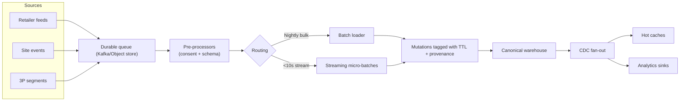
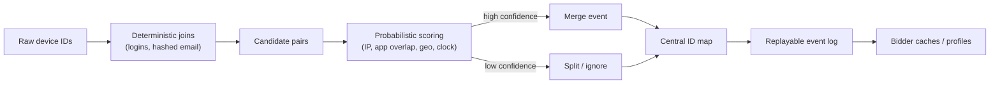
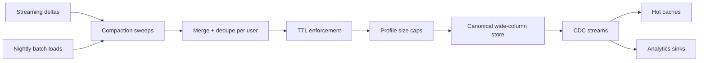
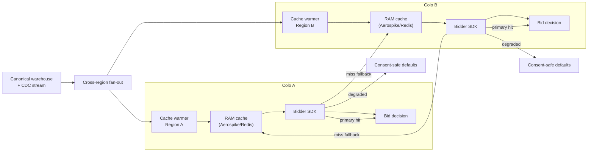

# DSP's Data system

A DSP’s User Data Service manages the audience intelligence that powers bidding decisions.

### Responsibilities:

* **Identity resolution** – maintaining device IDs, cookies, MAIDs, and cross-device graphs so impressions can be tied to known users or households.
  * _Challenge:_ identity signals _**decay quickly**_ (cookie churn, iOS privacy changes, carrier IP reuse), so the service must constantly reconcile conflicting IDs and propagate merges/splits without corrupting shared profiles or violating consent constraints.
* **Profile storage & enrichment** – collecting behavioral, contextual, purchase, and third-party segments; merging them into user profiles with timestamps, recency, and frequency metadata.
  * _Challenge:_ ingest streams arrive at wildly different cadences and quality levels, so merging them risks double-counting events, blowing up profile size, or letting stale segments override fresher ones unless dedupe logic, TTL enforcement, and versioning are rigorously applied.
* **Consent & privacy enforcement** – honoring GDPR/CCPA/COPPA flags, suppressions, and opt-outs before any targeting or activation happens.
  * _Challenge:_ consent signals arrive from disparate frameworks (TCF strings, US privacy strings, hashed opt-out files) and can change between impression and conversion, so every data mutation must be re-checked or rolled back to avoid regulatory exposure and partner penalties.
* **Activation API** – exposing **fast lookups** (often in-memory or cache layers) to the bidder so each impression can be matched with relevant traits in microseconds.
  * _Challenge:_ bidders expect consistent low-latency responses even during cache churns or region failovers; any miss or timeout forces default bids, so the API needs aggressive replication, degraded-mode fallbacks, and circuit-breaker logic without inflating infrastructure cost.
* **Audience analytics** – surfacing reach, overlap, decay, and performance metrics to planners while feeding model training pipelines (e.g., lookalike, predictive scoring).
  * _Challenge:_ analytics queries scan massive historical datasets that live on colder storage, yet planners demand near-real-time numbers; balancing interactive SLAs with compute cost requires tiered storage, sampled rollups, and strict governance so exploration never starves the hot serving tier.

### Characteristic

* **Availability**: typically treated as tier-0/“always on,” with multi-region replication and self-healing to keep bidder SLAs; downtime directly lowers win rates. Target SLO is usually _**≥99.99% monthly**_ (≤4.3 minutes of error budget), with cross-region replication lag held under _**2–3 seconds**_&#x73;o auctions in any colo can keep reading fresh data.
* **Latency**: tight _**single-digit millisecond**_ budget per lookup (_**often 1–3 ms from bidder to cache**_) so the overall bid decision stays within \~100 ms exchange deadlines. Budgeting typically looks like:
  * 300–500 µs for network hop inside the colo
  * 500–800 µs for cache hit,
  * and <1 ms tail for serialization + SDK logic,
  * leaving \~90 ms for creative rendering and exchange overhead.
* **Volume**: must sustain _**hundreds of thousands to millions of QPS during peaks**_, plus _**continuous ingestion of logs/segments**_; profiles can reach billions of IDs. A single NA region often runs _**250–400 k lookups/sec baseline with burst headroom to 1 M QPS**_, while ingestion pipelines absorb _**5–8 TB of raw logs per day and keep \~5–10 B active IDs**_ (tens of terabytes compressed) online.
* **Access pattern**: a classic _**write-many/read-instant**_ system. Ingestion pipelines hammer storage with _continuous append-heavy updates_ _**(5–8 TB/day)**_ while nightly + streaming merges enforce TTLs and dedupe semantics, but _the bidder hot path is dominated by cache reads that must return traits in 1–3 ms_. Multi-region RAM replicas keep read latency flat even as writes churn in the warehouse tier.
* **Processing mode**: _hybrid—ingestion/enrichment happens via high-throughput batch + micro-batch pipelines, but serving to the bidder is strictly real-time via hot caches or in-memory stores_. Streaming enrichers typically push 30–50 k updates/sec into the warehouse (p99 < 10 seconds freshness), nightly compactions sweep \~15 TB of parquet/object storage in 2–3 hours, and cache propagation SLAs keep hot traits <60 seconds behind canonical.

### System design recommendations

#### Ingestion + consent gate:

Land retailer feeds, site events, and partner segments into durable queues (Kafka/Object storage) where pre-processors validate schema, attach consent tokens, and reject/park anything failing policy checks—directly backing the **consent/privacy** responsibility while scaling to the **volume** targets. Split flows into nightly bulk loads for elephant updates and streaming micro-batches for < 10 s freshness, tagging each mutation with TTL + provenance so downstream merges stay deterministic and satisfy the **access-pattern** + **processing-mode** goals. By gating data before it hits the warehouse, we prevent non-compliant mutations from polluting caches, and by decoupling batch versus streaming paths we keep ingestion horizontally scalable even as log rates spike.

* “**consent tokens**” are the machine-readable artifacts attached to each event (e.g., TCF v2 string, US Privacy string, hashed opt-out flag, per-partner consent bitset) that encode what the user allowed or denied at the time of collection. Ingestion attaches these tokens to every record so downstream merges and cache serves can enforce GDPR/CCPA/COPPA rules per look-up.
*   Each incoming update (“mutation”) **carries two bits of metadata**:

    * **TTL (time-to-live)** marks when that trait expires, so downstream jobs know when to drop it instead of letting stale data override fresher writes. TTL is _**assigned during ingestion based on consent requirements**_ (CCPA deletions get immediate expiration, state consent gets 90 days), business rules (behavioral segments expire in 7/14/30 days), and third-party contracts (e.g., 180 days), with the pre-processor stamping this TTL into metadata so all downstream systems use consistent expiration semantics.
    * **Provenance** encodes the source feed/version (e.g., “retailer bulk load 2025‑12‑05 03:00, file 7”), so if multiple feeds touch the same user attribute, merge logic can consistently pick the newest or highest-priority source.

    With TTL + provenance on every mutation, compaction jobs _**can deterministically reconcile batch vs. streaming inputs**_ (no double counts, no random winner). That determinism is what keeps the hybrid processing mode sane—streaming updates provide freshness, batch sweeps clean up debt—and what preserves the write-many/read-instant access pattern, because caches receive a single, ordered change stream instead of conflicting rewrites.

#### Identity graph + dedupe services

The service should have the following processing step:

* _**Deterministic joins**_ (login, hashed email) first, then
* _**Probabilistic device graph scoring**_:
  * _Is how the identity service guesses when multiple device IDs belong to the same user/household by running ML models over shared signals. Instead of just deterministic keys (logins, hashed emails), it scores features like IP co-occurrence, app install overlap, browsing clocks, geo proximity, and hardware fingerprints. Each candidate pair or cluster gets a probability, and when it crosses a confidence threshold the system emits a “merge” event linking those IDs. If the probability drops (e.g., signals diverge) it can emit a “split.” This keeps the graph fresh even when deterministic links are missing but also lets the system roll back if confidence was misplaced._
* _**Emitting merge/split**_ events that update a centralized ID map to uphold the _identity resolution_ responsibility

All graph mutations are **replayable logs** so privacy teams can _**roll back poisoning or honor subject-access/delete**_ requests within minutes, reinforcing **availability** of clean IDs and **compliance** guarantees.

This layered resolver _**prevents stale or conflicting IDs**_ from inflating profile counts, while the immutable logs let us _**re-derive the graph after failures**_, so bidder lookups never depend on best-effort heuristics alone.

#### Canonical profile warehouse

* Store **hydrated profiles** in a wide-column or key/value database (Bigtable/Cassandra/DynamoDB) partitioned by **stable user ID** so billions of IDs stay queryable, satisfying the **volume** characteristic.
  * _Wide-column/key-value stores like Bigtable, Cassandra, or DynamoDB give you exactly what this canonical profile tier needs: **horizontally sharded partitions** keyed by a stable user ID, f**ast range and point lookups**, and **write throughput** high enough to absorb tens of thousands of updates per second while keeping **storage costs predictable**. They offer tunable **consistency/replication**, **built-in TTL support** per column, and column families that let you keep different trait classes isolated. Relational schemas would bottleneck on JOINs and index bloat at billions of rows, while purely document/object stores tend to lack deterministic TTL + wide-row patterns. So these distributed KV/column stores hit the sweet spot for billion-profile scale with deterministic sharding and low-latency access for CDC and cache refresh._
* Background **compaction** jobs:
  * _**Merge streaming deltas with batch loads**_: The store receives tiny updates from streams (fresh traits) and huge nightly backfills (bulk partner drops). _Compaction sweeps_ combine them into a single ordered record per user, so caches see one source of truth instead of conflicting versions.
  * _**Enforce per-trait TTL**_: Every attribute has an expiry enforced here; compaction drops anything past its TTL so stale behavior can’t override fresh signals.
  * _**Cap profile size**_: Prevents runaway growth from overactive feeds by trimming or archiving least-recent traits, keeping rows within SLA-friendly bounds.
  * _**Emit change data capture (CDC)**_ streams toward caches and analytics sinks: After reconciling, compaction emits change events to caches and analytics sinks so downstream systems stay synchronized without rereading the whole table.

which protects **profile storage & enrichment** integrity and keeps downstream tiers within **latency** budgets. **Centralizing truth** here means **caches can be rebuilt deterministically after incidents**, and the compaction/TTL routines **keep storage bounded** so SLA budgets aren’t blown on oversized rows.

Compaction sweeps algorithm from wellknown database

> Some popular **compaction sweeps algorithm** from wellknown database that can be adopted:
>
> * **Size-tiered compaction**: merge smaller SSTables into progressively larger ones; good for write-heavy workloads (used by Cassandra’s STCS).
> * **Leveled compaction**: maintain multiple levels with fixed-size SSTables; keeps read amplification low and enforces strict size caps (Cassandra LCS, RocksDB default).
> * **Time-window compaction**: bucket SSTables by time windows so TTL’d data can age out efficiently (Cassandra TWCS).
> * **FIFO compaction**: drop oldest SSTables first; handy for strictly append-only data like logs (some Bigtable/GCP use cases).
> * **Hybrid / adaptive**: combine leveled + size-tiered depending on shard pressure (RocksDB’s universal compaction, Cassandra’s adaptive compaction).
> * **Partial or row-level compaction**: only touch rows with overlapping primary keys (HBase minor compactions).
> * **Major/full compaction**: periodic full rewrite to reclaim space and reindex TTL metadata (HBase major compaction, Bigtable’s full compaction).

#### Hot serving tier + bidder SDK

_Everything above focused on ingest-side rigor—getting data landed, normalized, deduped, and enriched. Those pipelines can tolerate tens of seconds of lag because writes flow asynchronously. The next section shifts to the serving tier, where every lookup must hit in 1–3 ms or the bidder can’t place a competitive bid._

* Replicate frequently accessed traits into **multi-region in-memory** clusters (Aerospike/Redis) **co-located with bidder pods** to meet the latency (1–3 ms) and availability (99.99%) commitments.
* SDK-side clients issue cache-first lookups with p99 < 3 ms, fall back to regional replicas on miss, and degrade to consent-aware defaults if all caches fail, preserving **activation API** SLAs.
* **Writes never go directly to caches**; instead, **CDC fan-out** plus **cache warmer** services push updates so read paths remain **lock-free** and aligned with the _write-many/read-instant_ access pattern. This separation lets the bidder stay responsive even when ingest spikes or warehouse repairs occur, because caches ride off CDC streams rather than synchronous writes.

**What “co-located colo caches” really means:**

Each bidder deployment runs in its own colocation (colo) cage inside a regional data center. Putting the cache cluster in that same cage removes the extra cross-region hop, so the bidder SDK can reach user traits within microseconds. “Multi-region replicas” simply means every colo keeps its own hot copy that is fed by the same CDC stream, and health-checked peer links let Region A borrow Region B’s cache (or vice versa) if a local cache shard fails, all while keeping writes asynchronous.

**Keeping the cache warm:**

Cache warmers subscribe to the CDC stream, batch the trait deltas, and write them into the cache using **single-writer semantics** before the bidder ever needs them. Because the warmers own the write path (and do it asynchronously), the bidder SDK only performs reads; there’s no read-write contention, no per-request locks, and no need for the bidder to invalidate keys itself. The warmer can stage updates (e.g., write-behind buffers, multi-key pipelines) and atomically swap them into the cache, so lookups stay lock-free and purely read-only while updates propagate in the background.

Single write making read lock free

> _Warmers never take a table-wide lock—doing so would collapse QPS. Each warmer shard owns a slice of the keyspace and applies updates per entry (or small deterministic batches) using pipelined/multi-key commands, so only the targeted keys see brief atomic ops. Single-writer semantics just means “only the warmer writes,” not “one global mutex”: the cache stays read-only for bidders, while warmers stream CDC deltas through per-key sets or compare-and-swap updates, optionally guarded by short-lived row/partition locks if the cache supports them._

Tool for cdc stream fanout

* **Kafka + MirrorMaker 2 / Cluster Linking** when you already use Kafka upstream; built-in ACLs, topic-level filtering, and high-throughput replication make it the default fan-out spine.
* **Debezium (on Kafka Connect)** if CDC originates from relational stores—gives schema evolution, exactly-once semantics into Kafka, then fan-out via MirrorMaker or Flink.
* **AWS DMS + Kinesis Data Streams / Firehose** for managed CDC out of RDS/Aurora into multi-region consumers, especially in all-AWS stacks.
* **GCP Datastream + Pub/Sub** when sourcing from Cloud SQL/Oracle into GCP analytics and cache warmers.
* **Flink or Spark Structured Streaming** jobs downstream of the CDC log to handle per-region routing, filtering, and back-pressure control before hitting cache warmers.

**Falling back strategy:**

There few strategy to pick the other colo cage when a local cache miss:

* **Prefer nearest healthy regions first**: keep an ordered list based on measured latency + replication lag so the SDK tries the lowest-latency replica most likely to be warm.
* **Use health-scored consistent hashing**: map user IDs to fallback regions via a consistent hash ring that skips unhealthy nodes, so the same user tends to hit the same remote cache and benefits from reuse.
* **Layer adaptive retries**: after a miss, pick a different region using weighted randomization biased by recent hit rates/lag metrics rather than round-robin, so traffic gravitates toward replicas with fresher data.
* **Cache short-lived negative lookups**: if a fallback region reports “not found,” memoize that outcome briefly to avoid hammering the same cold replica until CDC catch-up closes the gap.

#### Analytics + ML surfaces

* Funnel CDC and historical snapshots into columnar warehouses (BigQuery/Snowflake) backing reach/overlap reports and model training, fulfilling the **audience analytics** responsibility.
* Tiered storage (hot parquet rollups → cold object store) lets planners run interactive queries without hammering the serving tier, preserving **hot-path latency** and **cost efficiency**. Because analytics work off replicas, experimentation never competes with bidder caches for CPU or memory, so the system sustains growth without degrading impression-time SLAs.

#### Observability, governance, resilience

* SLO dashboards to watch: `ingest lag`, `cache hit rate`, `lookup latency`, `replication skew` to guard the **availability** + **latency** goals.
* Automated failover scripts promote standby regions when health checks fail, and chaos drills validate bidder fallback logic, ensuring the tier-0 **Availability** expectations.
* Governance pipelines replay audit logs nightly to prove consent compliance, purge expired data, and reconcile data catalog ownership, tying back to **consent & privacy enforcement** responsibilities.
* These guardrails mean we detect regressions before they burn the 4.3-minute error budget, and auditors get evidence that every data touch honors consent lineage.
