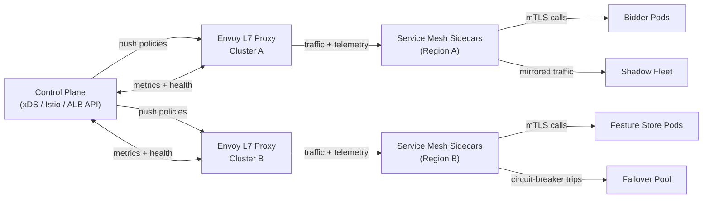
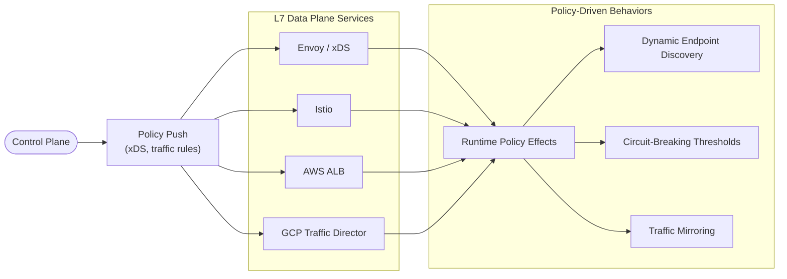
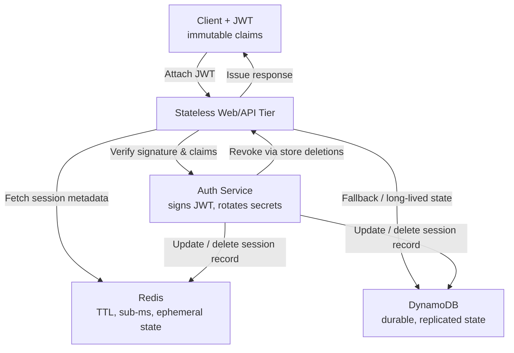

# Load balancing (L4 vs L7)

**Concept:** Distribute requests across multiple service instances so no single host becomes a hotspot and the system tolerates failures. Treat it as the first guardrail of reliability—if traffic is skewed or misrouted, nothing downstream matters.

### **Layer 4 (transport-level)**

balancers operate on TCP/UDP metadata (IP, port). They are protocol-agnostic and fast, forwarding packets using algorithms like round-robin, least connections, power-of-two choices, or Maglev-style consistent hashing. Because they ignore payloads, they shine for raw throughput, TLS passthrough, and protocols beyond HTTP (gRPC, custom RPC, QUIC).

* **Round-robin:** simplest scheme; each new connection advances a pointer through the target list. Great for _uniform servers_ but _oblivious to current load_. It shines when:
  * (1) every backend node has _comparable CPU/memory_
  * (2) request durations are _short/consistent_, and
  * (3) you can’t afford the state tracking overhead of least-connections (think stateless HTTP gateways or edge POPs with _thousands of downstream targets_). In those conditions, deterministic fairness beats the noise of lagging counters.
* **Least connections:** directs traffic to the target with the _fewest active connections_, reacting to slow nodes but requiring each proxy to _track per-target state_.
  * Be careful of the _**black-hole problem**_: if a backend fails fast and shows near-zero connections, the LB may keep sending traffic and worsen the incident unless coupled with health probes/outlier detection.
  * Use it when connection _**lifetimes vary widely**_ - usually long - (streaming APIs, long-polling) and you need the balancer to observe real load rather than assume uniformity.
  * Works well for _**small/medium fleets**_ where per-target counters can be synced cheaply and the cost of an imbalanced host is high (stateful workers, CPU-heavy inference).
* **Power-of-two choices:** randomly samples two targets and picks the better one (e.g., fewer connections). Nearly matches global least-connections accuracy with far less coordination—ideal for massive fleets.
  * Use it at L4 when you have thousands of mostly identical workers and want near least-connections accuracy without exchanging per-target counters across proxies.
  * Prefer it for stateless fleets (API gateways, queue workers) where fairness and fast convergence matter more than sticky routing.
  * It also works well when you expect frequent autoscaling events—sampling two candidates absorbs membership churn without rebuilding hash tables.
* **Maglev-style consistent hashing:** hashes 5-tuple metadata onto a large lookup table built once per deployment. Provides sticky routing with O(1) lookup and minimal remapping when hosts churn; a staple for Google Front End and Envoy.
  * Ideal for _**tenant-affinity at L4**_ (gaming sessions, chat rooms) when you cannot afford L7 parsing but still need sticky flows.
  * Downsides: table rebuilds during membership churn are heavier than round-robin, and uneven node sizes require virtual nodes or weighting logic.

**L4 quick checklist:**

* **Pros**: low latency data-plane (single-digit microseconds), protocol agnostic, cheap to scale horizontally, excellent for throughput-sensitive workloads.
* **Cons**: no insight into HTTP/gRPC semantics, harder to enforce auth/rate-limits, requires external systems for retries/mTLS.
* **Use it**: at the edge or in front of stateful TCP services where payload inspection is unnecessary and shedding happens via transport-level policies.

### **Layer 7 (application-level)**

Balancers parse the HTTP/gRPC payload, enabling routing by path, headers, tenant metadata, device type, or per-route policies such as A/B testing, authentication, rate shaping, and content-based routing. They terminate TLS, normalize headers, inject tracing, and talk to service meshes or sidecars for mTLS and retries.

#### Consistent hashing

maps each key (tenant, session, user) onto a hash ring so only a tiny fraction of clients remap when nodes join/leave—critical for:

* _Sticky sessions_: statefull backend, where requests for the same id (user id for example) need to hit the same node which have the session info.
* _Cache sharding_: each cache responsible for a range of keys, each request will be routed to the correct node with keys that request interested in
* _Per-budget pacing_: keep a campaign’s budget bucket on the same shard so spend calculations stay warm and you avoid double-charging when nodes churn.
* _Rate-limit buckets_: rate limit base on certain key, having routing to the same node so the counting can be count correctly (without a need for distributed counter)

Weighted rings or rendezvous hashing cope with heterogeneous capacity.

#### Hierarchical fan-out

Often combines a global L4 anycast layer with regional L7 proxies; edge nodes terminate TLS, enforce auth, perform bot mitigation, then forward to mesh sidecars that understand service-level resilience policies. This separation keeps global routing simple while letting teams iterate on application-aware logic locally.

#### Control plane + data plane split

Modern stacks (Envoy/xDS, Istio, AWS ALB, GCP Traffic Director) push policies from a control plane, enabling dynamic endpoint discovery, circuit-breaking thresholds, and traffic mirroring without restarts.

#### L7 quick checklist:

* **Pros**: understands application headers/bodies, enforces auth, retries, A/B policies, and observability at request granularity.
* **Cons**: higher CPU cost per request, needs schema awareness, adds a few ms latency, more blast radius when config is wrong.
* **Use it**: for multi-tenant APIs, feature stores, bidder fleets, or anywhere per-route policy, routing by tenant, or tracing injection is required.

**Use cases:**

* **Fan-in APIs** receiving unpredictable bursts (e.g., creative approval workflows or reporting APIs hit by internal cron jobs) where smoothing load keeps downstream caches warm.
* **Stateful systems** needing affinity (session caches, ML feature stores, multiplayer rooms) so per-tenant state stays warm and write-amplification stays bounded.
* **Multi-tenant data pipelines** where routing by account tier, campaign priority, or geography reduces noisy-neighbor effects and enforces SLAs per customer cohort.
* **Real-time bidding** fleets where requests must hit bidders with the right model snapshot and budget context; L7 balancers can detect malformed RTB payloads, shed load early, and mirror traffic to dry-run models.
* **Hybrid cloud or multi-region topologies** where traffic must shift quickly away from degraded zones using DNS latency steering, BGP anycast, or control-plane driven failover.

#### Design trade-offs

* L4 devices are simpler and faster but cannot make content-aware decisions; L7 adds latency and needs protocol decoders, schema awareness, WAF (Web Application Firewall) rules, and header parsing safeguards. Know how much extra tail latency you can afford.
* Consistent hashing reduces cache churn but complicates scaling when nodes have uneven capacity (virtual nodes or weighted hashing needed) and still requires background rebalancing jobs. It also interacts with autoscalers—new pods join slowly to avoid thrashing warm caches.
* Centralized hardware balancers add single points of failure unless deployed in pairs; software balancers scale horizontally but require aggressive health checking, retry budgets, circuit breakers, and autoscaling policies that understand connection counts, not just CPU.
* Sticky sessions increase hit-rate but reduce elasticity; stateless designs plus distributed caches give better failover at the cost of higher latency per read. You can storing session state in Redis/Dynamo + JWT to regain flexibility.
* Anycast DNS-based approaches offer global resilience yet suffer from eventual consistency of DNS TTLs. Control-plane driven routing (e.g., service mesh) provides faster convergence but adds operational complexity and certificates to manage.

<em>Redis/Dynamo + JWT to regain flexibility</em>

* Storing session metadata in Redis or DynamoDB externalizes mutable state so web nodes remain stateless and autoscalable, enabling blue/green deploys and regional failover without draining sticky connections.
* Each session write stores a compact JSON blob keyed by a session id plus a TTL;
  * Redis suits sub-ms lookups and expiring /tokens,
  * while DynamoDB offers regional replication and durability for longer-lived state or audit trails.
* The client still holds a JWT that includes immutable claims (user id, scopes, issued-at) and is signed by the auth service;
* Servers validate the JWT for fast authorization but treat it as advisory, fetching mutable fields (role changes, feature toggles, CSRF secrets) from the cache/store.

This hybrid model regains flexibility because you can rotate secrets, revoke sessions, or update entitlements centrally—just delete the Redis/Dynamo entry and future requests fail the lookup even if the JWT hasn’t expired—while heavy session payloads don’t bloat the token and you avoid reissuing JWTs for routine state tweaks.\*

#### Operational levers:

* **Health probes:** Active (HTTP/gRPC checks) plus passive (observe 5xx/latency) feed into control planes like Envoy/xDS so unhealthy targets drain gracefully instead of being yanked abruptly.
* **Deployment workflows:** Connection draining, blue/green pools, or canary subsets avoid abrupt cache cold-starts. Mention surge/capacity windows and how to bias consistent-hash placement toward warmed nodes.
* **Telemetry and observability:** Per-route P95/P99 latency, error-rate, outlier ejection counts, and load-distribution histograms surface imbalance caused by bad hashing, skewed tenants, or slow warm-up. Trace IDs injected at the balancer accelerate debugging of cross-service hops.
* **Multi-region failover:** DNS latency steering or anycast BGP plus runbooks describing how to re-point traffic when a region degrades. Include safeguards like regional circuit breakers to stop cascading retries.
* **Security + governance:** L7 layers can enforce JWT verification, bot detection, and request signing. During interviews, call out how rate-limits or token buckets at the edge keep abusive tenants from saturating internal links.

#### Failure modes & mitigations:

* **Thundering herds after deploy:** New pods join the ring cold; use slow-start load balancing where connections ramp gradually, or warm caches by pre-loading tenant metadata.
* **Split-brain control planes:** If configuration propagation stalls, segments of traffic may use stale endpoint lists. Mitigate with config versioning, convergence alarms, and safe defaults (e.g., fail-closed for auth).
* **Retries amplifying incidents:** Over-eager clients retry 5xx responses and multiply load. Edge balancers should enforce retry budgets, jittered backoff, and prioritize idempotent verbs.
* **Cross-zone bandwidth saturation:** Mention capacity planning, dedicated links, and how to bias routing toward locality using topology-aware load balancing (service mesh locality weights).
* **Misconfigured health checks:** Too sensitive checks cause flapping; too lax checks keep zombie instances in rotation. Pair liveness with readiness and expose override levers for incident commanders.
