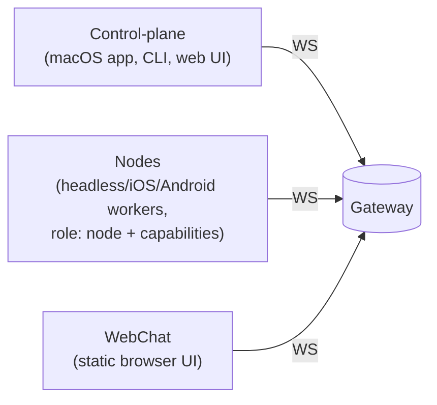
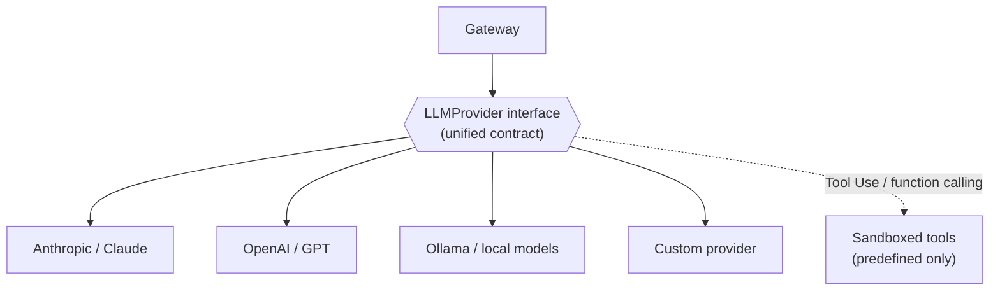
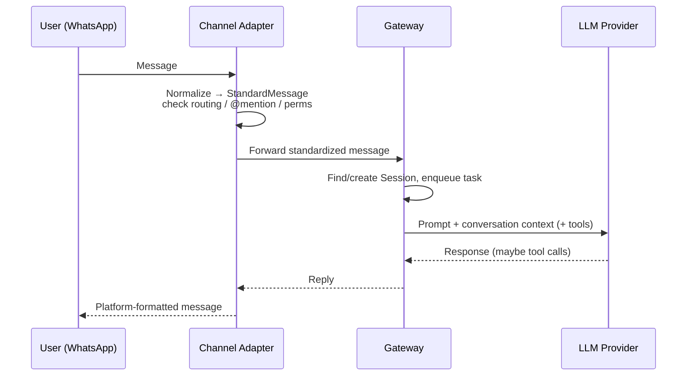

# How OpenClaw Works: A Tour of Its Architecture

OpenClaw is an open-source, self-hosted AI-agent runtime. The idea is simple from the
outside: you message it on WhatsApp, Telegram, Slack, or another app, and it runs an LLM
agent (with tools) and replies back on the same channel. What makes that work is a clean
**three-layer architecture built around a single long-lived daemon called the Gateway**.

This post walks through that design and answers three questions people always ask:

- What exactly *is* the Gateway?
- How does OpenClaw integrate with LLMs?
- How does it integrate with all those other services it lists on its site?

## The big picture

Three layers, each with one job:

- **Channel layer** — talks to the outside world (WhatsApp, Telegram, …)
- **Gateway** — thinks, remembers, schedules
- **LLM layer** — reasons and acts

```text
                                   ┌──────────────────────────────────┐
   You, on any app                 │            GATEWAY               │
                                   │   (the long-lived daemon/brain)  │
  WhatsApp  ─┐                     │                                  │
  Telegram  ─┤                     │  • Sessions & conversation hist. │
  Slack     ─┤   CHANNEL LAYER     │  • Task queue (≤10 concurrent)   │      LLM LAYER
  Discord   ─┼──► (adapters that ──┼─►• Workspace / memory / config   │──► (provider plugins)
  Signal    ─┤    normalize msgs)  │  • Routing to the right agent    │      ┌─────────────┐
  iMessage  ─┤                     │  • Node lifecycle + heartbeats   │      │ Anthropic   │
  WebChat   ─┘                     │  • WS API @ 127.0.0.1:18789      │      │ OpenAI/GPT  │
                                   └───────────┬──────────────────────┘      │ Ollama/local│
                                               │ WebSocket                   │ custom...   │
                          ┌────────────────────┼─────────────────────┐       └─────────────┘
                   Control-plane          Nodes               WebChat UI
                  (macOS app, CLI,   (mac/iOS/Android/      (static UI on
                   web UI, automations)  headless workers)    the WS API)
```

The separation is the whole point: changing one platform never affects the others, and
swapping an LLM model never touches the Gateway's memory and session logic.

## 1. What is the Gateway?

The Gateway is the **brain and the only always-on process**. Everything else connects *to*
it. A useful mental model is a "package-sorting center" for messages — work comes in from
many doors, gets sorted and tracked, and goes back out the right door.

It owns:

- **State & memory** — per-user conversation history, the agent's workspace, configuration.
- **Sessions** — it uses *per-channel-peer* isolation: your WhatsApp DM, your Telegram DM,
  and a Slack group each get their **own independent session**, so contexts don't bleed into
  each other.
- **A task queue** — incoming messages are queued and scheduled with concurrency control
  (default max ~10 at once).
- **Connection management** — it exposes a typed **WebSocket API** (default bind
  `127.0.0.1:18789`), with a handshake (the first frame must be `connect`), device
  pairing/approval, shared-secret tokens, and ~30-second heartbeats.
- **Routing** — multi-agent support, so different agents can be assigned to different
  channels, contacts, or groups.

Three kinds of clients connect to it over that WebSocket:



**Nodes** are worth calling out: they're worker clients that declare `role: node` and
advertise their capabilities/commands. This is how OpenClaw runs work on other machines or
devices. New devices must be approved — local loopback connections can auto-approve, but
remote connections require explicit approval, and the Gateway issues device tokens for
reconnects.

## 2. How does it integrate with LLMs?

Through the **LLM layer**, which in 2026 was refactored from hard-coded providers into a
**provider plugin system**. The key is a single interface — `LLMProvider` — that every model
backend implements.



What this buys you:

- **Swap models by config, not code.** Adding a model means implementing the Provider
  interface; providers auto-register at startup.
- **Tool use / function calling** is supported, but execution is **sandboxed to a predefined
  set of tools** — the model can't run arbitrary code.
- The Gateway handles the cross-cutting concerns *around* the LLM: API key routing, rate
  limiting, and injecting the correct conversation context per session.
- For local or offline use, it integrates with runtimes like **Ollama** and LiteLLM-style
  gateways.

## 3. How does it integrate with other services?

Through the **Channel layer** — a textbook **Adapter pattern**. Each platform has an adapter
that translates that platform's quirky message format into one unified internal object (a
`StandardMessage`), so the Gateway and LLM layers never contain platform-specific code.

Each adapter does three jobs:

1. **Normalize** inbound messages into a `StandardMessage`.
2. **Apply routing rules** — DM vs. group, whether an `@mention` is required, permission and
   auth checks.
3. **Handle that platform's auth** — e.g. WhatsApp via Baileys, Telegram via grammY, plus
   Slack, Discord, Signal, iMessage, and WebChat.

### Is this a standard protocol like A2A?

No — the Channel layer is a **customized protocol, not a standard inter-agent protocol**.
It speaks **each platform's own native protocol** (Telegram Bot API, WhatsApp via Baileys,
Slack, Discord, Matrix, Signal, iMessage, …) and then normalizes everything into OpenClaw's
own internal `StandardMessage`, carried to the Gateway over the Gateway's own typed
WebSocket wire protocol (`req` / `res` / `event` frames):

```text
Platform-native protocol → Channel adapter → StandardMessage (custom) → Gateway WS protocol (custom)
```

None of that is A2A. A2A (Agent-to-**Agent**) is a different concern — agents talking to
*other agents*, not ingesting user messages. Two distinct things share the "A2A" name in the
OpenClaw world:

- **OpenClaw's own "A2A follow-up path"** — an internal mechanism where one peer session can
  message another, wait for the reply, exchange a bounded number of follow-up turns, then
  emit an "announce" message back to the visible channel. This is *custom*, not the
  standardized spec.
- **The standardized A2A protocol (v0.3.0)** — available only through **third-party plugins**
  (e.g. `openclaw-a2a-gateway`, which adds JSON-RPC / REST / gRPC transports for cross-server
  agent discovery). Native support is still an open feature request, so it isn't in core.

### End-to-end data flow



## 4. Running work on other machines: Nodes

OpenClaw can run work on other machines and devices through **Nodes**. The key idea: a Node
doesn't run an agent or an LLM itself — it's a thin "hands and senses" client that connects
to the Gateway, advertises what it can do, and lets the agent (running on the Gateway)
**remotely invoke those capabilities**.

```text
  ┌──────────────────────────────────────────────┐
  │                  GATEWAY                       │
  │  (agent + LLM reasoning live here)             │
  │   agent decides: "take a photo on the phone"   │
  └───────────────┬────────────────────────────────┘
                  │  node.invoke  (over persistent WebSocket)
                  │  command + params
        ┌─────────┼─────────────┬──────────────────┐
        ▼         ▼             ▼                   ▼
   ┌─────────┐ ┌─────────┐ ┌───────────┐    ┌──────────────┐
   │ iOS     │ │ Android │ │ macOS     │    │ headless     │
   │ node    │ │ node    │ │ node      │    │ Linux box    │
   │camera,  │ │camera,  │ │canvas,    │    │ system.run,  │
   │GPS,SMS  │ │GPS,SMS  │ │screen,exec│    │ screen rec   │
   └─────────┘ └─────────┘ └───────────┘    └──────────────┘
   Each node executes the command locally and returns the result.
```

The lifecycle has four stages:

1. **Connect & declare.** A companion device (iOS / Android / macOS / headless Linux) opens a
   WebSocket to the Gateway with `role: "node"`. In its `connect` frame it declares a
   **command list** — the exact capabilities it offers. A headless Linux box might declare
   `system.run` and screen recording; a phone declares `camera.*`, GPS, SMS, and so on.
2. **Pair & approve.** The device presents a device identity, creating a pairing request that
   an admin must explicitly approve (`openclaw devices approve`). Approval scope depends on
   what was declared: a commandless node needs only `operator.pairing`, but a node offering
   dangerous commands like `system.run` requires `operator.admin`. The resulting pairing
   contract can't be silently upgraded to a more powerful role via token rotation.
3. **Register & persist.** After approval the node holds a persistent WebSocket connection and
   registers its capabilities. It stores its identity/token/gateway address in
   `~/.openclaw/node.json` so it can **auto-reconnect** if the link drops.
4. **Invoke.** Any agent on the Gateway can now call a node's capability:

   ```bash
   openclaw nodes invoke --node <id> --command system.run --params '{...}'
   ```

   Every invocation passes **two gates**: the node must have declared the command in its
   `connect.commands` list, and the Gateway's platform policy must allow it. The Gateway
   forwards the call, the node executes it locally, and the result returns over the same
   socket.

### What a node can do

| Category | Example commands | Notes |
| --- | --- | --- |
| Canvas / media | screenshot, navigate webpage, eval JS, render buttons | "safe" |
| Camera | photo (JPEG), video (MP4) | requires foreground |
| Device | status, app list, notifications, contacts, calendar, SMS search, motion sensors | hardware-dependent |
| Screen recording | MP4 with FPS / audio control | ~60s limit |
| System | `system.run` (shell), `system.which`, notifications | "dangerous" |
| Location | GPS coordinates | requires explicit enablement |
| SMS (Android) | send message | needs telephony permission |

This is what "run work on other machines" means in practice: put a node on a build server,
lab box, NAS, or CI runner, and the agent can run approved shell commands there via
`system.run` with `host=node` — **without installing the full app**, and while the model
reasoning stays on the Gateway.

### Security & sandboxing

Because nodes can execute shell commands on real machines, OpenClaw wraps them tightly:

- **Command risk tiers** — *safe* (canvas, `camera.list`), *standard* (notifications), and
  *dangerous* (`system.run`, `camera.snap`). Dangerous commands must be explicitly enabled
  via `gateway.nodes.allowCommands`.
- **Per-host allowlists** — the node enforces an exec allowlist at
  `~/.openclaw/exec-approvals.json`; approved runs bind to the exact request context and
  concrete file operands.
- **Environment scrubbing** — shell wrappers get a restricted env allowlist (`TERM`, `LANG`,
  `LC_*`…) with dangerous variables stripped (`DYLD_*`, `LD_*`). Windows nodes need explicit
  approval for `cmd.exe` wrapper forms.
- **Remote gateways** — when Gateway and node run on different machines, SSH tunneling
  supports a loopback-bound gateway so the control channel isn't exposed.

The net effect: the **model reasoning layer (Gateway) is separated from the execution context
(node)**, with an approval boundary at every step — pairing, command declaration, policy
gate, and per-command allowlist.

## Summary

- **Gateway** = the single always-on daemon that holds state/memory/sessions, queues work,
  and brokers everything over a WebSocket API.
- **LLM integration** = a pluggable `LLMProvider` interface (Claude, GPT, Ollama, custom)
  with sandboxed tool use; the Gateway adds key routing and context.
- **Other-service integration** = per-platform Channel adapters that normalize messages to a
  `StandardMessage` and enforce routing rules.

The layering is what makes OpenClaw approachable: each layer can change independently, and
you reason about the whole system as just "doors in, brain in the middle, model out the back."

---

*Sources:*

- [Gateway architecture · OpenClaw docs](https://docs.openclaw.ai/concepts/architecture)
- [OpenClaw Architecture Explained: Gateway, Channel, and LLM Layers · BetterLink Blog](https://eastondev.com/blog/en/posts/ai/20260205-openclaw-architecture-guide/)
- [OpenClaw Architecture, Explained · ppaolo Substack](https://ppaolo.substack.com/p/openclaw-system-architecture-overview)
- [OpenClaw + LiteLLM Integration](https://docs.litellm.ai/docs/tutorials/openclaw_integration)
- [Local models · OpenClaw docs](https://docs.openclaw.ai/gateway/local-models)
- [Nodes · OpenClaw docs](https://docs.openclaw.ai/nodes)
- [Node (CLI) · OpenClaw docs](https://docs.openclaw.ai/cli/node)
- [ACP agents · OpenClaw docs](https://docs.openclaw.ai/tools/acp-agents)
- [openclaw-a2a-gateway (A2A v0.3.0 plugin)](https://github.com/win4r/openclaw-a2a-gateway)
- [Feature Request: Add A2A Protocol Support · Issue #6842](https://github.com/openclaw/openclaw/issues/6842)
