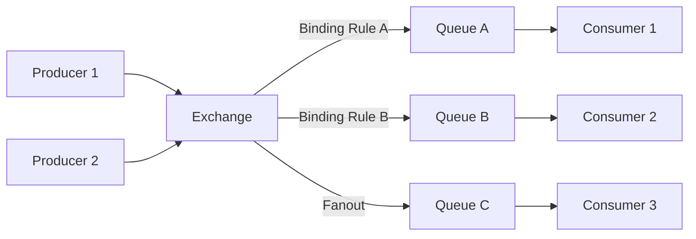

# AMQP vs Kafka/Pulsar

## AMQP (Advanced Message Queuing Protocol)

* **What it is**:\
  A standardized, binary, application-layer protocol for message-oriented middleware.\
  Designed for reliable, interoperable messaging between systems.

***

### Key Features

* **Message-oriented** → defines how messages are formatted, routed, delivered.
* **Broker-based** → typically uses a broker (e.g., RabbitMQ) to mediate producers and consumers.
* **Wire-level protocol** → ensures interoperability across different vendors/implementations.
* **Reliable delivery** → supports acknowledgments, transactions, persistence.
* **Routing model** → supports queues, topics (publish/subscribe), fanout, etc.

***

### Core Concepts

* **Exchange**: entry point for published messages (like a router).
* **Queue**: stores messages until consumed.
* **Binding**: rules that connect exchanges to queues.
* **Message**: payload with headers, properties, body.

***

### Usage

* Widely used in **RabbitMQ**, **Qpid**, **Azure Service Bus**, etc.
* Good for **enterprise integration**, **IoT messaging**, **work queues**, **pub/sub systems**.

## AMQP Message Flow Diagram

* **Producers** send messages to an **Exchange**.
* The **Exchange** applies **binding rules** to decide which **Queues** receive the messages.
* **Consumers** pull messages from queues.

This captures **direct routing**, **topic routing**, and **fanout** depending on the exchange type.

## What Problem Does AMQP Solve?

AMQP (Advanced Message Queuing Protocol) was created to solve **reliable, interoperable, asynchronous communication** between distributed systems.

***

### 1️⃣ Decoupling Producers and Consumers

* Without AMQP, producers must know **where** and **how** to deliver data.
* With AMQP:
  * Producers only send to an **exchange**.
  * Consumers read from **queues**.
  * They don’t need to know about each other → looser coupling.

***

### 2️⃣ Reliable Delivery

* Networks and services fail; AMQP ensures:
  * **Acknowledgments** (confirm message receipt).
  * **Persistence** (messages survive broker restarts).
  * **Retries and dead-lettering** (no silent loss).
* Solves the “did my message get through?” problem.

***

### 3️⃣ Interoperability

* Before AMQP, messaging systems were vendor-specific.
* AMQP defines a **standard wire protocol**, so:
  * A producer written in Java with RabbitMQ can talk to a consumer written in Python with Qpid.
  * No vendor lock-in.

***

### 4️⃣ Flexible Routing

* Traditional queues = one producer, one consumer.
* AMQP introduces:
  * **Direct** routing → point-to-point.
  * **Fanout** → broadcast.
  * **Topic** → wildcard-based routing.
  * **Headers** → content-based routing.
* Solves the “how do I deliver the right messages to the right services?” problem.

***

### 5️⃣ Flow Control & Backpressure

* Without queues, slow consumers can overwhelm producers.
* AMQP brokers **buffer** and apply flow control, preventing overload.

***

### 🔑 In Short

AMQP solves:

* **Decoupling** (loose coupling of services).
* **Reliability** (guaranteed delivery, persistence).
* **Interoperability** (cross-language, cross-vendor).
* **Routing flexibility** (direct, pub/sub, filtering).
* **Backpressure** (protects slow consumers).

## Why Kafka, Pulsar, and Similar Systems Don’t Use AMQP

While AMQP is a mature, interoperable messaging protocol, Kafka and Pulsar were designed for **high-throughput, persistent, log-based streaming**, which leads to different architectural choices.

***

### 1️⃣ Focus on Streaming and Logs

* **Kafka/Pulsar** treat topics/partitions as **append-only logs**.
* Consumers can **replay history**, **seek to arbitrary positions**, and **process streams multiple times**.
* AMQP’s queue/exchange model is **message-oriented**, typically discarding messages after consumption.
* → Log-based storage gives better support for **event sourcing, stream processing, and large-scale data pipelines**.

***

### 2️⃣ Performance and Throughput

* Kafka and Pulsar optimize for **high-throughput, low-latency**, often millions of messages/sec.
* AMQP is more **general-purpose**, with richer metadata, routing, and broker logic.
* These features add **protocol overhead** that can limit raw throughput for streaming workloads.

***

### 3️⃣ Broker Architecture

* AMQP brokers (like RabbitMQ) **store queues in memory/disk**, with exchanges handling routing.
* Kafka uses **partitioned log segments on disk** + sequential writes → very fast sequential I/O.
* Pulsar separates **storage (BookKeeper)** and **brokers**, optimizing for scale and long-term retention.
* The AMQP protocol does not natively support these storage abstractions.

***

### 4️⃣ Consumer Model

* AMQP is **push-based**, consumers are usually **queue subscribers**.
* Kafka/Pulsar are **pull-based**, consumers fetch messages at their own pace.
* Pull-based consumption is essential for **replay, backpressure control, and large-scale streaming**.

***

### 5️⃣ Simplicity vs Standardization

* AMQP’s strength: standard protocol across languages/vendors.
* Kafka/Pulsar: custom protocol (Kafka’s binary protocol, Pulsar’s custom protocol)
  * Optimized for **efficiency, batching, compression**.
  * Tradeoff: lose out-of-the-box standardization, gain speed and scalability.

***

### 🔑 Summary

| Feature             | AMQP             | Kafka/Pulsar                |
| ------------------- | ---------------- | --------------------------- |
| Delivery model      | Message-oriented | Log/stream-oriented         |
| Replay history      | ❌ usually no     | ✅ yes                       |
| Consumer model      | Push             | Pull                        |
| Throughput          | Moderate         | Very high                   |
| Protocol            | Standardized     | Custom, optimized           |
| Routing flexibility | High (exchanges) | Low (partition/topic-based) |

* Kafka and Pulsar **don’t use AMQP** because their design is for **high-throughput, replayable, partitioned logs**, not general-purpose queue-based messaging.

## Alternative Protocols / Systems Combining AMQP & Log-based Streaming

***

### 1️⃣ NATS JetStream

* **Protocol**: NATS protocol (lightweight, simple)
* **Features**:
  * Persistent, replayable streams (like logs)
  * At-least-once or exactly-once delivery semantics
  * Key/value and message streaming abstractions
  * Pull/push consumers
* **AMQP-like**: Lightweight pub/sub with multiple subjects and flexible subscriptions
* **Use case**: High-throughput messaging + streaming without heavy broker overhead

***

### 2️⃣ Redpanda with Kafka API

* **Protocol**: Kafka-native, but supports client libraries that can mimic AMQP semantics
* **Features**:
  * Kafka log-based storage
  * Transactions, idempotent producers
  * Can integrate with routing systems (like RabbitMQ) through connectors
* **Use case**: Event streaming + exactly-once semantics

***

### 3️⃣ MQTT + Extensions

* **Protocol**: MQTT (publish/subscribe, IoT-focused)
* **Extensions**:
  * Some brokers (like EMQX, HiveMQ) add persistence and replay
  * Durable subscriptions
* **AMQP-like**: Lightweight publish/subscribe, topic filtering
* **Kafka-like**: Replay messages if broker stores them persistently

***

### 4️⃣ Apache Pulsar (already partially combines both)

* **Protocol**: Pulsar native or MQTT/AMQP over Pulsar
* **Features**:
  * Log-based, replayable topics
  * Subscription modes (Exclusive, Shared, Key\_Shared)
  * Can expose AMQP or MQTT protocol endpoints via proxies
* **Benefit**: You can use AMQP clients to send/receive messages while still getting Pulsar’s log-based semantics

***

### 🔑 Takeaways

* True “best of both worlds” is rare; usually, you trade off:
  * **Interoperable standard protocols** (AMQP)
  * **High-throughput log-based streaming** (Kafka/Pulsar)
* **Pulsar** comes closest by:
  * Allowing multiple protocol endpoints (AMQP/MQTT/Kafka)
  * Maintaining replayable, partitioned topics under the hood
* Other approaches:
  * NATS JetStream for lightweight streaming + flexible pub/sub
  * MQTT brokers with durable subscriptions for IoT scenarios

### 💡 **Summary**:

* No single protocol perfectly merges AMQP’s rich routing with Kafka/Pulsar’s log-based architecture natively.
* Pulsar is probably the closest “hybrid,” especially if you enable AMQP protocol support on top of its log storage.
* NATS JetStream is another option for lightweight, durable streaming with flexible subscriptions.
