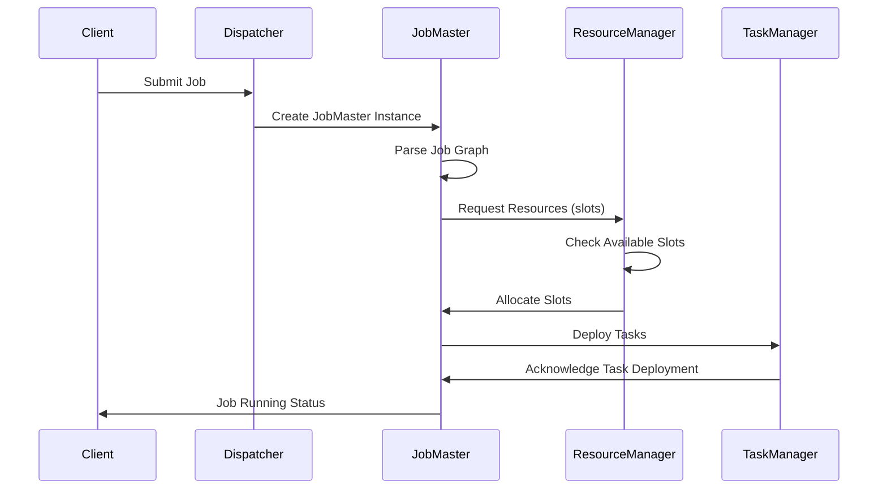
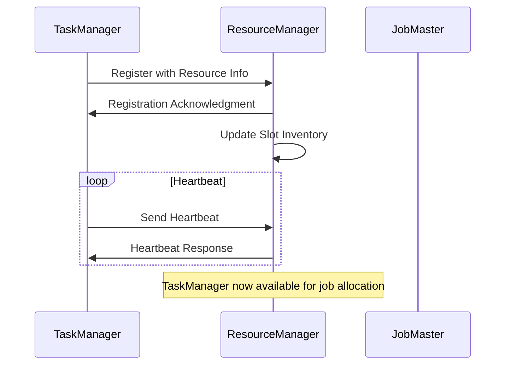
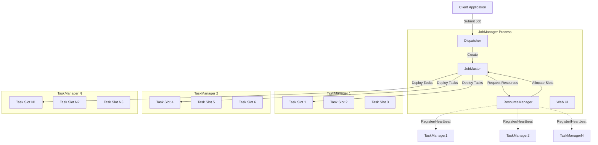
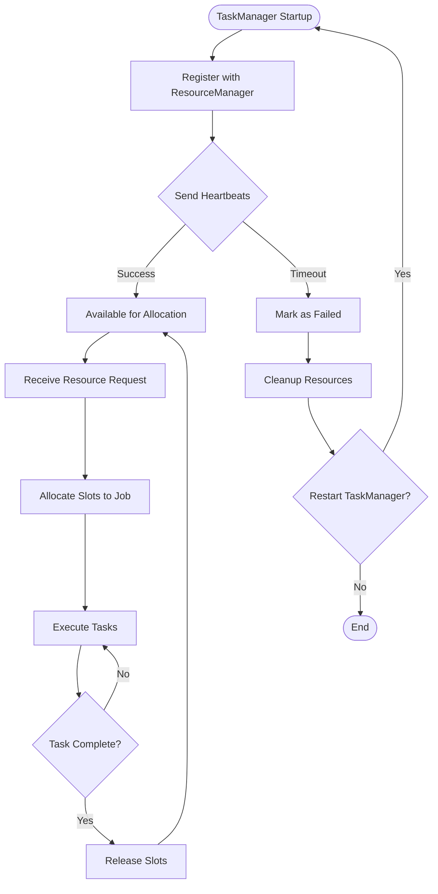
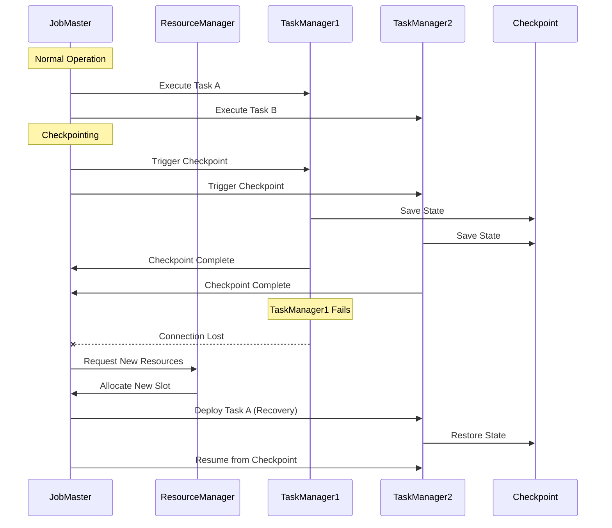
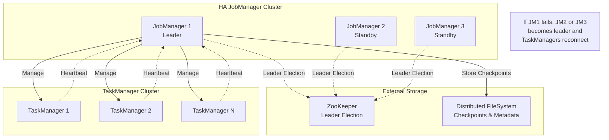

# Apache Flink Architecture

### Overview

Apache Flink uses a **centralized architecture** with a **JobManager** acting as the central coordinator, rather than a gossip protocol for cluster topology management.

### Cluster Topology Management

#### How Flink Discovers New Nodes

Apache Flink uses a **centralized architecture** with a **JobManager** acting as the central coordinator, rather than a gossip protocol for cluster topology management.

**ResourceManager Component**

* The **ResourceManager** (part of the JobManager) is responsible for cluster membership and resource allocation
* It maintains the authoritative view of available TaskManagers and their resources
* All topology changes flow through this centralized component

**Node Discovery Mechanisms**

Flink supports multiple deployment modes with different discovery mechanisms:

**Standalone Mode**

* TaskManagers connect directly to a known JobManager address
* Configuration specifies the JobManager host/port
* TaskManagers register themselves upon startup

**YARN Mode**

* YARN ResourceManager handles container allocation
* Flink's ResourceManager communicates with YARN to request/release containers
* New TaskManager containers are started by YARN and connect to the JobManager

**Kubernetes Mode**

* Uses Kubernetes service discovery
* TaskManagers are deployed as pods that discover the JobManager service
* Kubernetes handles networking and service registration

**Mesos Mode (deprecated)**

* Similar to YARN, uses Mesos for resource management
* Mesos scheduler allocates resources and starts TaskManagers

**Registration Process**

When a new TaskManager joins:

1. **Connection**: TaskManager connects to the JobManager's RPC endpoint
2. **Registration**: Sends registration message with resource information (CPU, memory, slots)
3. **Acknowledgment**: JobManager validates and acknowledges the registration
4. **Heartbeats**: Establishes periodic heartbeat mechanism for failure detection
5. **Resource Updates**: JobManager updates its view of available cluster resources

**Failure Detection**

* **Heartbeat Protocol**: Regular heartbeats between JobManager and TaskManagers
* **Timeout-based**: If heartbeats are missed beyond a threshold, node is considered failed
* **Immediate Notification**: TaskManagers notify JobManager when shutting down gracefully

**High Availability (HA)**

In HA setups:

* Multiple JobManager instances use **leader election** (via ZooKeeper or Kubernetes)
* Only the leader JobManager actively manages the cluster
* TaskManagers reconnect to the new leader if the current leader fails

**Key Differences from Gossip Protocols**

Unlike distributed systems using gossip protocols (like Cassandra or Consul), Flink:

* Has a **single source of truth** for cluster state (the active JobManager)
* Uses **direct registration** rather than peer-to-peer discovery
* Relies on **external systems** (YARN, K8s, etc.) for some discovery aspects
* Implements **centralized scheduling** and resource management

This centralized approach simplifies job scheduling and state management but requires the JobManager to be highly available through external HA mechanisms.

### Component Roles

#### JobManager

The **JobManager** serves as the central coordinator and control plane of a Flink cluster.

**Primary Responsibilities:**

* **Job Scheduling**: Receives job submissions from clients and schedules them for execution
* **Execution Graph Management**: Transforms the user's job into an execution graph with tasks and dependencies
* **Task Coordination**: Coordinates task execution across TaskManagers and handles task lifecycle
* **Checkpoint Coordination**: Triggers and coordinates checkpoints for fault tolerance
* **State Management**: Manages job state and metadata
* **Web UI**: Provides the web dashboard for monitoring jobs and cluster status
* **Client Communication**: Handles job submission, cancellation, and status requests from clients

**Components Within JobManager:**

* **Dispatcher**: Receives job submissions and spawns JobMaster instances
* **JobMaster**: Manages individual job execution (one per job)
* **ResourceManager**: Manages cluster resources and TaskManager allocation
* **WebMonitorEndpoint**: Serves the web UI and REST API

#### TaskManager

**TaskManagers** are the worker nodes that execute the actual computation tasks.

**Primary Responsibilities:**

* **Task Execution**: Runs individual tasks assigned by the JobManager
* **Data Processing**: Processes streaming records and batch data
* **Network Communication**: Exchanges data with other TaskManagers through network channels
* **Memory Management**: Manages task memory, including heap and off-heap memory pools
* **Local State Storage**: Stores task state locally and participates in checkpointing
* **Resource Provision**: Provides processing slots for task execution
* **Heartbeat Communication**: Sends regular heartbeats to JobManager for health monitoring

**Task Slots:**

* Each TaskManager provides multiple **task slots** (configurable)
* One slot can execute one parallel task instance
* Slots share TaskManager resources (CPU, memory, network)
* Different tasks from the same job can share a slot (slot sharing)

#### ResourceManager

The **ResourceManager** (part of JobManager) handles cluster resource management and TaskManager lifecycle.

**Primary Responsibilities:**

* **TaskManager Registration**: Accepts and manages TaskManager registrations
* **Resource Allocation**: Allocates TaskManager slots to jobs based on resource requirements
* **Cluster Membership**: Maintains view of available TaskManagers and their resources
* **Resource Requests**: Handles resource requests from JobMaster instances
* **Container Management**: In containerized environments (YARN, K8s), requests/releases containers
* **Failure Detection**: Monitors TaskManager health through heartbeats
* **Resource Reporting**: Reports cluster resource status to JobMasters

**Deployment-Specific Behavior:**

* **Standalone**: Manages pre-started TaskManagers
* **YARN**: Requests/releases YARN containers dynamically
* **Kubernetes**: Manages TaskManager pods through Kubernetes API
* **Mesos**: Coordinates with Mesos for resource allocation

### Interaction Flows

#### Job Submission:

1. Client submits job to **JobManager Dispatcher**
2. **Dispatcher** creates **JobMaster** for the job
3. **JobMaster** requests resources from **ResourceManager**
4. **ResourceManager** allocates TaskManager slots
5. **JobMaster** deploys tasks to **TaskManagers**
6. **TaskManagers** execute tasks and report back to **JobMaster**

#### Resource Management:

1. **TaskManagers** register with **ResourceManager** on startup
2. **ResourceManager** maintains slot inventory
3. **JobMaster** requests slots for job execution
4. **ResourceManager** matches requests with available slots
5. **TaskManagers** report slot status changes

#### Fault Tolerance:

1. **TaskManagers** send heartbeats to **JobManager**
2. **JobMaster** detects TaskManager failures
3. **ResourceManager** handles TaskManager re-registration
4. **JobMaster** restarts failed tasks on available TaskManagers
5. Recovery uses checkpointed state when available

### Architecture Diagrams

#### 1. Job Submission Flow

#### 2. TaskManager Registration Flow

#### 3. Cluster Architecture Overview

#### 4. Resource Management Flow

#### 5. Fault Tolerance and Recovery Flow

#### 6. High Availability Setup

### Key Interaction Patterns

#### **Centralized Control**

* All coordination flows through JobManager components
* ResourceManager maintains authoritative cluster state
* No peer-to-peer communication between TaskManagers

#### **Resource Lifecycle**

1. TaskManager registration with ResourceManager
2. Resource request from JobMaster to ResourceManager
3. Slot allocation and task deployment
4. Task execution and resource release

#### **Fault Recovery**

* Heartbeat-based failure detection
* Automatic resource reallocation on failures
* Checkpoint-based state recovery
* Leader election for JobManager HA

### High Availability Considerations

* **JobManager HA**: Multiple JobManager instances with leader election
* **TaskManager Recovery**: Failed TaskManagers can be replaced automatically
* **State Persistence**: Job state and checkpoints stored in external systems
* **Resource Manager HA**: Integrated with JobManager HA mechanisms

This architecture ensures strong consistency and simplified coordination at the cost of having the JobManager as a potential single point of failure (mitigated by HA setups). The centralized approach provides clear separation of concerns while enabling scalable, fault-tolerant distributed processing.
