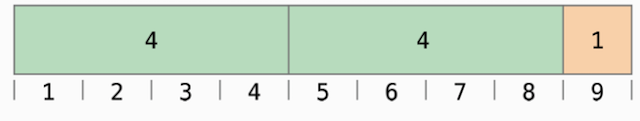

# Arithmetic Operators

Swift có 4 toán tử số học (_arithmetic operators_) cở bản cho tất cả các kiểu số:

* Phép cộng (`+`)
* Phép trừ (`-`)
* Phép nhân (`*`)
* Phép chia (`/`)

```swift
1 + 2        // Equals 3
5 - 3        // Equals 2
2 * 3        // Equals 6
10.0 / 2.5   // Equals 4.0
```

Không giống như các toán tử trong C hay Objective-C, trong Swift các toán tử số học không cho phép các giá trị bị tràn (_overflow_). Ta có thể chuyển sang dùng các toán tử cho phép tràn giá trị (như `a &= b`). Xem chi tiết [Overflow Operators](../advanced_operators/overflow-operators.md).

Toán tử cộng cũng được áp dụng cho hai chuỗi kí tự:

```
"hello, " + "world" //equals "hello, world"
```

## Toán tử số dư (thừa số)

Toán tử số dư (`a % b`) tính ra số dư của phép chia a cho b.

> CHÚ Ý
>
> Toán tử số dư cũng còn được gọi là _modulo operator_ trong các ngôn ngữ khác. Tuy nhiên trong Swift, đối với sô âm, số dư mang ý nghĩa đúng hơn là modulo operation.

Hãy xem minh hoạ sau để thấy toán tử này hoạt động thể nào, ví dụ nhu phép tình `9 % 4`, đầu tiên tính bao nhiêu lần của 4 có trong giá trị 9:



Có 2 lần 4 trong 9, và phần dư là 1. Trong swift, có thể viẻt

```swift
9 % 4   //equals 1
```

Để xác định kết quả cho phép tình `a % b`, toán tử % tính và trả vể phẩn `remainder`

```
a = (b x số nhân) + remainder
```

Ơ đây `số nhân` là giá trị lớn nhất mà khi nhân với b kêt quả vẫn nhỏ hơn a.

Thay thế a và b trong biểu thức trên bởi 9 và 4 ta đươc:

```
9 = (4 x 2) + 1
```

Cùng với cách thửc trên có thể dùng để tính với các số âm

```
-9 % 4  // bằng -1
```

Dấu của b được bỏ qua cho các giá trị âm, nghĩa là `a % b` và `a % -b` cho cùng một kết quả.

## Đơn tử trừ

Dấu của giá trj số cỏ thể được thay đổi bằng đăt kỉ tự `-` trước nó, toán tử này gọi là đơn tử trừ (_unary minus operator_).

```swift
let three - 3
let minusThree = -three  //minusThree equals -3
let plusThree = -minusThree // plusThree equals 3
```

Toán tử đơn trử được gắn trước ngay giá trị, không có khoảng trống giữa toán tử và giá trị.

## Đơn tử cộng

Đơn tử cộng (_unary plus operator_) `+` đơn giản trả về giá trị của toán hạng mà không thay đổi giá trị toán hạng:

```swift
let minusSix = -6
let alsoMinusSix = +minusSix // vẫn giữ giá trị -6
```

Toán tử đơn + thực chất không có tác dụng thay đổi giá trị nhưng có thẻ dùng để làm cho code dễ đọc hơn.
